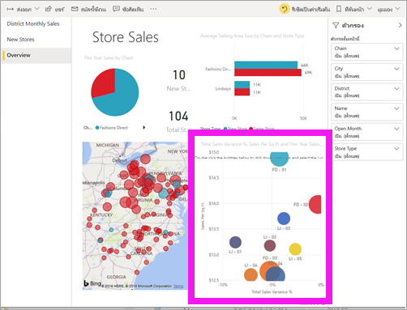

# เริ่มต้นใช้งานด่วน: เรียนรู้เกี่ยวกับความสามารถ Power BI สำหรับ*ผู้บริโภค*
ในเริ่มต้นใช้งานด่วนนี้ คุณจะได้เรียนรู้วิธีการโต้ตอบกับ Power BI เพื่อค้นหาข้อมูลธุรกิจเชิงลึก บทความนี้ไม่ได้มีวัตถุประสงค์ที่จะเจาะลึก แต่เป็นการสำรวจแบบรวดเร็วผ่านการดำเนินการหลายอย่างที่พร้อมให้**ผู้บริโภค** Power BI ใช้งาน

ถ้าคุณไม่ได้ลงทะเบียน Power BI ให้[ลงทะเบียนรุ่นทดลองใช้ฟรี](https://app.powerbi.com/signupredirect?pbi_source=web)ก่อนที่คุณจะเริ่มต้นใช้งาน

## Power BI คืออะไร 
Power BI เป็นคอลเลกชันของบริการซอฟต์แวร์ แอป และตัวเชื่อมต่อที่ทำงานร่วมกันเพื่อเปลี่ยนแหล่งข้อมูลที่ไม่เกี่ยวข้องของคุณให้เป็นข้อมูลเชิงลึกที่สอดคล้องกัน แสดงข้อมูลได้ และโต้ตอบได้ ไม่ว่าข้อมูลของคุณจะเป็นสเปรดชีต Excel ง่ายๆ หรือคอลเลกชันของข้อมูจากแหล่งข้อมูลที่แตกต่างกัน Power BI จะช่วยให้คุณเชื่อมต่อกับแหล่งข้อมูลของคุณ แสดงภาพ (หรือค้นพบ) ข้อมูลสำคัญ และแชร์ข้อมูลนั้นกับใครก็ตามหรือทุกคนที่คุณต้องการได้อย่างง่ายดาย 

## มุมมองการอ่าน
มุมมองการอ่านพร้อมให้*ผู้บริโภค*ใช้งานในบริการของ Power BI สำหรับรายงาน เมื่อเพื่อนร่วมงานแชร์รายงาน แดชบอร์ด หรือแอปกับคุณ คุณสามารถใช้มุมมองการอ่านเพื่อสำรวจและโต้ตอบกับรายงาน 

เพียงแค่เปิดบริการของ Power BI ในเบราว์เซอร์หรือบนอุปกรณ์เคลื่อนที่ คุณและเพื่อนร่วมงานของคุณสามารถใช้งานได้จากแอป แดชบอร์ด และรายงานที่เชื่อถือได้ฉบับเดียวกัน ซึ่งมีการอัปเดตและการรีเฟรชโดยอัตโนมัติ ดังนั้นคุณจึงทำงานกับเนื้อหาที่สดใหม่อยู่เสมอ   

เนื่องจากเนื้อหาไม่ใช่แบบคงที่ คุณสามารถเจาะดูแนวโน้ม ข้อมูลเชิงลึก และข่าวกรองทางธุรกิจอื่น ๆ ได้ แบ่งส่วนและแยกย่อยเนื้อหาและแม้แต่ถามคำถามโดยใช้คำพูดของคุณเอง หรือนั่งลง และปล่อยให้ข้อมูลของคุณค้นพบข้อมูลเชิงลึกที่น่าสนใจสำหรับคุณ ส่งการแจ้งเตือนเมื่อมีการเปลี่ยนแปลงข้อมูล และรายงานทางอีเมลถึงคุณตามกำหนดเวลาที่คุณตั้งไว้ เข้าถึงข้อมูลทั้งหมดของคุณได้ทุกที่ทุกเวลาในระบบคลาวด์หรือภายในองค์กรจากอุปกรณ์ใดก็ได้ 

อ่านเพื่อเรียนรู้เกี่ยวกับสิ่งเหล่านี้และอื่น ๆ

## เนื้อหา Power BI
เมื่อเราใช้คำว่า "เนื้อหา" ใน Power BI เราจะอ้างอิงถึงรายงาน แดชบอร์ด และแอป สิ่งเหล่านี้คือบล็อกการสร้างที่คุณจะใช้เพื่อสำรวจข้อมูลของคุณและทำการตัดสินใจทางธุรกิจ 

> [!NOTE]
> เราสามารถดูและแชร์แดชบอร์ด รายงาน และแอปบนมือถือได้ด้วย

###  แอป

*แอป* เป็นประเภทเนื้อหา Power BI ที่รวมแดชบอร์ดและรายงานที่เกี่ยวข้องทั้งหมดไว้ในที่เดียวกัน แอปสามารถมีแดชบอร์ดอย่างน้อยหนึ่งรายการและรายงานอย่างน้อยหนึ่งรายงานทั้งหมดรวมเข้าด้วยกัน แอปถูกสร้างโดย Power BI *นักออกแบบ* ซึ่งเป็นผู้แจกจ่ายและแบ่งปันแอปกับ *ผู้บริโภค* เช่นคุณ 

วิธีหนึ่งในการดูแอปของคุณคือการเลือก**แอป**จากหน้าต่างนำทางและเลือกแอปเพื่อเปิด

หากต้องการเรียนรู้เพิ่มเติมเกี่ยวกับการดูแอป โปรดดูหัวข้อ [แอป Power BI](end-user-apps.md)

### รายงาน

รายงาน Power BI มีมุมมองแบบหลากหลายมุมมองในชุดข้อมูล พร้อมด้วยวิชวลที่แสดงถึงผลลัพธ์และข้อมูลเชิงลึกที่แตกต่างจากชุดข้อมูลนั้น รายงานอาจมีวิชวลเดียวหรือมีหน้าที่เต็มไปด้วยวิชวล รายงานถูกสร้างโดย Power BI *นักออกแบบ* ซึ่งเป็นผู้แจกจ่ายและแบ่งปันรายงานกับ *ผู้บริโภค* เช่นคุณ

หากต้องการเรียนรู้วิธีการดูรายงาน โปรดดูหัวข้อ [รายงาน Power BI](end-user-reports.md)

### แดชบอร์ด

แดชบอร์ด Power BI เป็นแบบหน้าเดียว ซึ่งมักเรียกว่าพื้นที่ทำงานที่ใช้การแสดงผลข้อมูลด้วยภาพเพื่อบอกเล่าเรื่องราวหนึ่ง ๆ ได้ เนื่องจากจำกัดอยู่เพียงหนึ่งหน้า แดชบอร์ดทีี่ออกแบบมาอย่างดีจะประกอบด้วยองค์ประกอบที่สำคัญที่สุดของเรื่องราวเท่านั้น

การแสดงผลข้อมูลด้วยภาพที่คุณเห็นบนแดชบอร์ดเรียกว่าไทล์ และจะถูกปักหมุดไปยังแดชบอร์ดโดยรายงานของ*ผู้ออกแบบ* ในกรณีส่วนใหญ่ การเลือกไทล์ที่จะนำคุณไปยังหน้ารายงานที่การแสดงภาพถูกสร้างขึ้น 

หากต้องการเรียนรู้วิธีการดูแดชบอร์ด โปรดดูหัวข้อ [แดชบอร์ด Power BI](end-user-dashboards.md)
 
## โต้ตอบในบริการของ Power BI:

### ทำงานร่วมกับเพื่อนร่วมงาน
ข้ามอีเมล เพิ่มข้อคิดเห็นส่วนบุคคล หรือเริ่มการสนทนากับเพื่อนร่วมงานเกี่ยวกับแดชบอร์ด ตรงนั้นบนแดชบอร์ดนั้น คุณลักษณะข้อคิดเห็นเป็นเพียงหนึ่งในหลายแนวทางที่คุณสามารถทำงานร่วมกับผู้อื่นได้ 

เรียนรู้เพิ่มเติมเกี่ยวกับ [การแสดงข้อคิดเห็น](end-user-comment.md)

### เอนหลังและปล่อยให้ Power BI ทำงานให้คุณ
แนวทางสองวิธีที่บริการ Power BI ทำงานสำหรับคุณคือการสมัครใช้งานและการแจ้งเตือน 

#### สมัครใช้งานแดชบอร์ด (หรือรายงาน)
ไม่จำเป็นต้องเปิด Power BI เพื่อตรวจสอบแดชบอร์ด  คุณสามารถสมัครใช้งานแทนได้ และ Power BI จะส่งสแนปช็อตของแดชบอร์ดนั้นตามเวลาที่คุณตั้งค่าถึงคุณทางอีเมล 

.

 เรียนรู้เพิ่มเติมเกี่ยวกับ [การสมัครใช้งาน Power BI](end-user-subscribe.md)

#### รับการแจ้งเตือนเมื่อข้อมูลของคุณถึงขีดจำกัด
ข้อมูลของคุณเป็นแบบสด และวิชวลของคุณจะอัปเดตโดยอัตโนมัติเพื่อสะท้อนถึงสิ่งนี้ หากคุณต้องการรับการแจ้งเตือนเมื่อมีการเปลี่ยนแปลงข้อมูลที่สูงกว่าหรือต่ำกว่าเกณฑ์ที่คุณกำหนด ให้ใช้การแจ้งเตือนข้อมูล การแจ้งเตือนจะทำงานบนตัววัด kpi และการ์ด    

Power BI ส่งอีเมลถึงคุณเมื่อค่าเพิ่มขึ้นหรือลดลงเกินขีดจำกัดที่คุณตั้งไว้  

เรียนรู้เพิ่มเติมเกี่ยวกับ [การแจ้งเตือน Power BI](end-user-alerts.md)

### ใช้ ถามตอบ เพื่อถามคำถามโดยใช้ภาษาธรรมชาติ
ในบางครั้ง วิธีที่เร็วที่สุดในการให้ได้คำตอบจากข้อมูลของคุณคือ การถามคำถามโดยใช้ภาษาธรรมชาติ กล่องคำถามของ ถามตอบ จะพร้อมใช้งานที่ด้านบนของแดชบอร์ดของคุณ ตัวอย่างเช่น "แสดงให้ฉันเห็นถึงโอกาสในการขายตามระยะการขายเป็นแผนภูมิกรวย" 

เรียนรู้เพิ่มเติมเกี่ยวกับ [ถามตอบ Power BI](end-user-q-and-a.md)

### แสดงรายละเอียดในภาพ
วิชวลประกอบขึ้นจากจุดข้อมูลและโดยการวางเมาส์เหนือจุดข้อมูล คุณสามารถดูรายละเอียดได้

### แดชบอร์ดรายการโปรด
เมื่อคุณทำให้เนื้อหาเป็น*รายการโปรด* คุณจะสามารถเข้าถึงเนื้อหาเหล่านั้นได้จากหน้าต่างนำทาง คุณสามารถมองเห็นหน้าต่างนำทางได้จากทุกส่วนของ Power BI รายการโปรดโดยทั่วไปมักเป็นแดชบอร์ด หน้ารายงาน และแอปที่คุณเยี่ยมชมบ่อยที่สุด

จากมุมขวาบนในบริการของ Power BI ให้เลือก **รายการโปรด** หรือหากมองไม่เห็น ให้เลือก**ตัวเลือกเพิ่มเติม** (...) และเลือก **รายการโปรด**จากรายการแบบเลื่อนลง 
   

ลองดูการดำเนินการอื่น ๆ ที่มีให้ในรายการแบบเลื่อนลง  ในบทความนี้จะไม่ครอบคลุมถึงเรื่องดังกล่าว แต่เราจะกล่าวถึงในบทความอื่น  เรียนรู้เพิ่มเติมโดยการใช้สารบัญ Power BI หรือเขตข้อมูล **ค้นหา** 

เรียนรู้เพิ่มเติมเกี่ยวกับ[รายการโปรดและรายการโดดเด่น](end-user-favorite.md)

### ปรับขนาดการแสดง
รายงานจะดูได้บนหลายอุปกรณ์ ที่มีขนาดหน้าจอและอัตราส่วนกว้างยาวแตกต่างกัน  การแสดงภาพตามค่าเริ่มต้นอาจไม่ใช่สิ่งที่คุณต้องการดูบนอุปกรณ์ของคุณ  

หากต้องการปรับจากแถบเมนูด้านขวาบน ให้เลือก**มุมมอง**และเลือกตัวเลือกการแสดงผลหนึ่งตัว 

### ดูว่าภาพทั้งหมดในหน้าเว็บเชื่อมต่อระหว่างกันอย่างไร
ไฮไลต์แบบเชื่อมโยงและกรองแบบเชื่อมโยงการแสดงผลข้อมูลด้วยภาพที่เกี่ยวข้องบนหน้ารายงาน การแสดงภาพข้อมูลบนหน้ารายงานหนึ่งจะ "เชื่อมต่อ" กันทั้งหมด  นั่นหมายความว่า ถ้าคุณเลือกค่าอย่างน้อยหนึ่งค่าในภาพหนึ่ง ภาพอื่น ๆ ที่ใช้ค่านั้นจะเปลี่ยนไปตามสิ่งที่คุณเลือก

> 

เรียนรู้เพิ่มเติมเกี่ยวกับ [การโต้ตอบกับวิชวล](end-user-interactions.md)

<!-- ###  Open the **Selection** pane
Easily navigate between the visualizations on the report page. 

1. Select **View > Selection pane** to open the Selection pane. Toggle **Selection pane** to On.

    

2. The Selection pane opens on your report canvas. Select a visual from the list to make it active.

     -->

### ซูมขยายภาพต่าง ๆ
เวางเมาส์เหนือภาพ และเลือก**ไอคอน**โหมดโฟกัส  เมื่อคุณดูภาพในโหมดโฟกัส ภาพจะขยายเต็มพื้นที่รายงานทั้งหมดตามที่แสดงด้านล่าง

<!-- To display that same visualization without the distraction of menubars, filter pane, and other chrome -- select the **Full Screen** icon from the top menubar    .

 -->

เรียนรู้เพิ่มเติมเกี่ยวกับ[โหมดโฟกัสและโหมดเต็มหน้าจอ](end-user-focus.md)

### เรียงลำดับการแสดงภาพ
สามารถเรียงลำดับภาพต่าง ๆ ในหน้ารายงานและบันทึกภาพต่าง ๆ ที่คุณทำการเปลี่ยนแปลง 

วางเมาส์เหนือวิชวลเพื่อทำให้วิชวลทำงาน และเลือก **ตัวเลือกเพิ่มเติม** (...) เพื่อเปิดตัวเลือกการเรียงลำดับ

 

เรียนรู้เพิ่มเติมเกี่ยวกับ [การเรียงลำดับวิชวล](end-user-search-sort.md)

### แสดงข้อมูลที่ใช้เพื่อสร้างการแสดงภาพ
ภาพ Power BI จะสร้างขึ้นโดยใช้ข้อมูลจากชุดข้อมูลเบื้องต้น หากคุณสนใจที่เห็นเบื้องหลัง Power BI ให้คุณสามารถ*แสดง*ข้อมูลที่กำลังกำลังมีการใช้เพื่อสร้างภาพดังกล่าว เมื่อคุณเลือก**แสดงข้อมูล** Power BI แสดงข้อมูลด้านล่าง (หรือถัดจาก) การแสดงภาพ

เมื่อวิชวลทำงาน ให้เลือก**ตัวเลือกเพิ่มเติม** (...) และเลือก**แสดงข้อมูล**
   
   

### ส่งออกข้อมูลไปยัง Excel
นอกจากการแสดงข้อมูลที่ใช้ในการสร้างวิชวลแล้ว คุณยังสามารถส่งออกข้อมูลและดูใน Microsoft Excel ได้อีกด้วย เมื่อคุณส่งออกไปยัง Excel คุณกำลังสร้างเอกสารแยกต่างหาก ซึ่งเป็นสเปรดชีตที่ไม่ใช่ส่วนหนึ่งของ Power BI การเปลี่ยนแปลงใดก็ตามที่คุณทำในไฟล์ Excel จะไม่ส่งผลกระทบต่อข้อมูลใน Power BI ไม่ว่าคุณจะต้องการดูข้อมูลอย่างใกล้ชิดหรือต้องการใช้ข้อมูลในแอปพลิเคชันอื่นหรือเพื่อวัตถุประสงค์อื่น Power BI ให้ความยืดหยุ่นแก่คุณ

<!-- Exporting isn’t limited to individual visuals; you can export entire reports to PowerPoint or PDF to share with your colleagues.

 -->

สิ่งที่บรรยายข้างต้นเป็นภาพรวมของคุณสมบัติบางประการที่*ผู้บริโภค*สามารถทำได้ผ่านบริการของ Power BI  

## ล้างแหล่งข้อมูล
- ถ้าคุณเชื่อมต่อกับแอป จากหน้าต่างนำทาง ให้เลือก**แอป**เพื่อเปิดรายการเนื้อหาแอป วางเมาส์เหนือแอป แล้วเลือกไอคอนถังขยะ

- ถ้าคุณนำเข้าหรือเชื่อมต่อกับรายงานตัวอย่าง Power BI จากหน้าต่างนำทาง ให้เปิด**พื้นที่ทำงานของฉัน** ใช้แท็บที่ด้านบน เพื่อค้นหาแดชบอร์ด รายงาน และชุดข้อมูล และเลือกไอคอนถังขยะสำหรับแต่ละรายการ

## ขั้นตอนถัดไป
[Power BI สำหรับผู้ใช้งาน](end-user-consumer.md)

