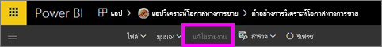
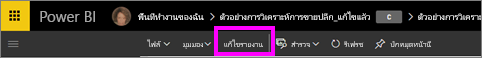
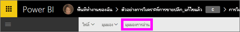

# มุมมองการอ่านและมุมมองการแก้ไขในรายงานบริการ Power BI
ในบริการ Power BI (ไม่ใช่ Power BI Desktop) จะมีสองโหมดสำหรับดู และโต้ตอบกับรายงานคือ มุมมองการอ่าน และมุมมองการแก้ไข มุมมองการอ่านจะพร้อมใช้งานสำหรับผู้ใช้ทั้งหมด และได้รับการออกแบบมาสำหรับ*ผู้ใช้*ข้อมูลโดยเฉพาะ ส่วนมุมมองการแก้ไขจะพร้อมใช้งานสำหรับ*ผู้สร้าง*และเจ้าของรายงานเท่านั้น

## มุมมองการอ่านรายงาน

 มุมมองการอ่านคือสิ่งที่จะช่วยให้คุณทำการสำรวจ และโต้ตอบกับรายงาน ซึ่งเป็นวิธีที่สนุกสนานและปลอดภัยในการเล่น และทำความรู้จักกับข้อมูลของคุณ มุมมองการอ่านได้รับการออกแบบมาสำหรับ*ผู้ใช้*รายงานที่เปิดรายงานจากแอป หรือที่มีการแบ่งปันรายงาน[กับผู้ใช้รายงาน](../service-share-dashboards.md) มุมมองการอ่านช่วยให้แน่ใจว่า ผู้ใช้ทุกรายของแต่ละรายงานจะเห็นรายงานเดียวกัน การแสดงภาพเดียวกัน และอาจมีการใช้ตัวกรองเดียวกัน  ผู้ใช้รายงานสามารถโต้ตอบกับรายงาน เปลี่ยนตัวกรองที่มีอยู่ (และการเปลี่ยนแปลงเหล่านี้จะได้รับการบันทึกกับรายงาน) แต่ไม่สามารถเพิ่มตัวกรองใหม่ได้

> [!NOTE]
> ในบางกรณี ผู้ใช้รายงานอาจเห็นข้อมูลที่ต่างกันเนื่องจากมีระดับการรักษาความปลอดภัยต่ำและสิทธิ์ในการเข้าถึงข้อมูล

## มุมมองการแก้ไขรายงาน

มุมมองการแก้ไขพร้อมใช้งานสำหรับผู้สร้างรายงาน หรือ[เจ้าของรายงานร่วมในฐานะสมาชิกหรือผู้ดูแลของพื้นที่ทำงานแอป](../service-create-distribute-apps.md)

มุมมองการแก้ไขได้รับการออกแบบมาสำหรับผู้สร้าง*รายงาน* ซึ่งเป็นที่สำหรับให้ผู้สร้างรายงานดำเนินการนำเข้าและเชื่อมต่อกับชุดข้อมูล สำรวจข้อมูล และสร้างรายงานและแดชบอร์ด ในมุมมองการแก้ไข*ผู้สร้างรายงาน*สามารถเจาะลึกลงในข้อมูลของพวกเขามากยิ่งขึ้นได้โดยการเพิ่มและเอาเขตข้อมูลออก เปลี่ยนชนิดการแสดงภาพ สร้างการแสดงภาพใหม่ และเพิ่มและลบการแสดงภาพและหน้าจากรายงาน ผู้สร้างรายงานสามารถแบ่งปันรายงานที่พวกเขาสร้างกับเพื่อนร่วมงาน

## มุมมองการอ่านและมุมมองการแก้ไข
แผนภูมินี้ไม่ได้แสดงรายการความสามารถของรายงานทั้งหมดของบริการ Power BI! แต่แสดงเฉพาะงานรายงานที่ไม่พร้อมใช้งานใน**ทั้ง**มุมมองการอ่าน และมุมมองการแก้ไข

|งาน  | มุมมองการอ่าน  | มุมมองการแก้ไข |
|-------------------------|-------|-------|
|**รายงานโดยทั้งหมด**  |
| [สร้างและแก้ไขรายงาน](../service-report-create-new.md) | ไม่ใช่  | ใช่ |
| [แชร์รายงาน](../service-share-reports.md)| ใช่ | ใช่ และยังสามารถจัดการสิทธิ์ รวมถึงการให้สิทธิ์*ความเป็นเจ้าของ*กับผู้อื่น |
| [สร้างระดับวิชวล ตัวเจาะเข้าถึงรายละเอียด ระดับหน้า และตัวกรองระดับรายงานจากบานหน้าต่างตัวกรองแบบถาวร (ถาวร)](../power-bi-report-add-filter.md) | ไม่ใช่  | ใช่ |
| [ใช้บานหน้าต่างตัวกรองรายงาน](end-user-report-filter.md) | ใช่ คุณสามารถใช้ตัวกรองที่มีอยู่ และสามารถบันทึกการเปลี่ยนแปลงกับรายงาน แต่ไม่สามารถเพิ่มตัวกรองใหม่ | ใช่ |
| [ใช้บานหน้าต่างการวิเคราะห์รายงาน](../service-analytics-pane.md) | ไม่ใช่ | ใช่ |
| [ตัวเลือก**มุมมอง**รายงาน](../power-bi-report-display-settings.md) | ใช่ มีข้อยกเว้นบางอย่าง | ใช่ ทั้งหมด รวมถึงเส้นตาราง จัดชิด และล็อก |
| [สร้างกำหนดการรีเฟรช](../refresh-data.md) | ไม่ใช่  | ใช่ |
| [สมัครใช้งานรายงาน](end-user-subscribe.md) | ใช่ | ไม่ใช่ |
| [ถามตอบ - ถามคำถามในรายงาน](end-user-q-and-a.md) | ไม่ใช่  | ใช่ |
| [ดูเมตริกการใช้ ](../service-usage-metrics.md) | ใช่ ในพื้นที่รายงาน | ใช่ ในรายการของรายงาน (มุมมองเนื้อหา) |
| [ดูรายการที่เกี่ยวข้อง](end-user-related.md) | ใช่ ในพื้นที่รายงาน | ใช่ ในรายการของรายงาน (มุมมองเนื้อหา) |
| [บันทึกรายงาน](../service-report-save.md) | ใช่ แต่ใช้**บันทึกเป็น**เท่านั้น | ใช่ |
| [ลบรายงาน](../service-delete.md) | ไม่ใช่  | ใช่ |
|**หน้ารายงาน** |
| [เพิ่ม หรือเปลี่ยนชื่อหน้ารายงาน](../power-bi-report-add-page.md)  | ไม่ใช่  | ใช่  |
| [ทำซ้ำหน้ารายงาน](../power-bi-report-copy-paste-page.md) | ไม่ใช่  | ใช่ |
| [ลบหน้ารายงาน](../service-delete.md) | ไม่ใช่ | ใช่ |
|**ทำงานกับการแสดงภาพรายงาน**|
| [เพิ่มการแสดงภาพในรายงาน](../visuals/power-bi-report-add-visualizations-i.md) | ไม่ใช่  | ใช่ |
| [เพิ่มกล่องข้อความและรูปร่างในรายงาน](../power-bi-reports-add-text-and-shapes.md) | ไม่ใช่  | ใช่ |
| [ใช้บานหน้าต่างการจัดรูปแบบรายงาน](../service-the-report-editor-take-a-tour.md) | ไม่ใช่ | ใช่ |
| [ตั้งค่าการโต้ตอบกับภาพ](end-user-interactions.md) | ไม่ใช่  | ใช่ |
| [แสดงข้อมูลที่ใช้ในการสร้างการแสดงภาพ](end-user-show-data.md) | ไม่ใช่  | ใช่ |
| [กำหนดค่าตัวเจาะเข้าถึงรายละเอียด](end-user-drill.md) | ไม่ใช่  | ใช่ |
| [เปลี่ยนการแสดงภาพที่ใช้](../visuals/power-bi-report-change-visualization-type.md) | ไม่ใช่ | ใช่|
| [ลบการแสดงภาพ กล่องข้อความ หรือรูปร่าง](../service-delete.md)| ไม่ใช่ | ใช่ |

## ย้ายไปมาระหว่างมุมมองการแก้ไขและมุมมองการอ่าน
โปรดอย่าลืมว่ามีเพียงผู้สร้างรายงานและเจ้าของรายงานเท่านั้นที่จะสามารถเปิดรายงานในมุมมองการแก้ไข

1. โดยปกติแล้วรายงานจะเปิดขึ้นในมุมมองการอ่าน ตามค่าเริ่มต้น ถ้าคุณเห็นตัวเลือกสำหรับ**แก้ไขรายงาน**หมายความว่าคุณอยู่ในมุมมองการอ่าน ถ้า**แก้ไขรายงาน**เป็นสีเทา คุณไม่มีสิทธิ์ในการเปิดรายงานในมุมมองการแก้ไข

   

2. ถ้า**แก้ไขรายงาน**ไม่ใช่สีเทา ให้คุณเลือก ก้ไขรายงาน เพื่อเปิดรายงานในมุมมองการแก้ไข

   

   ขณะนี้รายงานอยู่ในมุมมองการแก้ไข และใช้[การตั้งค่าการแสดง](../power-bi-report-display-settings.md)เหมือนกับที่คุณใช้ล่าสุดในมุมมองการอ่าน

2. เลือก**มุมมองการอ่าน**จากแถบนำทางด้านบนเพื่อกลับไปยังมุมมองการอ่าน

    

## ขั้นตอนถัดไป
มีวิธีมากมายเพื่อตอบโต้กับรายงานในมุมมองการอ่าน เช่น การหั่นและการเจาะข้อมูลของคุณเพื่อค้นหาข้อมูลเชิงลึกและหาคำตอบสำหรับคำถาม  หัวข้อถัดไปจะอธิบาย[โต้ตอบกับรายงานในมุมมองการอ่าน](../service-interact-with-a-report-in-editing-view.md)บางอย่างอย่างละเอียด    
กลับไปยัง[รายงานใน Power BI](end-user-reports.md)    
