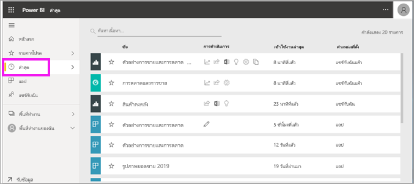
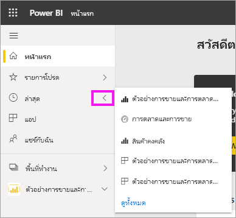
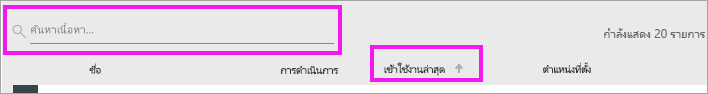

# เนื้อหา**ล่าสุด**ในบริการ Power BI
เนื้อหาล่าสุดคือรายการสุดท้ายที่คุณเข้าชมใน Power BI ไม่เกิน 20 รายการ  ซึ่งรวมถึง แดชบอร์ด รายงาน แอป และเวิร์กบุ๊ก

ให้ดู Amanda สาธิตว่ารายการ**ล่าสุด**ของบริการ Power BI นั้นเติมข้อมูลอย่างไร จากนั้นทำตามคำแนะนำแบบทีละขั้นตอนตามด้านล่างวิดีโอเพื่อลองใช้งานด้วยตัวคุณเอง

<iframe width="560" height="315" src="https://www.youtube.com/embed/G26dr2PsEpk" frameborder="0" allowfullscreen></iframe>

> [!NOTE]
> วิดีโอนี้ใช้บริการ Power BI รุ่นเก่า

## แสดงเนื้อหาล่าสุด
หากคุณต้องการดูห้ารายการที่เข้าชมล่าสุด ให้ไปยังเมนูนำทางแล้วเลือกลูกศรไปทางขวาของ**ล่าสุด**  จากที่นี่ คุณสามารถเลือกเนื้อหาล่าสุดเมื่อต้องเปิด แสดงเฉพาะห้ารายการล่าสุด

ถ้าคุณมีรายการที่เยี่ยมชมล่าสุดมากกว่าห้ารายการ ให้เลือก**ดูทั้งหมด**เพื่อเปิดหน้าจอล่าสุด คุณยังสามารถเลือก**ล่าสุด**หรือ จากแถบคำสั่งในการสืบค้นเนื้อหา

## การดำเนินการจากรายการเนื้อหา**ล่าสุด**
การดำเนินการที่คุณสามารถใช้ได้จะขึ้นอยู่กับค่าปรับตั้งที่กำหนดโดย*ผู้ออกแบบ*เนื้อหา ตัวเลือกบางส่วนของคุณอาจได้แก่
* เลือกไอคอนรูปดาวเพื่อ[ทำรายการโปรดแดชบอร์ด รายงานหรือแอป](end-user-favorite.md) 
* สามารถแชร์แดชบอร์ดหรือรายงานบางอย่างได้อีก  .
* [เปิดรายงานใน](end-user-export.md)  ของ Excel 
* [ดูข้อมูลเชิงลึก](end-user-insights.md)ที่ Power BI พบในสำหรับข้อมูลดังกล่าว
* นอกจากนี้ หากคุณมีรายการยาว [ใช้เขตข้อมูลค้นหาและการจัดเรียงเพื่อหาสิ่งที่คุณต้องการ](end-user-search-sort.md) ค้นหาว่าคอลัมน์ใดที่สามารถจัดเรียงได้โดยเลื่อนไปด้านบนเพื่อดูว่ามีลูกศรปรากฏขึ้นหรือไม่ จากตัวอย่างนี้ การเลื่อนไปที่ **เข้าใช้งานล่าสุด** จะเป็นการแสดงลูกศรขึ้นมา - ซึ่งเป็นเนื้อหาล่าสุดที่คุณสามารถจัดเรียงได้จากวันที่ใช้งาน (สืบค้น) 

    

## ขั้นตอนถัดไป
[แอปบริการของ power BI](end-user-apps.md)

มีคำถามเพิ่มเติมหรือไม่? [ลองไปที่ชุมชน Power BI](http://community.powerbi.com/)

