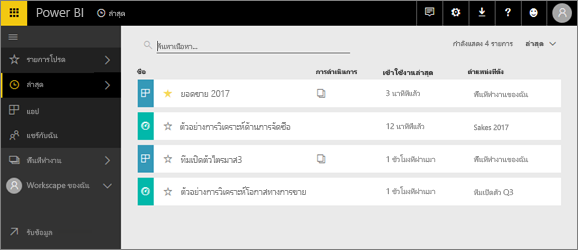
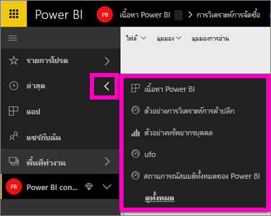
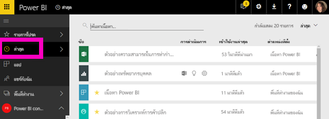

# เนื้อหา**ล่าสุด**ในบริการ Power BI
เนื้อหาล่าสุดคือรายการสุดท้ายที่คุณเข้าชมใน Power BI ไม่เกิน 20 รายการ  ซึ่งรวมถึง แดชบอร์ด รายงาน แอป และเวิร์กบุ๊กทั้งหมดของพื้นที่ทำงานของคุณ

ให้ดู Amanda สาธิตว่ารายการ**ล่าสุด**ของบริการ Power BI นั้นเติมข้อมูลอย่างไร จากนั้นทำตามคำแนะนำแบบทีละขั้นตอนตามด้านล่างวิดีโอเพื่อลองใช้งานด้วยตัวคุณเอง

<iframe width="560" height="315" src="https://www.youtube.com/embed/G26dr2PsEpk" frameborder="0" allowfullscreen></iframe>

## แสดงเนื้อหาล่าสุด
หากคุณต้องการดูห้ารายการที่เข้าชมล่าสุด ให้ไปยังเมนูนำทางด้านซ้ายมือแล้วเลือกลูกศรไปทางขวาของ**ล่าสุด**  จากที่นี่ คุณสามารถเลือกเนื้อหาล่าสุดเมื่อต้องเปิด แสดงเฉพาะห้ารายการล่าสุด

ถ้าคุณมีรายการที่เยี่ยมชมล่าสุดมากกว่าห้ารายการ ให้เลือก**ดูทั้งหมด**เพื่อเปิดหน้าจอล่าสุด (ดูด้านล่าง) คุณยังสามารถเลือก**ล่าสุด**หรือ จากเมนูด้านซ้าย

จากตรงนี่ คุณสามารถโต้ตอบกับเนื้อหาตามที่คุณต้องการบนแต่ละแทบของ[ **แดชบอร์ด**](end-user-dashboards.md), [ **รายงาน**](end-user-reports.md)และ **สมุดงาน** และบนหน้าจอ<!--[**Apps**](end-user-apps.md)--> แอป 

## ขั้นตอนถัดไป
<!--[Power BI service Apps](end-user-apps.md)-->

มีคำถามเพิ่มเติมหรือไม่? [ลองไปที่ชุมชน Power BI](http://community.powerbi.com/)

