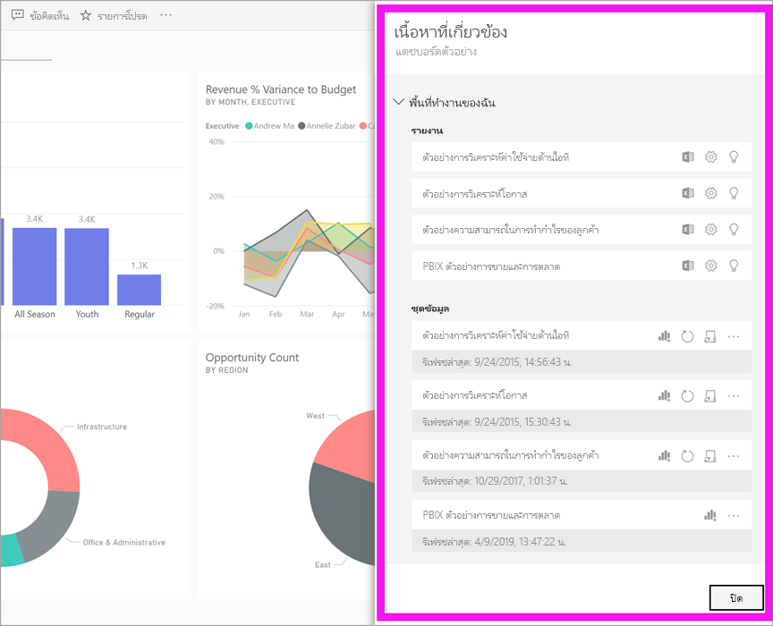
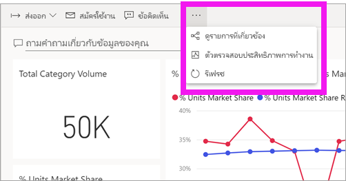
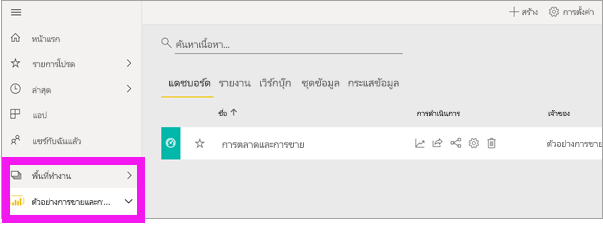
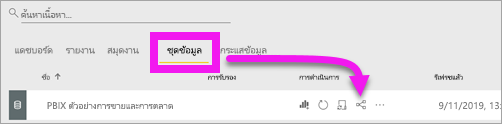
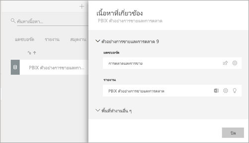

# ดูเนื้อหาที่เกี่ยวข้องในบริการ Power BI

[!INCLUDE [power-bi-service-new-look-include](../includes/power-bi-service-new-look-include.md)]

บานหน้าต่าง**เนื้อหาที่เกี่ยวข้อง**แสดงว่าเนื้อหาPower BI service แดชบอร์ด รายงาน และชุดข้อมูลของคุณเชื่อมต่อกันอย่างไร บานหน้าต่าง**เนื้อหาที่เกี่ยวข้อง**จะเป็นเสมือนจุดเริ่มต้นในการดำเนินการ จากที่นี่คุณสามารถทำสิ่งต่างๆเช่นเปิดแดชบอร์ดเปิดรายงานสร้างข้อมูลเชิงลึกวิเคราะห์ข้อมูลใน Excel และอื่นๆ อีกมากมาย  

Power BI จะดำเนินการรายงานบนชุดข้อมูล ภาพรายงานจะปักหมุดไว้บนแดชบอร์ด และภาพบนแดชบอร์ดนั้นจะเชื่อมโยงกลับไปยังการรายงาน แต่คุณจะรู้ได้อย่างไรว่าแดชบอร์ดใดที่คอยจัดการดูแลภาพจากรายงานทางการตลาดของคุณ และคุณจะค้นหาแดชบอร์ดเหล่านั้นได้อย่างไร แดชบอร์ดการจัดซื้อของคุณกำลังใช้งานภาพจากชุดข้อมูลมากกว่าหนึ่งชุดหรือไม่ ถ้าเป็นเช่นนั้น พวกเขาตั้งชื่ออะไร และวิธีสามารถเปิดและแก้ไขเอกสารนั้นได้อย่างไร ชุดข้อมูล HR ของคุณกำลังถูกใช้งานในการรายงานหรือบอร์ดใดหรือไม่ หรือ มันสามารถถูกเคลื่อนย้ายโดยไม่ส่งผลกระทบต่อลิงก์ต่าง ๆ ได้ไหม คำถามเหล่านี้ทั้งหมดสามารถได้รับการตอบบนบานหน้าต่าง**เนื้อหาที่เกี่ยวข้อง**  บานหน้าต่างนี้ไม่เพียงแต่แสดงเนื้อหาที่เกี่ยวข้อง ทว่ายังอนุญาตให้คุณดำเนินการกับเนื้อหา และเปิดเนื้อหาที่เกี่ยวข้องได้อย่างง่ายดายอีกด้วย

> [!NOTE]
> ลักษณะการทำงานเนื้อหาที่เกี่ยวข้องไม่สามารถใช้งานได้สำหรับชุดข้อมูลแบบสตรีม
> 
> 

## ดูเนื้อหาที่เกี่ยวข้องของแดชบอร์ดหรือรายงาน
ดูเนื้อหาที่เกี่ยวข้องของแดชบอร์ด จากนั้นให้ทำตามขั้นตอนด้านล่างวิดีโอแบบขั้นต่อขั้น เพื่อลองด้วยตนเองโดยใช้ชุดข้อมูลตัวอย่างการวิเคราะห์การจัดซื้อ

<iframe width="560" height="315" src="https://www.youtube.com/embed/B2vd4MQrz4M#t=3m05s" frameborder="0" allowfullscreen></iframe>

หากต้องการเปิดแดชบอร์ดหรือรายงาน ให้เลือก **ตัวเลือกเพิ่มเติม** (...) ในแถบเมนูและเลือก**มุมมองที่เกี่ยวข้อง**จากรายการแบบดรอปดาวน์

บานหน้าต่าง**เนื้อหาที่เกี่ยวข้อง**เปิดขึ้น สำหรับแดชบอร์ดซึ่งแสดงรายงานทั้งหมดที่มีการแสดงภาพที่ปักหมุดที่แดชบอร์ดและชุดข้อมูลที่เชื่อมโยงของพวกเขา สำหรับแดชบอร์ดนี้มีการแสดงภาพที่ปักหมุดจากรายงานเดียวเท่านั้นและรายงานดังกล่าวจะยึดตามชุดข้อมูลเดียวเท่านั้น 

จากที่นี่ คุณสามารถดำเนินการโดยตรงกับเนื้อหาที่เกี่ยวข้อง  ตัวอย่างเช่น เลือกชื่อรายงานหรือแดชบอร์ดเพื่อเปิด  สำหรับรายงานที่แสดงในรายการ ให้เลือกไอคอนเพื่อ[วิเคราะห์ใน Excel](../service-analyze-in-excel.md) หรือ[รับข้อมูลเชิงลึก](end-user-insights.md) สำหรับชุดข้อมูลคุณสามารถดูวันที่และเวลารีเฟรชล่าสุด[วิเคราะห์ใน Excel](../service-analyze-in-excel.md)และ[รับข้อมูลเชิงลึกได้](end-user-insights.md)  

## ดูเนื้อหาที่เกี่ยวข้องกับชุดข้อมูล
คุณจะต้องใช้อย่างน้อย สิทธิ์*ดู*เพื่อเปิดบานหน้าต่าง**เนื้อหาที่เกี่ยวข้อง** ในตัวอย่างนี้ เราใช้[ตัวอย่างการวิเคราะห์การจัดซื้อ](../sample-procurement.md)

จากหน้าต่างนำทางให้ค้นหาหัวข้อ**Workspaces**เพื้นที่ทำงานและเลือกพื้นที่ดำเนินการจากรายการ ถ้าคุณมีเนื้อหาในพื้นที่ทำงานแอปจะแสดงใน canvas ทางด้านขวา 

ในพื้นที่ทำงาน ให้เลือกแท็บ**ชุดข้อมูล** และเลือกไอคอน**ที่เกี่ยวข้องกับมุมมอง**

เลือกไอคอนเพื่อเปิดบานหน้าต่าง**เนื้อหาที่เกี่ยวข้อง**

จากที่นี่ คุณสามารถดำเนินการโดยตรงกับเนื้อหาที่เกี่ยวข้อง ตัวอย่างเช่น เลือกชื่อแดชบอร์ดหรือรายงานเมื่อต้องการเปิด  สำหรับแดชบอร์ดใด ๆ ในรายการ ให้เลือกไอคอนเพื่อ[แชร์ แดชบอร์ดกับผู้อื่น](../service-share-dashboards.md) หรือเปิดหน้าต่าง**การตั้งค่า**สำหรับแดชบอร์ด สำหรับรายงาน ให้เลือกไอคอนเพื่อ[วิเคราะห์ใน Excel](../service-analyze-in-excel.md)[เปลี่ยนชื่อ](../service-rename.md)หรือ[รับข้อมูลเชิงลึก](end-user-insights.md)  

## ข้อจำกัดและการแก้ไขปัญหา
* ถ้าคุณไม่เห็น "มุมมองที่เกี่ยวข้อง" โปรดค้นหาแทน เลือกไอคอนเพื่อเปิดบานหน้าต่าง**เนื้อหาที่เกี่ยวข้อง**
* เมื่อต้องเปิดเนื้อหาที่เกี่ยวข้องสำหรับรายงาน คุณจำเป็นต้องอยู่ใน[มุมมองการอ่าน](end-user-reading-view.md)
* คุณสมบัติของเนื้อหาที่เกี่ยวข้องไม่สามารถใช้งานกับชุดข้อมูลแบบสตรีมได้

## ขั้นตอนถัดไป
* [เริ่มต้นใช้งานบริการ Power BI](../service-get-started.md)
* มีคำถามเพิ่มเติมหรือไม่ [ลองไปที่ชุมชน Power BI](https://community.powerbi.com/)

