# สำรวจภาพรวมของบานหน้าต่างตัวกรองรายงาน
บทความนี้จะอธิบายหน้าต่างตัวกรองรายงานแบบเชิงลึก คุณจะเห็นบานหน้าต่างใน[มุมมองการแก้ไขและมุมมองการอ่าน ower BI ](end-user-reading-view.md)และใน[มุมมองรายงาน Power BI Desktop](../desktop-report-view.md)

การกรองข้อมูลใน Power BI มีหลายวิธี และเราขอแนะนำให้อ่าน[เกี่ยวกับตัวกรองและการไฮไลท์](../power-bi-reports-filters-and-highlighting.md)ก่อน

## สำรวจภาพบานหน้าต่างตัวกรองรายงาน
ใน Power BI Desktop รายงานจะเปิดในมุมมองรายงาน ใน Power BI service รายสามารถเปิดใน [มุมมองการอ่านและการแก้ไข](end-user-reading-view.md) ในมุมมองการแก้ไข และ ในมุมมองรายงานของเดสท็อป เจ้าของรายงานสามารถ[เพิ่มตัวกรองไปใช้กับรายงาน](../power-bi-report-add-filter.md) และตัวกรองเหล่านั้นจะถูกบันทึกไว้กับรายงาน คนที่กำลังดูที่รายงานในมุมมองการอ่าน สามารถโต้ตอบกับตัวกรองและบันทึกการเปลี่ยนแปลงได้ แต่ไม่สามารถเพิ่มตัวกรองใหม่ในรายงาน

ใน Power BI service รายงานเก็บการเปลี่ยนแปลงที่คุณทำในบานหน้าต่างตัวกรอง และการเปลี่ยนแปลงเหล่านั้นจะดำเนินการได้ผ่านรายงานสำหรับอุปกรณ์เคลื่อน เมื่อต้องการรีเซ็ตบานหน้าต่างตัวกรองเป็นค่าเริ่มต้นของผู้สร้าง เลือก**รีเซ็ตให้เป็นค่าเริ่มต้น**จากแถบเมนูด้านบน     

## เปิดพื้นที่ตัวกรอง
เมื่อรายงานถูกเปิด บานหน้าต่างตัวกรองแสดงตามแนวทางด้านขวาของพื้นที่รายงาน ถ้าคุณไม่เห็นบานหน้าต่างตัวกรอง เลือกมุมขวาบนเพื่อขยาย ถ้าคุณอยู่ในมุมมองการอ่านของ Power BI service บานหน้าต่างเดียวใช้งานได้ทางด้านขวาคือบานหน้าต่างตัวกรอง

ในตัวอย่างนี้ เราได้เลือกภาพที่มีตัวกรอง 6 ตัว หน้ารายงานยังมีตัวกรอง แสดงรายการภายใต้หัวเรื่อง**หน้าระดับตัวกรอง** มีเพียง[ตัวกรอง Drillthrough](../power-bi-report-add-filter.md) หนึ่งตัว และรายงานทั้งหมดมีตัวกรอง **FiscalYear** 2013 หรือ 2014 เช่นเดียวกัน

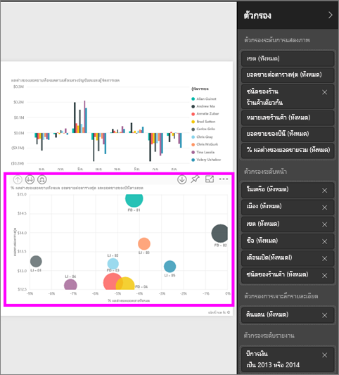

ตัวกรองบางตัวมีคำว่า**ทั้งหมด**ถัดจากพวกมันและซึ่งหมายความว่าค่าทั้งหมดจะถูกรวมอยู่ในตัวกรอง  ตัวอย่างเช่น**Chain(All)** ในสกรีนช็อตด้านล่าง ซึ่งบอกเราว่าหน้ารายงานนี้มีข้อมูลเกี่ยวกับห่วงโซ่ของร้านทั้งหมด  ในทางกลับกัน ตัวกรองระดับรายงาน**FiscalYear เป็น 2013 หรือ 2014**บอกเราว่า รายงานมีข้อมูลสำหรับปีงบประมาณ 2013 และ 2014 เท่านั้น

ทุกคนที่ดูรายงานนี้สามารถโต้ตอบกับตัวกรองเหล่านี้

* ดูรายละเอียดของตัวกรอง โดยการวางเคอร์เซอร์แล้วเลือกลูกศรถัดจากตัวกรอง
  
   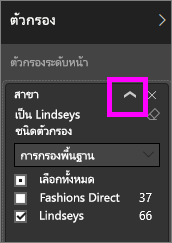
* เปลี่ยนตัวกรอง ตัวอย่างเช่น เปลี่ยน**Lindseys**เป็น**Fashions Direct**
  
     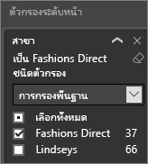

* รีเซ็ตตัวกรองเป็นแบบเดิม โดยการเลือก**รีเซ็ตเป็นค่าเริ่มต้น**จากแถบเมนูด้านบน    
    
    
* ลบตัวกรอง โดยการเลือก**x**ถัดจากชื่อตัวกรอง
  
  ลบตัวกรองออกจากรายการ แต่ไม่ลบข้อมูลจากรายงาน  ตัวอย่างเช่น ถ้าคุณลบตัวกรอง**FiscalYear คือ 2013 หรือ 2014** ข้อมูลปีงบประมาณจะยังคงอยู่ในรายงาน แต่จะไม่มีสามารถกรองข้อมูลเพื่อแสดง 2013 และ 2014 เท่านั้น ซึ่งจะแสดงปีงบประมาณทั้งหมดที่มีข้อมูล  อย่างไรก็ตาม เมื่อคุณลบตัวกรอง คุณจะไม่สามารถปรับเปลี่ยนอีก เนื่องจากจะถูกนำออกจากรายการ มีตัวเลือกที่ดีกว่าคือการ ล้างตัวกรองโดยการเลือกไอคอนยางลบ
  
  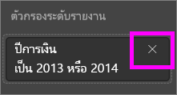

## ตัวกรองในมุมมองการแก้ไข
เมื่อรายงานถูกเปิดในเดสก์ท็อป หรือในมุมมองการแก้ไขของ Power BI service บานหน้าต่างตัวกรองแสดงที่ขอบด้านขวาของพื้นที่รายงาน ในด้านล่างครึ่งหนึ่งของ**บานหน้าต่างการแสดงภาพ** ถ้าคุณไม่เห็นบานหน้าต่างตัวกรอง เลือกมุมขวาบนเพื่อขยาย

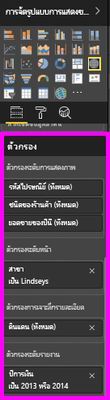  

ถ้าไม่มีภาพที่ถูกเลือกในพื้นที่ แล้วบานหน้าต่างตัวกรองแสดงเพียงตัวกรองที่นำไปใช้กับหน้ารายงานหรือรายงานทั้งหมด และตัวกรองแบบลงรายละเอียดใดๆ (ถ้ามีการตั้งค่า) ในตัวอย่างด้านล่างรูปภาพไม่ถูกเลือก และไม่มีรูปภาพที่ถูกเลือกและไม่มีตัวกรองระดับหน้าหรือกรองแบบลงรายละเอียด แต่ไม่มีตัวกรองระดับรายงาน  

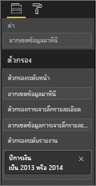  

ถ้าภาพที่ถูกเลือกอยู่ในพื้นที่แก้ไข คุณจะเห็นตัวกรองที่ใช้เฉพาะกับภาพนั้น   

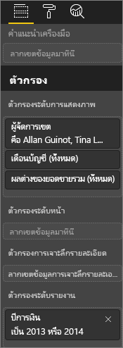

เพื่อแสดงตัวเลือกสำหรับตัวกรองเฉพาะ ให้เลือกลูกศรด้านล่างถัดจากชื่อตัวกรอง  ในตัวอย่างด้านล่าง ตัวกรองระดับรายงานถูกตั้งค่าเป็น 2013 และ 2014 และนี่คือตัวอย่างของ**การกรองพื้นฐาน**  เมื่อต้องการแสดงตัวเลือกขั้นสูง เลือก**การกรองขั้นสูง**

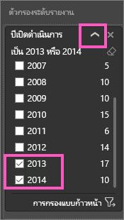

## ล้างตัวกรอง
 ไม่ว่าในขั้นสูงหรือโหมดการกรองพื้นฐาน ให้เลือกไอคอนยางลบเมื่อต้องล้างตัวกรอง 

## เพิ่มตัวกรอง
* ในเดสก์ท็อป แล ในมุมมองการแก้ไข Power BI service เพิ่มตัวกรองในรูปภาพ หน้า การลงรายละเอียดหรือรายงาน โดยการเลือกเขตข้อมูลจากบานหน้าต่าง Fields แล้วลากลงในตัวกรองที่เหมาะสม ในตำแหน่งที่คุณเห็นคำว่า**ลากเขตข้อมูลที่นี่** เมื่อมีการเพิ่มเขตข้อมูลเป็นตัวกรอง ปรับแต่งโดยใช้การกรองพื้นฐานและตัวควบคุมการกรองขั้นสูง (อธิบายไว้ด้านล่าง)

* **ลากเขตข้อมูลใหม่ลงในพื้นที่ตัวกรองระดับภาพ แย่าเพิ่มเขตข้อมูลนั้นลงในรูปภาพ**แต่อนุญาตให้คุณสามารถกรองภาพ ด้วยเขตข้อมูลใหม่นี้ ในตัวอย่างด้านล่าง**ห่วงโซ่**ถูกเพิ่มเป็นตัวกรองใหม่ลงในภาพ โปรดสังเกตว่า แค่เพิ่ม**ห่วงโซ่**เป็นตัวกรองไม่ได้เปลี่ยนแปลงภาพจนกว่าคุณจะใช้ตัวควบคุมการกรองขั้นพื้นฐานหรือขั้นสูง

    

* เขตข้อมูลทั้งหมดที่ถูกใช้เพื่อสร้างการแสดงภาพยังใช้งานเป็นตัวกรองได้ เลือกการแสดงภาพที่ได้งานได้ก่อน เขตข้อมูลที่ใช้ภายในรูปภาพแสดงอยู่ในบานหน้าต่างการแสดงภาพ และในบานหน้าต่างตัวกรองภายใต้หัวเรื่อง**ตัวกรองระดับการมองเห็น**
  
   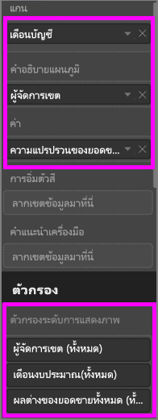  
  
   การปรับแต่งใดๆ ของเขตข้อมูลโดยใช้ตัวควบคุมการกรองพื้นฐานและขั้นสูงเหล่านี้(ตามอธิบายไว้ด้านล่าง)

## ชนิดของตัวกรอง ตัวกรองเขตข้อมูลตัวอักษร
### โหมดรายการ
เลือกกล่องกาเครื่องหมายหรือยกเลิกเลือกค่า สามารถใช้กล่องกาเครื่องหมาย**ทั้งหมด**เพื่อสลับสถานะของกล่องกาเครื่องหมายทั้งหมด เป็นเปิดหรือปิด กล่องกาเครื่องหมายแสดงค่าที่พร้อมใช้งานทั้งหมดสำหรับเขตข้อมูลนั้น  เมื่อคุณปรับตัวกรอง การปรับปรุงย้อนหลังเพื่อแสดงตัวเลือกของคุณ 

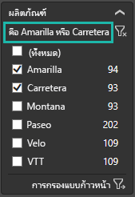

ให้ตั้งใจดูวิธีการปรับย้อนหลัง ตอนนี้กล่าวว่า "is Amarilla or Carretera"

### โหมดขั้นสูง
เลือก**กรองขั้นสูง**เมื่อต้องสลับไปยังโหมดขั้นสูง ใช้ตัวควบคุมดร๊อปดาวน์และกล่องข้อความเพื่อระบุเขตข้อมูลที่จะรวม โดยการเลือกระหว่าง**And**และ**Or** คุณสามารถสร้างนิพจน์ตัวกรองที่ซับซ้อนได้ เลือกปุ่ม**ใช้ตัวกรอง** เมื่อคุณได้ตั้งค่าคุณต้องการ  

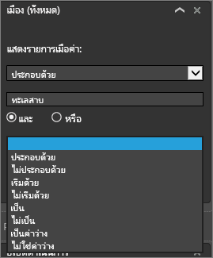

## ชนิดของตัวกรอง ตัวกรองเขตข้อมูลตัวเลข
### โหมดรายการ
ถ้าเป็นจำนวนจำกัด โดยเลือกชื่อเขตข้อมูลที่แสดงรายการ  ดู**ตัวกรองเขตข้อมูลข้อความ** &gt; **โหมดรายการ**ด้านบนสำหรับความช่วยเหลือในการใช้กล่องกาเครื่องหมาย   

### โหมดขั้นสูง
ถ้าไม่เป็นจำนวนจำกัด หรือแสดงช่วง การเลือกชื่อเขตข้อมูลเปิดในโหมดตัวกรองขั้นสูงขึ้น ใช้กล่องดร๊อปดาวน์และข้อความเพื่อระบุช่วงของค่าที่คุณต้องการดู 

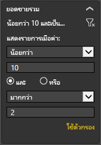

โดยการเลือกระหว่าง**And**และ**Or** คุณสามารถสร้างนิพจน์ตัวกรองที่ซับซ้อนได้ เลือกปุ่ม**ใช้ตัวกรอง** เมื่อคุณได้ตั้งค่าคุณต้องการ

## ชนิดของตัวกรอง วันที่และเวลา
### โหมดรายการ
ถ้าเป็นจำนวนจำกัด โดยเลือกชื่อเขตข้อมูลที่แสดงรายการ  ดู**ตัวกรองเขตข้อมูลข้อความ** &gt; **โหมดรายการ**ด้านบนสำหรับความช่วยเหลือในการใช้กล่องกาเครื่องหมาย   

### โหมดขั้นสูง
ถ้าค่าเขตข้อมูลจะแสดงวันที่หรือเวลา คุณสามารถระบุเวลาเริ่มต้น/สิ้นสุดเมื่อใช้ตัวกรองวันที่/เวลา  

## ขั้นตอนถัดไป
[ตัวกรองและการทำไฮไลท์ในรายงาน](../power-bi-reports-filters-and-highlighting.md)  
[โต้ตอบกับตัวกรองและการเน้นในมุมมองการอ่านรายงาน](end-user-reading-view.md)  
[สร้างตัวกรองในมุมมองการแก้ไขรายงาน](../power-bi-report-add-filter.md)  
[เปลี่ยนวิธีที่่ภาพรายงานกรองแบบไขว้ และข้ามไฮไลท์ของแต่ละตัว](end-user-interactions.md)

อ่านเพิ่มเติมเกี่ยวกับ[รายงานใน Power BI](end-user-reports.md)  
[Power BI แนวคิดพื้นฐาน](end-user-basic-concepts.md)

มีคำถามเพิ่มเติมหรือไม่ [ลองไปที่ชุมชน Power BI](http://community.powerbi.com/)

