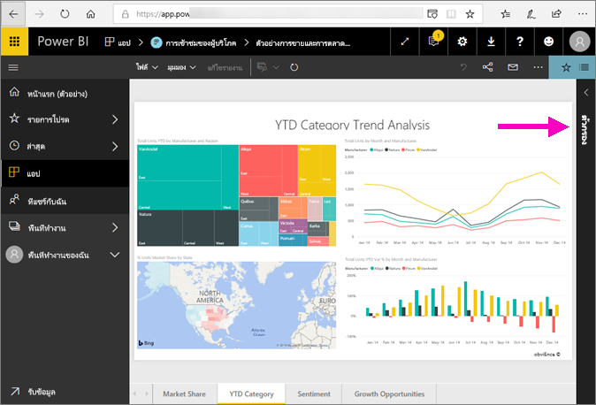
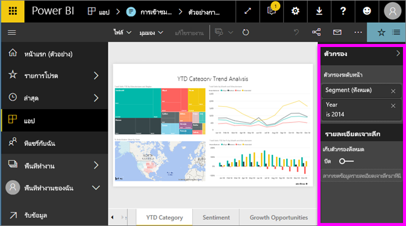
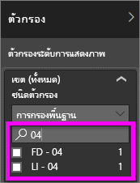

# สำรวจภาพรวมของบานหน้าต่างตัวกรองรายงาน
บทความนี้จะอธิบายหน้าต่างตัวกรองรายงานในบริการของ Power BI

การกรองข้อมูลใน Power BI มีหลายวิธี และเราขอแนะนำให้อ่าน[เกี่ยวกับตัวกรองและการไฮไลท์](../power-bi-reports-filters-and-highlighting.md)ก่อน

## สำรวจภาพบานหน้าต่างตัวกรองรายงาน
เมื่อเพื่อนร่วมงานแชร์รายงานกับคุณ ให้แน่ใจว่าได้ดูบานหน้าต่าง**ตัวกรอง** ในบางครั้งจะถูกยุบตามขอบด้านขวาของรายงาน เลือกเพื่อขยาย   

บานหน้าต่างตัวกรองประกอบด้วยตัวกรองที่เพิ่มลงในรายงานโดย*นักออกแบบ*รายงาน *ผู้ใช้*ผู้ใช้แบบคุณสามารถโต้ตอบกับตัวกรองและบันทึกการเปลี่ยนแปลงได้ แต่ไม่สามารถเพิ่มตัวกรองใหม่ในรายงาน ตัวอย่างเช่น สกรีนช็อตด้านบนตัวออกแบบได้เพิ่มตัวกรองระดับเพจสองตัวกรอง: เซ็กเมนต์และปี คุณสามารถโต้ตอบ และเปลี่ยนตัวกรองเหล่านี้ แต่คุณไม่สามารถเพิ่มตัวกรองระดับหน้าตัวที่สามได้

ใน Power BI service รายงานเก็บการเปลี่ยนแปลงที่คุณทำในบานหน้าต่างตัวกรอง และการเปลี่ยนแปลงเหล่านั้นจะดำเนินการได้ผ่านรายงานสำหรับอุปกรณ์เคลื่อน รีเซ็ตบานหน้าต่างตัวกรองเป็นค่าเริ่มต้นของนักออกแบบ โดยเลือก**รีเซ็ตให้เป็นค่าเริ่มต้น**จากแถบเมนูด้านบน     

## เปิดพื้นที่ตัวกรอง
เมื่อรายงานถูกเปิด บานหน้าต่างตัวกรองแสดงตามแนวทางด้านขวาของพื้นที่รายงาน ถ้าคุณไม่เห็นบานหน้าต่างตัวกรอง เลือกมุมขวาบนเพื่อขยาย  

ในตัวอย่างนี้ เราได้เลือกภาพที่มีตัวกรอง 6 ตัว หน้ารายงานยังมีตัวกรอง แสดงรายการภายใต้หัวเรื่อง**หน้าระดับตัวกรอง** มีเพียง[ตัวกรอง Drillthrough](../power-bi-report-add-filter.md) หนึ่งตัว และรายงานทั้งหมดมีตัวกรอง **FiscalYear** 2013 หรือ 2014 เช่นเดียวกัน

ตัวกรองบางตัวมีคำว่า**ทั้งหมด**ถัดจากพวกมันและซึ่งหมายความว่าค่าทั้งหมดจะถูกรวมอยู่ในตัวกรอง  ตัวอย่างเช่น **Chain(All)** ในสกรีนช็อตด้านบนบอกเราว่า หน้ารายงานนี้มีข้อมูลเกี่ยวกับห่วงโซ่ร้านค้าทั้งหมด  ในทางกลับกัน ตัวกรองระดับรายงาน**FiscalYear เป็น 2013 หรือ 2014**บอกเราว่า รายงานมีข้อมูลสำหรับปีงบประมาณ 2013 และ 2014 เท่านั้น

ทุกคนที่ดูรายงานนี้สามารถโต้ตอบกับตัวกรองเหล่านี้

- ค้นหาในหน้า ภาพ รายงาน และตัวกรอง Drillthrough เพื่อค้นหาและเลือกค่าที่คุณต้องการ 

    

- ดูรายละเอียดของตัวกรอง โดยการวางเคอร์เซอร์แล้วเลือกลูกศรถัดจากตัวกรอง
  
   
* เปลี่ยนตัวกรอง ตัวอย่างเช่น เปลี่ยน**Lindseys**เป็น**Fashions Direct**
  
     

* รีเซ็ตตัวกรองเป็นแบบเดิม โดยการเลือก**รีเซ็ตเป็นค่าเริ่มต้น**จากแถบเมนูด้านบน    
    
    
* ลบตัวกรอง โดยการเลือก**x**ถัดจากชื่อตัวกรอง
  
    

  ลบตัวกรองออกจากรายการ แต่ไม่ลบข้อมูลจากรายงาน  ตัวอย่างเช่น ถ้าคุณลบตัวกรอง**FiscalYear คือ 2013 หรือ 2014** ข้อมูลปีงบประมาณจะยังคงอยู่ในรายงาน แต่จะไม่มีสามารถกรองข้อมูลเพื่อแสดง 2013 และ 2014 เท่านั้น ซึ่งจะแสดงปีงบประมาณทั้งหมดที่มีข้อมูล  อย่างไรก็ตาม เมื่อคุณลบตัวกรอง คุณจะไม่สามารถปรับเปลี่ยนอีก เนื่องจากจะถูกนำออกจากรายการ ตัวเลือกที่ดีกว่าคือการล้างตัวกรองโดยการเลือกไอคอนยางลบ 
  
  

## ล้างตัวกรอง
 ไม่ว่าในโหมดการกรองขั้นสูงหรือพื้นฐาน เลือกไอคอนยางลบ   เมื่อต้องล้างตัวกรอง 

## ชนิดของตัวกรอง ตัวกรองเขตข้อมูลตัวอักษร
### โหมดรายการ
เลือกกล่องกาเครื่องหมายหรือยกเลิกเลือกค่า สามารถใช้กล่องกาเครื่องหมาย**ทั้งหมด**เพื่อสลับสถานะของกล่องกาเครื่องหมายทั้งหมด เป็นเปิดหรือปิด กล่องกาเครื่องหมายแสดงค่าที่พร้อมใช้งานทั้งหมดสำหรับเขตข้อมูลนั้น  เมื่อคุณปรับตัวกรอง การปรับปรุงย้อนหลังเพื่อแสดงตัวเลือกของคุณ 

โปรดทราบว่าคำสั่งใหม่ในตอนนี้จะระบุ "เป็น มี.ค. เม.ย. หรือพ.ค."

### โหมดขั้นสูง
เลือก**กรองขั้นสูง**เมื่อต้องสลับไปยังโหมดขั้นสูง ใช้ตัวควบคุมดร๊อปดาวน์และกล่องข้อความเพื่อระบุเขตข้อมูลที่จะรวม โดยการเลือกระหว่าง**And**และ**Or** คุณสามารถสร้างนิพจน์ตัวกรองที่ซับซ้อนได้ เลือกปุ่ม**ใช้ตัวกรอง** เมื่อคุณได้ตั้งค่าคุณต้องการ  

## ชนิดของตัวกรอง ตัวกรองเขตข้อมูลตัวเลข
### โหมดรายการ
ถ้าเป็นจำนวนจำกัด โดยเลือกชื่อเขตข้อมูลที่แสดงรายการ  ดู**ตัวกรองเขตข้อมูลข้อความ** &gt; **โหมดรายการ**ด้านบนสำหรับความช่วยเหลือในการใช้กล่องกาเครื่องหมาย   

### โหมดขั้นสูง
ถ้าไม่เป็นจำนวนจำกัด หรือแสดงช่วง การเลือกชื่อเขตข้อมูลเปิดในโหมดตัวกรองขั้นสูงขึ้น ใช้กล่องดร๊อปดาวน์และข้อความเพื่อระบุช่วงของค่าที่คุณต้องการดู 

โดยการเลือกระหว่าง**And**และ**Or** คุณสามารถสร้างนิพจน์ตัวกรองที่ซับซ้อนได้ เลือกปุ่ม**ใช้ตัวกรอง** เมื่อคุณได้ตั้งค่าคุณต้องการ

## ชนิดของตัวกรอง วันที่และเวลา
### โหมดรายการ
ถ้าเป็นจำนวนจำกัด โดยเลือกชื่อเขตข้อมูลที่แสดงรายการ  ดู**ตัวกรองเขตข้อมูลข้อความ** &gt; **โหมดรายการ**ด้านบนสำหรับความช่วยเหลือในการใช้กล่องกาเครื่องหมาย   

### โหมดขั้นสูง
ถ้าค่าเขตข้อมูลจะแสดงวันที่หรือเวลา คุณสามารถระบุเวลาเริ่มต้น/สิ้นสุดเมื่อใช้ตัวกรองวันที่/เวลา  

## ขั้นตอนถัดไป
[เรียนรู้วิธีที่่ภาพกรองแบบไขว้และข้ามไฮไลท์ของแต่ละตัวบนหน้ารายงาน](end-user-interactions.md)