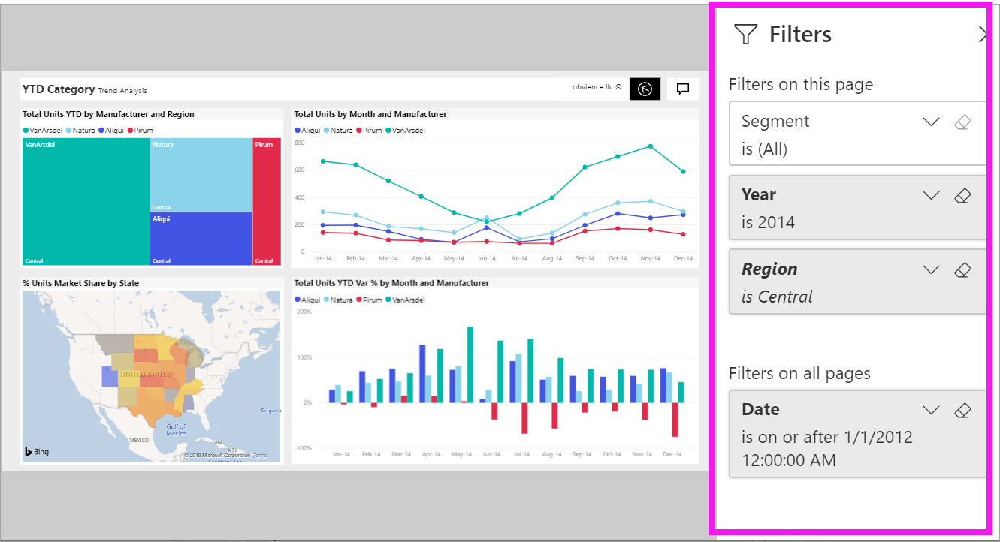
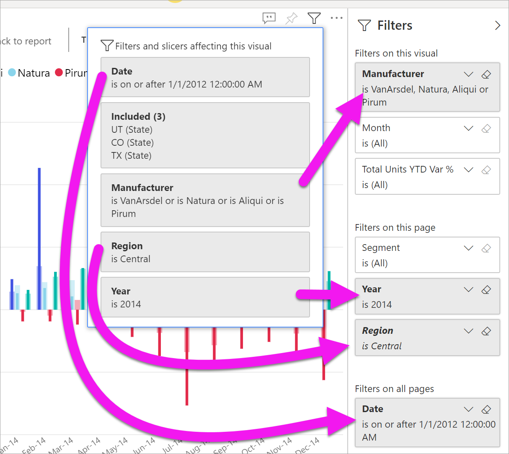
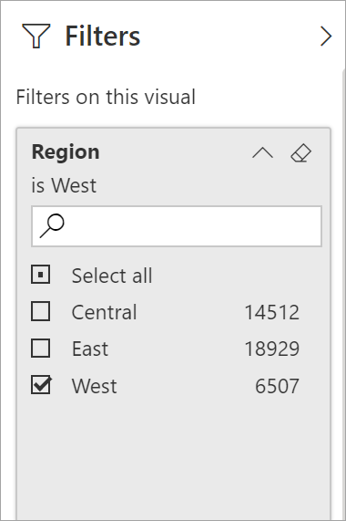
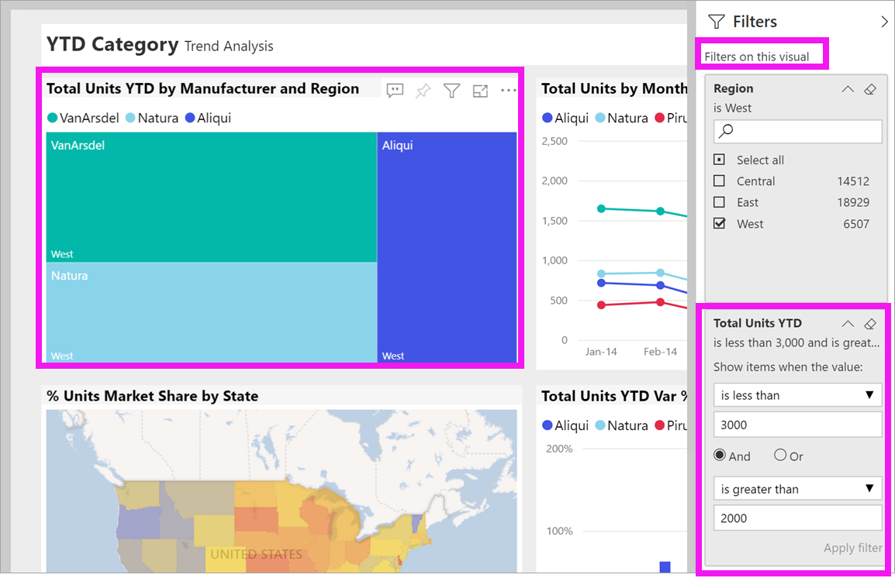
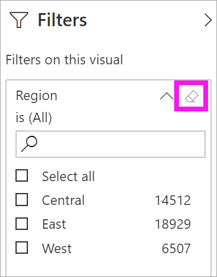

# สำรวจภาพรวมของบานหน้าต่างตัวกรองรายงาน

[!INCLUDE[consumer-appliesto-yyny](../includes/consumer-appliesto-yyny.md)]

[!INCLUDE [power-bi-service-new-look-include](../includes/power-bi-service-new-look-include.md)]

บทความนี้จะอธิบายบานหน้าต่าง **ตัวกรอง** รายงานในบริการของ Power BI ใช้ตัวกรองเพื่อค้นหาข้อมูลเชิงลึกใหม่ในข้อมูลของคุณ

มีหลายวิธีในการกรองข้อมูลใน Power BI สำหรับข้อมูลเพิ่มเติมเกี่ยวกับตัวกรอง ดูที่ [ตัวกรองและการไฮไลท์ในรายงาน Power BI](../create-reports/power-bi-reports-filters-and-highlighting.md)

## สำรวจภาพบานหน้าต่างตัวกรองรายงาน

เมื่อเพื่อนร่วมงานแชร์รายงานกับคุณ ให้แน่ใจว่าได้ดูบานหน้าต่าง**ตัวกรอง** ในบางครั้งจะถูกยุบตามขอบด้านขวาของรายงาน เลือกเพื่อขยาย

บานหน้าต่าง **ตัวกรอง** ประกอบด้วยตัวกรองที่ *ผู้ออกแบบ* ได้เพิ่มในรายงาน *ผู้ใช้*เช่นคุณสามารถโต้ตอบกับตัวกรองที่มีอยู่ และบันทึกการเปลี่ยนแปลงได้ แต่ไม่สามารถเพิ่มตัวกรองใหม่ในรายงาน ตัวอย่างเช่น สกรีนช็อตด้านบนตัวออกแบบได้เพิ่มตัวกรองระดับหน้าสามตัวกรอง: **เซกเมนต์คือทั้งหมด**, **ปีคือ 2014** และ**ภูมิภาคเป็นภาคกลาง** คุณสามารถโต้ตอบ และเปลี่ยนตัวกรองเหล่านี้ แต่คุณไม่สามารถเพิ่มตัวกรองระดับหน้าตัวที่สี่ได้

ในบริการ Power BI รายงานจะเก็บข้อมูลการเปลี่ยนแปลงที่คุณทำในบานหน้าต่าง **ตัวกรอง** บริการจะขยายการเปลี่ยนแปลงเหล่านั้นผ่านไปยังอุปกรณ์เคลื่อนที่ของรายงาน 

หากต้องการรีเซ็ตบานหน้าต่าง **ตัวกรอง** เป็นค่าเริ่มต้นของตัวออกแบบ เลือก **รีเซ็ตเป็นค่าเริ่มต้น** จากแถบเมนูด้านบน

 

> [!NOTE]
> หากคุณไม่เห็นตัวเลือก **รีเซ็ตเป็นค่าเริ่มต้น** ตัวเลือกนี้อาจถูกปิดใช้งานโดย *ผู้ออกแบบ*รายงาน *ผู้ออกแบบ* ยังสามารถล็อกตัวกรองที่ระบุเพื่อไม่ให้คุณสามารถเปลี่ยนแปลงได้

## ดูตัวกรองทั้งหมดสำหรับหน้ารายงาน

บานหน้าต่าง **ตัวกรอง** จะแสดงตัวกรองทั้งหมดที่เพิ่มโดยผู้ออกแบบในรายงาน บานหน้าต่าง **ตัวกรอง** เป็นพื้นที่ที่คุณสามารถดูข้อมูลเกี่ยวกับตัวกรอง และโต้ตอบกับตัวกรองเหล่านั้น บันทึกการเปลี่ยนแปลงที่คุณสร้างหรือใช ้**รีเซ็ตเป็นค่าเริ่มต้น** เพื่อแปลงกลับเป็นการตั้งค่าตัวกรองต้นฉบับได้

ถ้ามีการเปลี่ยนแปลงที่คุณต้องการบันทึก คุณสามารถสร้างบุ๊กมาร์กส่วนบุคคลได้ สำหรับข้อมูลเพิ่มเติม ให้ดูที่ [บุ๊กมาร์กคืออะไร](end-user-bookmarks.md)

บานหน้าต่าง **ตัวกรอง** จะแสดงและจัดการตัวกรองรายงานหลายชนิด: รายงาน หน้ารายงาน และวิชวล

ในตัวอย่างนี้ เราได้เลือกวิชวลที่มีตัวกรองสามตัว หน้ารายงานยังมีตัวกรอง ซึ่งแสดงรายการภายใต้หัวเรื่อง **ตัวกรองในหน้านี้** นอกจากนี้ รายงานทั้งหมดยังมีตัวกรองสำหรับ**วันที่**

บางตัวกรองมี **(ทั้งหมด)** อยู่ถัดจากตัวกรองเหล่านั้น **(ทั้งหมด)**  หมายความว่าค่าทั้งหมดจะถูกรวมอยู่ในตัวกรอง ในสกรีนช็อตข้างต้น **Segment(All)** จะบอกให้เราว่าหน้ารายงานนี้มีข้อมูลเกี่ยวกับเซ็กเมนต์ผลิตภัณฑ์ทั้งหมด 

ทุกคนที่ดูรายงานนี้สามารถโต้ตอบกับตัวกรองเหล่านี้

### ดูเฉพาะตัวกรองที่นำไปใช้กับวิชวลเท่านั้น

เมื่อต้องการดูรายละเอียดตัวกรองที่นำไปใช้กับวิชวลเฉพาะ ให้โฮเวอร์เหนือวิชวลเพื่อแสดงไอคอนตัวกรอง  เลือกไอคอนตัวกรองเพื่อดูเมนูแบบป็อปอัพที่มีตัวกรองทั้งหมด ตัวแบ่งส่วนข้อมูล และอื่นๆ ที่มีผลต่อวิชวลนั้น ตัวกรองบนป๊อปอัพมีตัวกรองเดียวกันที่แสดงอยู่ในบานหน้าต่าง**ตัวกรอง**รวมถึงการกรองเพิ่มเติมที่ส่งผลกระทบต่อวิชวลที่เลือก

นี่คือชนิดตัวกรองที่มุมมองนี้สามารถแสดงได้:

- ตัวกรองพื้นฐาน
- ตัวแบ่งส่วนข้อมูล
- ไฮไลต์เชื่อมโยง
- กรองข้าม
- ตัวกรองขั้นสูง
- ตัวกรอง Top N
- ตัวกรองวันที่ที่เกี่ยวข้อง
- ตัวแบ่งส่วนข้อมูลซิงค์
- ตัวกรอง รวม/ไม่รวม
- ตัวกรองที่ส่งผ่าน URL

ในตัวอย่างนี้:
1. **รวม**บอกเราว่าวิชวลได้รับการกรองแบบข้าม สิ่งนี้หมายความว่ารัฐยูทาห์ โคโลราโด และเท็กซัสได้รับการคัดเลือกบนหนึ่งในวิชวลอื่น ๆ บนหน้ารายงานนี้ ในกรณีนี้ นี่เป็นแผนที่ การคัดเลือกทั้งสามรัฐมีการตัดข้อมูลสำหรับรัฐอื่น ๆ ทั้งหมดออกจากการแสดงบนแผนภูมิแท่งที่เลือกไว้  

1. **วันที่**คือตัวกรองที่นำไปใช้กับทุกหน้าในรายงานนี้และ

1. **ภูมิภาคคือภาคกลาง**และ**ปีคือ 2014** เป็นตัวกรองที่นำไปใช้กับหน้ารายงานนี้และ

4. **ผู้ผลิตคือ VanArsdel, Natura, Aliqui, หรือ Pirum** เป็นตัวกรองที่นำไปใช้กับวิชวลนี้

### ค้นหาในตัวกรอง

ในบางครั้งตัวกรองอาจมีรายการค่าที่ยาว ใช้กล่องค้นหาเพื่อค้นหา และเลือกค่าคุณต้องการ

### แสดงรายละเอียดตัวกรอง

เพื่อทำความเข้าใจตัวกรอง โปรดดูที่ค่าและจำนวนที่ใช้ได้  ดูรายละเอียดของตัวกรองโดยการวางเคอร์เซอร์แล้วเลือกลูกศรถัดจากชื่อตัวกรอง
  

### เปลี่ยนแปลงการเลือกตัวกรอง

วิธีหนึ่งในการค้นหาข้อมูลเชิงลึกคือการโต้ตอบกับตัวกรอง คุณสามารถเปลี่ยนการเลือกตัวกรองโดยใช้ลูกศรดรอปดาวน์ถัดจากชื่อเขตข้อมูล  ตัวเลือกของคุณจะมีตั้งแต่ตัวเลือกแบบง่ายจากรายการไปจนถึงการระบุช่วงของวันที่หรือตัวเลข ทั้งนี้ขึ้นอยู่กับตัวกรองและชนิดของข้อมูลที่ Power BI กำลังกรอง ในตัวกรองขั้นสูงด้านล่าง เราได้เปลี่ยนแปลงตัวกรอง **YTD ของหน่วยรวม** บนแผนที่ต้นไม้เพื่อให้อยู่ระหว่าง 2,000 และ 3,000 โปรดสังเกตว่าการเปลี่ยนแปลงนี้จะลบ Pirum ออกจากแผนที่ต้นไม้
  

> [!TIP]
> เมื่อต้องเลือกค่าตัวกรองมากกว่าหนึ่งรายการในแต่ละครั้ง ให้กดแป้น CTRL ค้างไว้ ตัวกรองส่วนใหญ่รองรับการเลือกหลายรายการ

### รีเซ็ตตัวกรองเป็นค่าเริ่มต้น

ถ้าคุณต้องการย้อนกลับการเปลี่ยนแปลงทั้งหมดที่คุณได้ทำกับตัวกรอง ให้เลือก**รีเซ็ตเป็นค่าเริ่มต้น**จากแถบเมนูด้านบน  การเลือกนี้เปลี่ยนกลับตัวกรองเป็นแบบเดิมตามที่ผู้ออกแบบรายงานตั้งค่าไว้

### ล้างตัวกรอง

เมื่อต้องการรีเซ็ตตัวกรองเป็น (ทั้งหมด) ให้ล้างข้อมูลด้วยการเลือกไอคอนยางลบที่อยู่ถัดจากชื่อตัวกรอง

  
<!--  too much detail for consumers

## Types of filters: text field filters
### List mode
Ticking a checkbox either selects or deselects the value. The **All** checkbox can be used to toggle the state of all checkboxes on or off. The checkboxes represent all the available values for that field.  As you adjust the filter, the restatement updates to reflect your choices. 

Note how the restatement now says "is Mar, Apr or May".

### Advanced mode
Select **Advanced Filtering** to switch to advanced mode. Use the dropdown controls and text boxes to identify which fields to include. By choosing between **And** and **Or**, you can build complex filter expressions. Select the **Apply Filter** button when you've set the values you want.  

## Types of filters: numeric field filters
### List mode
If the values are finite, selecting the field name displays a list.  See **Text field filters** &gt; **List mode** above for help using checkboxes.   

### Advanced mode
If the values are infinite or represent a range, selecting the field name opens the advanced filter mode. Use the dropdown and text boxes to specify a range of values that you want to see. 

By choosing between **And** and **Or**, you can build complex filter expressions. Select the **Apply Filter** button when you've set the values you want.

## Types of filters: date and time
### List mode
If the values are finite, selecting the field name displays a list.  See **Text field filters** &gt; **List mode** above for help using checkboxes.   

### Advanced mode
If the field values represent date or time, you can specify a start/end time when using Date/Time filters.  

-->

## ขั้นตอนถัดไป

เรียนรู้วิธีที่ [วิชวลกรองแบบไขว้และข้ามไฮไลท์ของแต่ละตัวบนหน้ารายงาน](end-user-interactions.md)
