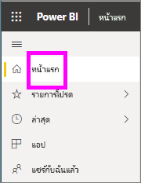
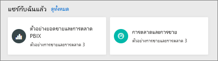
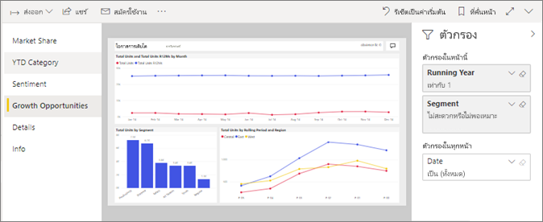
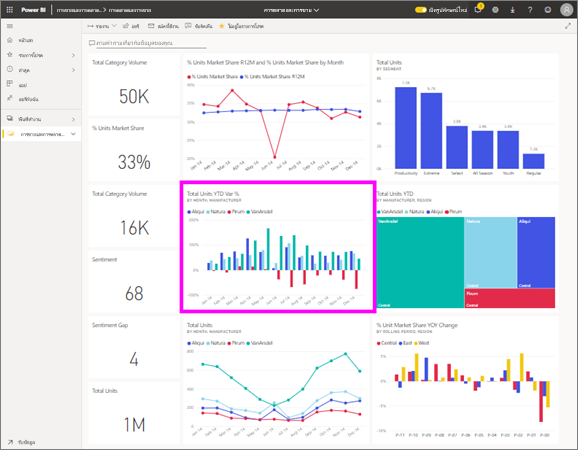

# ดูรายงานในบริการ Power BI สำหรับ*ผู้บริโภค*
รายงานเป็นภาพอย่างน้อยหนึ่งหน้า รายงานถูกสร้างขึ้น โดย Power BI *นัก*และ[ที่ใช้ร่วมกันกับ*ผู้บริโภค*โดยตรง](end-user-shared-with-me.md)หรือ เป็นส่วนหนึ่งของการ[แอ](end-user-apps.md) 

มีหลายวิธีในการเปิดรายงาน และเราจะแสดงสองรายการ: เปิดจากที่บ้าน และเปิดจากแดชบอร์ด 

<!-- add art-->

## เปิดรายงานจาก Power BI หน้าแรก
ลองเปิดรายงานที่ได้แชร์กับคุณโดยตรง จากนั้น เปิดรายงานที่แชร์ไว้เป็นส่วนหนึ่งของแอป

   

### เปิดรายงานที่ได้แชร์กับคุณ
Power BI *นัก*สามารถแชร์รายงานกับคุณโดยตรงได้ เนื้อหาที่ใช้ร่วมกันด้วยวิธีนี้แสดงขึ้นในการ**แชร์กับฉัน**คอนเทนเนอร์บน nav ของคุณแถบ และในการ**แชร์กับฉัน**ส่วนของพื้นที่หน้าแรกของคุณ

1. เปิดบริการ Power BI (app.powerbi.com)

2. จากแถบนำทาง เลือก**Home**เพื่อแสดงพื้นที่งานที่บ้านของคุณ  

   
   
3. เลื่อนลงจนกว่าคุณเห็น**แชร์กับฉัน** ค้นหาไอคอนรายงาน ในสกรีนช็อตนี้ เรามีหนึ่งแดชบอร์ดและรายงานหนึ่งที่ชื่อว่า*ยอดขายและตัวอย่างทางการตลาด* 
   
   

4. เพียงแค่เลือกรายงาน*บัตร*เพื่อเปิดรายงาน

   

5. โปรดสังเกตว่า แท็บทางด้านซ้าย  แต่ละแท็บแสดง*หน้า*รายงาน เรามีการ*โอกาสการเติบโต*เปิดหน้า เลือกคำ*ประเภทตั้งแต่ต้นปี*แท็บเพื่อเปิดหน้ารายงานนั้นแทน 

   

6. ในขณะนี้เรากำลังดูหน้ารายงานทั้งหมด เมื่อต้องเปลี่ยนการแสดง (ขยาย) ของหน้า เลือกดรอปดาวน์มุมมองจากมุมบนขวา ( **>** ) และเลือก**ขนาดจริง**

   

   

### เปิดรายงานที่เป็นส่วนหนึ่งของแอป
ถ้าคุณได้รับแอป จากเพื่อนร่วมงาน หรือ จาก AppSource แอปเหล่านั้นจะพร้อมใช้งานจากหน้าแรก และจาก**แอ**คอนเทนเนอร์บนแถบนำทางของคุณ [แอป](end-user-apps.md)เป็นชุดของแดชบอร์ดและรายงาน

1. กลับไปยังโฮมเพโดย**Home**จากแถบนำทาง

7. เลื่อนลงจนกว่าคุณเห็น**แอปของฉัน**

   

8. เลือกหนึ่งแอปเพื่อเปิด ขึ้นอยู่กับตัวเลือกที่กำหนดโดย*ตัวออกแบบ*แอป แอปจะเปิดแดชบอร์ด รายงาน หรือรายการเนื้อหาแอป หากเลือกแอป:
    - เปิดรายงาน ตั้งค่าเรียบร้อย
    - เปิดแดชบอร์ด ดู***เปิดรายงานจากแดชบอร์ด***ด้านล่าง
    - เปิดรายการเนื้อหาแอป ภายใต้ตัวเลือก **รายงาน** เลือกรายงานเพื่อเปิด

## เปิดรายงานจากแดชบอร์ด
สามารถเปิดรายงานได้จากแดชบอร์ด ไทล์แดชบอร์ดส่วนใหญ่มีการ*ปักหมุด*จากรายงาน เลือกไทล์เปิดรายงานที่ใช้เพื่อสร้างไทล์ 

1. เปิดแดชบอร์ด แล้วเลือกไทล์ ในตัวอย่างนี้ เราได้เลือกไทล์แผนภูมิคอลัมน์ "จำนวนหน่วยรวม ตั้งแต่ต้นปีถึงปัจจุบัน..."

    

2.  เปิดรายงานที่เกี่ยวข้อง โปรดสังเกตว่า เรากำลังอยู่บนหน้า "ประเภท ตั้งแต่ต้นปีถึงปัจจุบัน" นี่คือหน้ารายงานที่มีแผนภูมิคอลัมน์ที่เราเลือกจากแดชบอร์ด

    

> [!NOTE]
> ไทล์ทั้งหมดไม่นำไปสู่รายงาน ถ้าคุณเลือกไทล์ที่[ถูกสร้างขึ้นด้วยการถามตอบ](end-user-q-and-a.md) หน้าจอถามตอบจะเปิดขึ้น หากคุณเลือกไทล์ที่[สร้างขึ้นโดยใช้แดชบอร์ด **เพิ่ม**วิดเจ็ต](../service-dashboard-add-widget.md)ของไทล์ แล้วสิ่งต่างๆ อาจเกิดขึ้นได้  

##  ยังคงวิธีอื่น ๆ ในการเปิดรายงาน
เมื่อคุณใช้สะดวกในการนำทางไปยังบริการ Power BI คุณจะรู้ว่าเวิร์กโฟลว์ที่ทำงานที่ดีที่สุดสำหรับคุณ สองสามวิธีอื่น ๆ ในการเข้าถึงรายงาน:
- จากบานหน้าต่างนำทางโดยใช้แถบ**รายการโปรด**และ**ล่าสุด**    
- ใช้[เนื้อหาที่เกี่ยวข้องกับมุมมอง](end-user-related.md)    
- ในอีเมล เมื่อมีใคร[แชร์กับคุณ](../service-share-reports.md) หรือคุณ[ตั้งค่าการแจ้งเตือน](end-user-alerts.md)    
- จาก[ศูนย์การแจ้งเตือน](end-user-notification-center.md)ของคุณ    
- และอื่น ๆ อีกมากมาย

## ขั้นตอนถัดไป
มี[วิธีมากมายเพื่อโต้ตอบกับรายงาน](end-user-reading-view.md)  เริ่มต้นสำรวจ โดยการเลือกแต่ละแท็บด้านข้างของพื้นที่รายงาน

