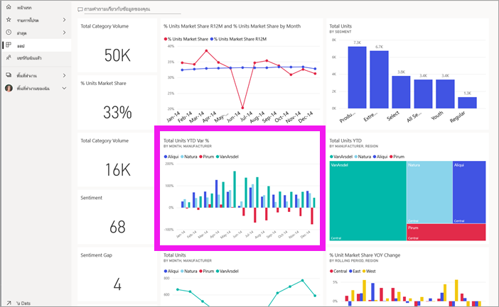

# ดูรายงานในบริการ Power BI สำหรับ*ผู้บริโภค*
รายงานเป็นภาพอย่างน้อยหนึ่งหน้า รายงานจะสร้างขึ้นโดย*นักออกแบบรายงาน* Power BI และ[ใช้ร่วมกันกับ*ผู้บริโภค*โดยตรง](end-user-shared-with-me.md)หรือในฐานะเป็นส่วนหนึ่งของ[แอป](end-user-apps.md) 

มีหลายวิธีในการเปิดรายงาน และเราจะแสดงสองรายการ: เปิดจากหน้าหลักและเปิดจากแดชบอร์ด 

<!-- add art-->

## เปิดรายงานจากหน้าหลักของคุณ
ลองเปิดรายงานที่ได้แชร์กับคุณโดยตรง จากนั้น เปิดรายงานที่แชร์ไว้เป็นส่วนหนึ่งของแอป

   

### เปิดรายงานที่ได้แชร์กับคุณ
*ตัวออกแบบ*ของ Power BI สามารถแชร์รายงานกับคุณโดยตรงโดยการคลิกที่ปุ่ม**แชร์**บนแถบเมนูด้านบน เนื้อหาที่แชร์ด้วยวิธีนี้ปรากฏขึ้นในที่เก็บ**แชร์กับฉัน**บนแถบการนำทางด้านซ้าย และในส่วน**แชร์กับฉัน**ของหน้าจอหลักของคุณ

1. เปิดบริการ Power BI (app.powerbi.com)

2. จากแถบนำทางด้านซ้าย เลือก**หน้าหลัก (ตัวอย่าง)** เพื่อเปิดหน้าหลักของคุณ  

   
   
3. เลื่อนลงจนกว่าคุณเห็น**แชร์กับฉัน** ค้นหาไอคอนรายงาน ในสกรีนช็อตนี้ เรามีรายงานสองฉบับ: *การเงิน*และ*Northwind* 
   
   

4. เพียงแค่เลือก*การ์ด*รายงานหนึ่งรายการเพื่อเปิดรายงาน

   

5. โปรดสังเกตแท็บด้านล่าง แต่ละแท็บแสดง*หน้า*รายงาน ขณะนี้กำลังเปิดหน้า*แนวโน้มการใช้จ่ายด้านไอที* เลือกแท็บอื่นเพื่อเปิดหน้ารายงานนั้น 

   

6. ขณะนี้เราสามารถดูส่วนหนึ่งของหน้ารายงานได้เท่านั้น เปลี่ยนการแสดง (ขยาย) ของหน้า โดนเลือก**มุมมอง** > **พอดีกับหน้า**

   

   

### เปิดรายงานที่เป็นส่วนหนึ่งของแอป
หากคุณได้รับแอปจากเพื่อนร่วมงานหรือ AppSource สามารถดูแอปเหล่านั้นได้จากหน้าแรกของคุณ และจากที่ใส่**แอป**บนแถบนำทางด้านซ้ายของคุณ [แอป](end-user-apps.md)เป็นชุดของแดชบอร์ดและรายงาน

1. กลับไปยังหน้าแรกของคุณโดยการเลือก**หน้าหลัก (ตัวอย่าง)** จากแถบนำทางด้านซ้าย

7. เลื่อนลงจนกว่าคุณเห็น**แอปของฉัน**

   

8. เลือกหนึ่งแอปเพื่อเปิด ขึ้นอยู่กับตัวเลือกที่กำหนดโดย*ตัวออกแบบ*แอป แอปจะเปิดแดชบอร์ด รายงาน หรือรายการเนื้อหาแอป หากเลือกแอป:
    - เปิดรายงาน ตั้งค่าเรียบร้อย
    - เปิดแดชบอร์ด ดู[เปิดรายงานจากแดชบอร์ด](#Open-a-report-from-a-dashboard)ด้านล่าง
    - เปิดรายการเนื้อหาแอป ภายใต้ตัวเลือก **รายงาน** เลือกรายงานเพื่อเปิด

## เปิดรายงานจากแดชบอร์ด
สามารถเปิดรายงานได้จากแดชบอร์ด ไทล์แดชบอร์ดส่วนใหญ่มีการ*ปักหมุด*จากรายงาน เลือกไทล์เปิดรายงานที่ใช้เพื่อสร้างไทล์ 

1. เปิดแดชบอร์ด แล้วเลือกไทล์ ในตัวอย่างนี้ เราได้เลือกไทล์แผนภูมิคอลัมน์ "จำนวนหน่วยรวม ตั้งแต่ต้นปีถึงปัจจุบัน..."

    

2.  เปิดรายงานที่เกี่ยวข้อง โปรดสังเกตว่า เรากำลังอยู่บนหน้า "ประเภท ตั้งแต่ต้นปีถึงปัจจุบัน" นี่คือหน้ารายงานที่มีแผนภูมิคอลัมน์ที่เราเลือกจากแดชบอร์ด

    

> [!NOTE]
> ไทล์ทั้งหมดไม่นำไปสู่รายงาน ถ้าคุณเลือกไทล์ที่[ถูกสร้างขึ้นด้วยการถามตอบ](end-user-q-and-a.md) หน้าจอถามตอบจะเปิดขึ้น หากคุณเลือกไทล์ที่[สร้างขึ้นโดยใช้แดชบอร์ด **เพิ่ม**วิดเจ็ต](../service-dashboard-add-widget.md)ของไทล์ แล้วสิ่งต่างๆ อาจเกิดขึ้นได้  

##  ยังคงวิธีอื่น ๆ ในการเปิดรายงาน
เมื่อคุณใช้บริการของ Power BI ต่าง ๆ ได้คล่องแล้ว คุณจะรู้ว่าเวิร์กโฟลว์การทำงานแบบไหนที่ดีที่สุดสำหรับคุณ สองสามวิธีอื่น ๆ ในการเข้าถึงรายงาน:
- จากบานหน้าต่างนำทางด้านซ้าย ใช้**รายการโปรด** และ **ล่าสุด**    
- ใช้[เนื้อหาที่เกี่ยวข้องกับมุมมอง](end-user-related.md)    
- ในอีเมล เมื่อมีใคร[แชร์กับคุณ](../service-share-reports.md) หรือคุณ[ตั้งค่าการแจ้งเตือน](end-user-alerts.md)    
- จาก[ศูนย์การแจ้งเตือน](end-user-notification-center.md)ของคุณ    
- และอื่น ๆ อีกมากมาย

## ขั้นตอนถัดไป
มี[วิธีมากมายเพื่อโต้ตอบกับรายงาน](end-user-reading-view.md)  รายงานการสำรวจโดยเลือกแต่ละแท็บด้านล่างของพื้นที่รายงาน

