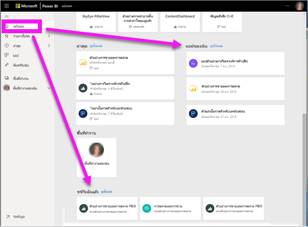
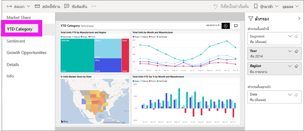
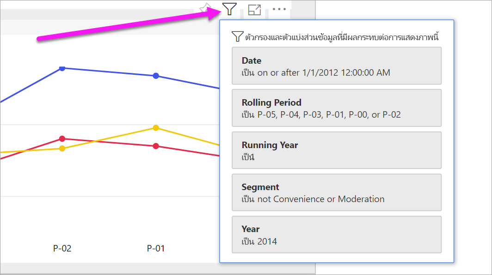
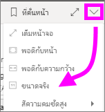
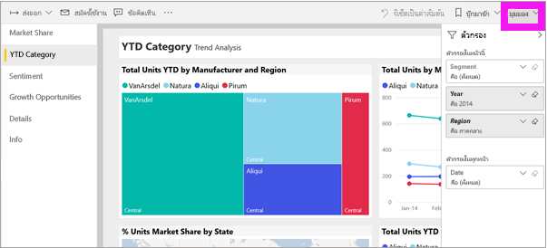
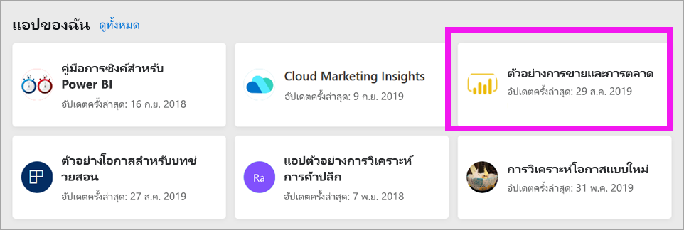
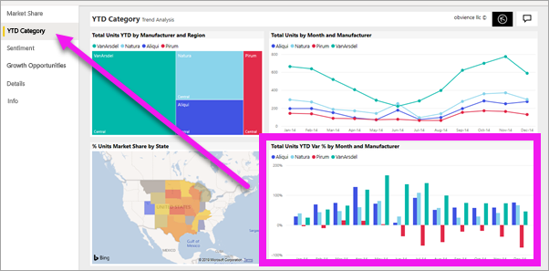

# ดูรายงานในบริการของ Power BI สำหรับ*ผู้บริโภค*

[!INCLUDE[consumer-appliesto-yyny](../includes/consumer-appliesto-yyny.md)]

[!INCLUDE [power-bi-service-new-look-include](../includes/power-bi-service-new-look-include.md)]

รายงานเป็นภาพอย่างน้อยหนึ่งหน้า รายงานจะถูกสร้างขึ้นโดย*นักออกแบบ* Power BI และ[แบ่งปันกับ*ผู้บริโภค*โดยตรง](end-user-shared-with-me.md)หรือในฐานะเป็นส่วนหนึ่งของ[แอป](end-user-apps.md) 

มีหลายวิธีในการเปิดรายงาน และเราจะแสดงให้คุณเห็นสองวิธี: เปิดจากหน้าหลักและเปิดจากแดชบอร์ด 

<!-- add art-->

## เปิดรายงานจากหน้าหลักของ Power BI
ลองเปิดรายงานที่ได้แชร์กับคุณโดยตรง จากนั้น เปิดรายงานที่แชร์ไว้เป็นส่วนหนึ่งของแอป

   

### เปิดรายงานที่ได้แชร์กับคุณ
*นักออกแบบ* Power BI สามารถแชร์รายงานเดี่ยวกับคุณโดยตรงผ่านลิงก์ในอีเมลหรือโดยเพิ่มรายงานดังกล่าวลงในเนื้อหาของ Power BI ของคุณโดยอัตโนมัติ เนื้อหาที่แชร์ด้วยวิธีนี้ปรากฏขึ้นในคอนเทนเนอร์**แชร์กับฉัน**บนหน้าต่างการนำทาง และในส่วน**แชร์กับฉัน**ของพื้นที่ทำงานของหน้าหลักของคุณ

1. เปิดบริการของ Power BI (app.powerbi.com)

2. จากหน้าต่างนำทาง เลือก **หน้าหลัก** เพื่อแสดงพื้นที่ทำงานของหน้าหลักของคุณ  

   
   
3. เลื่อนลงจนกว่าคุณเห็น**แชร์กับฉัน** ค้นหาไอคอนรายงาน ในภาพถ่ายหน้าจอนี้ เรามีแดชบอร์ดหนึ่งอันและรายงานหนึ่งชิ้น รายงายนั้นชื่อว่า *ตัวอย่างการขายและการตลาด* 
   
   

4. เพียงแค่เลือก*การ์ด*รายงานเพื่อเปิดรายงาน

   

5. โปรดสังเกตแถบทางด้านซ้าย  แต่ละแท็บแสดง*หน้า*รายงาน ขณะนี้เรามีหน้า*โอกาสการเติบโต*ที่เปิดอยู่ เลือกแท็บ*ประเภท YTD* เพื่อเปิดหน้ารายงานนั้นแทน 

   

6. โปรดสังเกตบานหน้าต่าง**ตัวกรอง**ทางด้านขวา ตัวกรองที่ถูกนำไปใช้กับหน้ารายงานนี้หรือรายงานทั้งหมดจะแสดงที่นี่

7. การวางเมาส์เหนือวิชวลรายงานจะแสดงไอคอนหลายรายการและ **ตัวเลือกเพิ่มเติม** (...) เมื่อต้องการดูตัวกรองที่ใช้กับวิชวลที่ระบุ ให้เลือกไอคอนตัวกรอง ที่นี่เราได้เลือกไอคอนตัวกรองสำหรับแผนภูมิเส้น *หน่วยรวมตามช่วงเวลาที่ไม่แน่นอนและภูมิภาค*

   

6. ในตอนนี้เราจะเห็นหน้ารายงานทั้งหมด หากต้องการเปลี่ยนการแสดงผล (ซูม) ของหน้า ให้เลือกมุมมองแบบเลื่อนลงจากมุมบนขวา และเลือก**ขนาดจริง**

   

   

มีหลายวิธีที่คุณสามารถโต้ตอบกับรายงาน เพื่อค้นหาข้อมูลเชิงลึกและทำการตัดสินใจทางธุรกิจ  ใช้สารบัญทางด้านซ้ายมือ เพื่ออ่านบทความต่าง ๆ เกี่ยวกับรายงาน Power BI 

### เปิดรายงานที่เป็นส่วนหนึ่งของแอป
หากคุณได้รับแอปจากเพื่อนร่วมงานหรือ AppSource สามารถดูแอปเหล่านั้นได้จากหน้าหลักของคุณ และจากคอนเทนเนอร์**แอป**บนหน้าต่างนำทางของคุณ [แอป](end-user-apps.md) คือคอลเลกชันของแดชบอร์ดและรายงานที่จับคู่รวมกันสำหรับคุณโดย *นักออกแบบ*ของ Power BI

### ข้อกำหนดเบื้องต้น
หากต้องการทำตามคำแนะนำ ให้ดาวน์โหลดแอปการขายและการตลาด
1. ในเบราว์เซอร์ของคุณ ให้นำทางไปยัง appsource.microsoft.com
1. ค้นหา "การขายและการตลาด" **และเลือกตัวอย่างของ Microsoft -** การขาย & การตลาด
1. เลือก **รับตอนนี้** > **ดำเนินการต่อ** > **ติดตั้ง** เพื่อติดตั้งแอปในคอนเทนเนอร์แอปของคุณ 

คุณสามารถเปิดแอปจากคอนเทนเนอร์แอปหรือจากหน้าแรกได้
1. กลับไปที่หน้าหลักโดยการเลือก **หน้าหลัก** จากหน้าต่างนำทาง

7. เลื่อนลงจนกว่าคุณเห็น**แอปของฉัน**

   

8. เลือกแอป*การขายและการตลาด*ใหม่เพื่อเปิด ขึ้นอยู่กับตัวเลือกที่กำหนดโดย*ตัวออกแบบ*แอป แอปจะเปิดแดชบอร์ดหรือหรือรายงาน แอปนี้จะเปิดไปยังแดชบอร์ด  

## เปิดรายงานจากแดชบอร์ด
สามารถเปิดรายงานได้จากแดชบอร์ด [ไทล์](end-user-tiles.md)แดชบอร์ดส่วนใหญ่มีการ*ปักหมุด*จากรายงาน เลือกไทล์เปิดรายงานที่ใช้เพื่อสร้างไทล์ 

1. จากแดชบอร์ด เลือกไทล์ กหในตัวอย่างนี้ เราได้เลือกไทล์แผนภูมิคอลัมน์ *จำนวนหน่วยรวม ตั้งแต่ต้นปีถึงปัจจุบัน...*

    

2.  เปิดรายงานที่เกี่ยวข้อง ฟหโปรดสังเกตว่า เรากำลังอยู่บนหน้า *ประเภทตั้งแต่ต้นปีถึงปัจจุบัน* นี่คือหน้ารายงานที่มีแผนภูมิคอลัมน์ที่เราเลือกจากแดชบอร์ด

    

> [!NOTE]
> ไทล์ทั้งหมดไม่นำไปสู่รายงาน ถ้าคุณเลือกไทล์ที่[ถูกสร้างขึ้นด้วยการถามตอบ](end-user-q-and-a.md) หน้าจอถามตอบจะเปิดขึ้น หากคุณเลือกไทล์ที่[สร้างขึ้นโดยใช้แดชบอร์ด **เพิ่มวิดเจ็ต**ของไทล์](../create-reports/service-dashboard-add-widget.md) แล้วสิ่งต่างๆ อาจเกิดขึ้นได้ วิดีโออาจเล่น เว็บไซต์เปิดขึ้น และอื่น ๆ อีกมากมาย  

##  ยังคงวิธีอื่น ๆ ในการเปิดรายงาน
เมื่อคุณใช้บริการของ Power BI ต่าง ๆ ได้คล่องแล้ว คุณจะรู้ว่าเวิร์กโฟลว์การทำงานแบบไหนที่ดีที่สุดสำหรับคุณ สองสามวิธีอื่น ๆ ในการเข้าถึงรายงาน:
- จากหน้าต่างนำทาง ใช้[รายการโปรด](end-user-favorite.md) และ [ล่าสุด](end-user-recent.md)    
- ใช้[เนื้อหาที่เกี่ยวข้องกับมุมมอง](end-user-related.md)    
- ในอีเมล เมื่อมีใคร[แชร์กับคุณ](../collaborate-share/service-share-reports.md) หรือคุณ[ตั้งค่าการแจ้งเตือน](end-user-alerts.md)    
- จาก[ศูนย์การแจ้งเตือน](end-user-notification-center.md)ของคุณ    
- จากพื้นที่ทำงาน
- และอื่น ๆ อีกมากมาย

## ขั้นตอนถัดไป
[เปิดและดูแดชบอร์ด](end-user-dashboard-open.md)    
[ตัวกรองรายงาน](end-user-report-filter.md)

