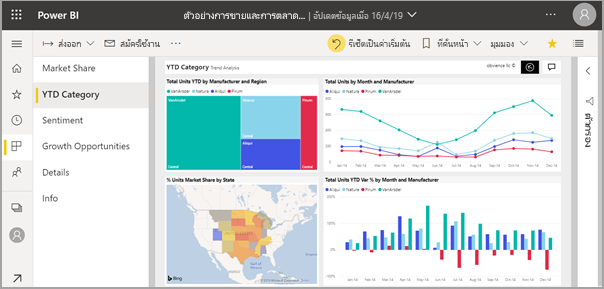
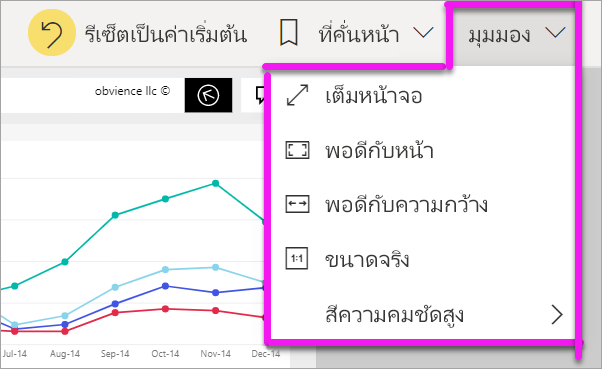
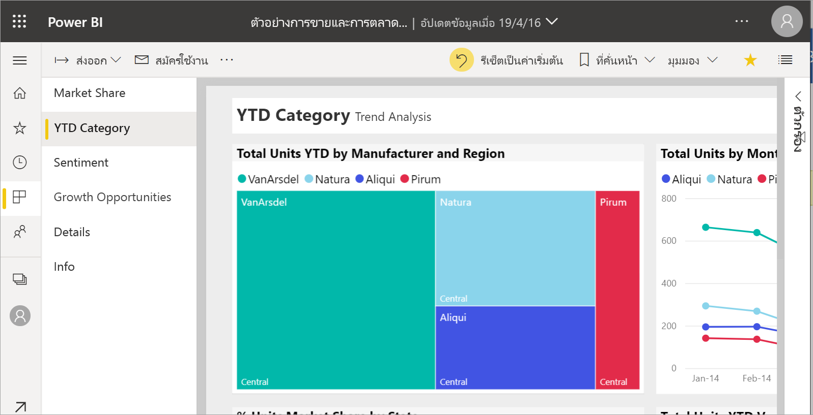
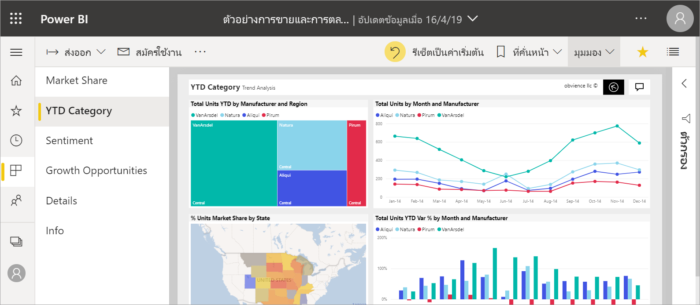
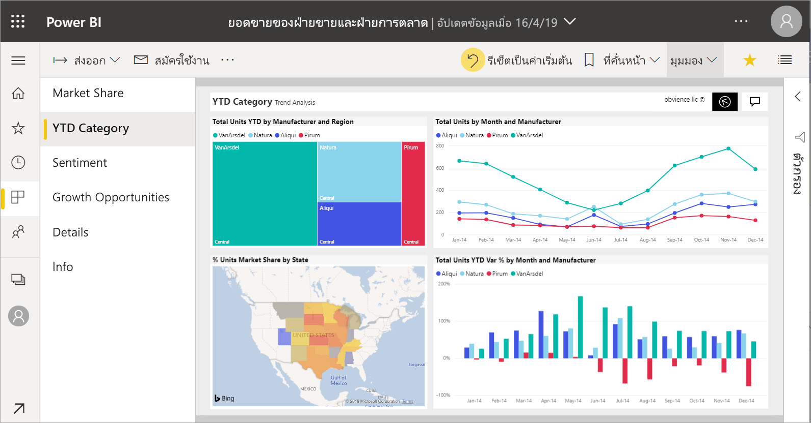
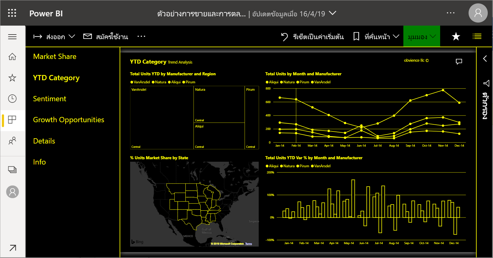
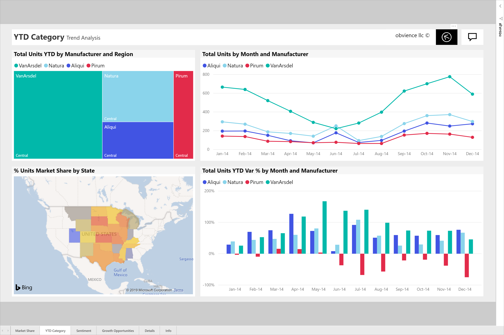

# เปลี่ยนการแสดงหน้ารายงาน

[!INCLUDE[consumer-appliesto-yyny](../includes/consumer-appliesto-yyny.md)]

[!INCLUDE [power-bi-service-new-look-include](../includes/power-bi-service-new-look-include.md)]

ผู้คนจะดูรายงานได้ในหลายอุปกรณ์ที่มีขนาดหน้าจอและอัตราส่วนกว้างยาวแตกต่างกัน เปลี่ยนวิธีแสดงหน้ารายงานให้ตรงกับความต้องการของคุณ

## สำรวจเมนูมุมมอง

ตัวเลือกในเมนู**มุมมอง** มีความยืดหยุ่นในการแสดงหน้ารายงานที่ขนาดและความกว้างที่คุณเลือก:

- สมมติว่าคุณกำลังดูรายงานบนอุปกรณ์ขนาดเล็ก และเป็นเรื่องยากที่จะเห็นชื่อเรื่องและคำอธิบายแผนภูมิ  เลือก**มุมมอง** > **ขนาดจริง**เพื่อเพิ่มขนาดของหน้ารายงาน ใช้แถบเลื่อนเพื่อย้ายไปรอบ ๆ รายงาน

    

- ตัวเลือกอื่นคือเพื่อจัดรายงานให้เหมาะกับความกว้างของหน้าจอโดยการเลือก**พอดีกับความกว้าง** เนื่องจากเป็นเพียงความกว้างและไม่ใช่ความสูง คุณอาจยังต้องการใช้แถบเลื่อนแนวตั้ง

  

- ถ้าคุณไม่ต้องการแถบเลื่อนใด ๆ แต่ต้องการใช้ขนาดหน้าจอให้ดีที่สุด เลือก**พอดีกับหน้า**

   

- คุณยังสามารถเลือกจาก**สีความคมชัดสูง** 4 สี: ความคมชัดสูง#1, ความคมชัดสูง#2, สีดำความคมชัดสูง และสีขาวความคมชัดสูง ซึ่งเป็นคุณลักษณะช่วบในการเข้าถึงที่คุณสามารถใช้เพื่อให้ผู้ที่มีความบกพร่องทางการมองเห็นสามารถดูรายงานได้ดีขึ้น ตัวอย่างด้านล่างเป็นแบบความคมชัดสูงที่มีค่าเท่ากับ 1 

    

- ตัวเลือกสุดท้าย**เต็มหน้าจอ**แสดงหน้ารายงานของคุณ โดยไม่มีแถบเมนูและหัวเรื่อง เต็มหน้าจออาจมีตัวเลือกที่ดีสำหรับหน้าจอขนาดเล็กที่มองเห็นรายละเอียดได้ยาก  เต็มหน้าจออาจยังมีตัวเลือกที่ดีเมื่อแสดงหน้ารายงานบนหน้าจอขนาดใหญ่ให้บุคคลอื่นสามารถดู แต่ไม่มีการโต้ตอบ  

    

เมื่อคุณออกจากรายงาน การตั้งค่า**มุมมอง**ของคุณจะไม่ถูกบันทึก แต่แปลงกลับเป็นค่าเริ่มต้น ถ้าเป็นสิ่งสำคัญสำหรับคุณในการบันทึกการตั้งค่าเหล่านี้ ให้ใช้[บุ๊กมาร์ก](end-user-bookmarks.md)

## ใช้เบราว์เซอร์ของคุณเพื่อเปลี่ยนการแสดงหน้าเพจ

ตัวควบคุมการย่อ/ขยายในเบราว์เซอร์ของคุณเพิ่มและลดพื้นที่พื้นที่ทำงานที่มีอยู่ การลดการย่อ/ขยายทำให้พื้นที่ทำงานเพิ่มขึ้นเพื่อขยายและในทางกลับกัน 

การเปลี่ยนแปลงขนาดของเบราว์เซอร์ของคุณเป็นอีกหนึ่งวิธีการเปลี่ยนแปลงขนาดการแสดงผลรายงานของคุณ 

## ขยายการแสดงผลด้วยภาพ
บางครั้งก็ยากที่จะเห็นรายละเอียดการแสดงผลด้วยภาพ คุณสามารถทำให้การแสดงผลใหญ่ขึ้นด้วยตนเอง สำหรับข้อมูลเพิ่มเติมดูโหมดโฟกัส ศึกษา [โหมดโฟกัสและโหมดเต็มหน้าจอ](end-user-focus.md)

### การแสดงผลในโหมด*โฟกัส*

### การแสดงผลในโหมด*เต็มหน้าจอ*

## ขั้นตอนถัดไป

* [สำรวจภาพรวมของบานหน้าต่างตัวกรองของรายงาน](end-user-report-filter.md)