# เปลี่ยนขนาดของหน้ารายงาน
ใน[บทความและวิดีโอก่อนหน้านี้](../power-bi-report-display-settings.md)คุณได้เรียนรู้สองวิธีในการควบคุมการแสดงหน้าในรายงาน Power BI: **มุมมอง**และ**ขนาดหน้า** มุมมองหน้าและขนาดหน้ามีใช้งานทั้งในบริการ Power BI และ Power BI Desktop โดยที่มีลักษณะและฟังก์ชันการทำงานเกือบเหมือนกันทั้งหมด แต่สำหรับบทช่วยสอนนี้ เราจะใช้บริการ Power BI

### ข้อกำหนดเบื้องต้น
- บริการ Power BI   
- [รายงานตัวอย่างการวิเคราะห์ร้านค้าปลีก](../sample-retail-analysis.md)

## ก่อนอื่นเรามาเปลี่ยนการตั้งค่ามุมมองหน้ากันก่อน

1. เปิดรายงานในมุมมองการอ่านหรือมุมมองการแก้ไข และเลือกแท็บรายงานสำหรับ**ร้านค้าใหม่** ตามค่าเริ่มต้น หน้ารายงานนี้จะแสดงขึ้นโดยใช้การตั้งค่า**พอดีกับหน้า**  ในกรณีนี้ การทำให้พอดีกับหน้า แสดงหน้ารายงานโดยไม่มีแถบเลื่อน แต่บางรายละเอียดและชื่อเรื่องเล็กเกินไปเมื่อต้องการอ่าน

   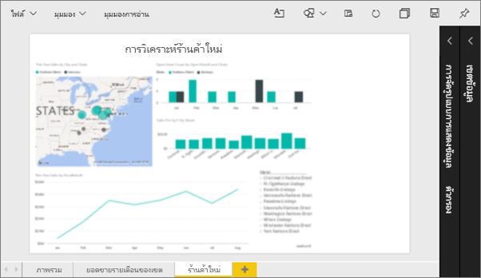
2. ตรวจสอบให้แน่ใจว่าไม่มีการเลือกการแสดงภาพใดบนพื้นที่รายงาน เลือก**มุมมอง**และตรวจทานตัวเลือกการแสดง

   * ในมุมมองการอ่าน คุณจะเห็นข้อมูลนี้

     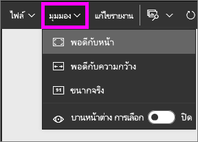
   * ในมุมมองการแก้ไข คุณจะเห็นข้อมูลนี้

     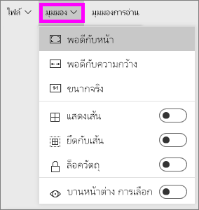

3. มาดูลักษณะที่ปรากฏของหน้าโดยใช้การตั้งค่า**ขนาดจริง**

   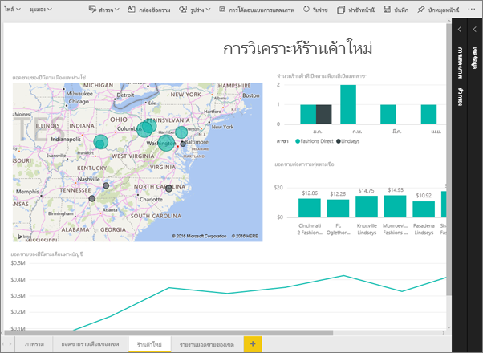

   ไม่สวยเท่าไหร่ ตอนนี้แดชบอร์ดมีแถบเลื่อนสองแถบ
4. สลับไปยัง**พอดีกับความกว้าง**

   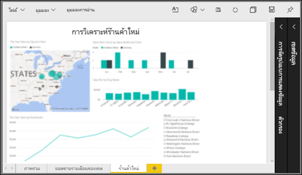

   ตอนนี้ดูดีขึ้น เรามีแถบเลื่อนต่าง ๆ แต่นั่นก็ทำให้ง่ายต่อการอ่านรายละเอียด

## เปลี่ยนมุมมองค่าเริ่มต้นสำหรับหน้ารายงาน
ถ้าคุณเป็น*ผู้สร้าง*รายงาน คุณสามารถเปลี่ยนมุมมองตามค่าเริ่มต้นสำหรับหน้ารายงานของคุณได้ เมื่อคุณแชร์รายงานของคุณกับผู้อื่น หน้ารายงานจะเปิดขึ้นโดยใช้มุมมองที่คุณได้ตั้งค่าไว้ *ผู้ใช้*รายงานจะสามารถเปลี่ยนมุมมองได้ แต่ไม่สามารถบันทึกการเปลี่ยนแปลงได้เมื่อพวกเขาออกจากรายงาน

1. ที่หน้า**ร้านค้าใหม่**ของรายงาน สลับกลับไปยังมุมมอง**ขนาดจริง**

   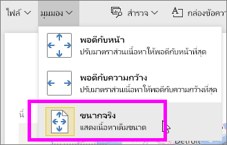

2. ที่หน้ารายงาน**ยอดขายรายเดือนของเขต** ตั้งค่ามุมมอง**จัดพอดีกับความกว้าง**

3. ที่หน้ารายงาน**ภาพรวม** ปล่อยให้เป็นการตั้งค่ามุมมองตามค่าเริ่มต้น

4. จากนั้นบันทึกรายงานโดยเลือก**ไฟล์ > บันทึก** ในครั้งถัดไปที่คุณเปิดรายงานนี้ หน้าดังกล่าวจะแสดงโดยใช้การตั้งค่ามุมมองใหม่ ไปดูกันเลย

   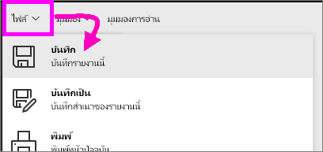
3. เลือกชื่อของพื้นที่ทำงานปัจจุบันจากแถบนำทางด้านบนเพื่อกลับไปยังพื้นที่ทำงานปัจจุบัน  

   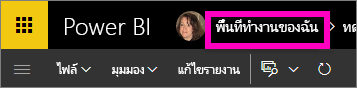
4. เลือกแท็บ**รายงาน** และเลือกรายงานเดียวกัน (ตัวอย่างการวิเคราะห์ร้านค้าปลีก)

    
5. เปิดแต่ละหน้าของรายงานเพื่อดูการตั้งค่าใหม่

   

## ตอนนี้ เรามาสำรวจการตั้งค่า*ขนาดหน้า*กัน
การตั้งค่าขนาดหน้ามีใช้เฉพาะใน[มุมมองการแก้ไข](../service-interact-with-a-report-in-editing-view.md) ดังนั้นคุณต้องมีสิทธิ์แก้ไข (*ผู้สร้าง*) สำหรับรายงานนั้นในการเปลี่ยนแปลงการตั้งค่าขนาดหน้า ถ้าคุณเคยเชื่อมต่อกับ[ตัวอย่าง](../sample-datasets.md)ใด ๆ ของเรา คุณจะมีสิทธิ์*ผู้สร้าง*ในการรายงานเหล่านั้น

1. เปิดหน้า "ยอดขายรายเดือนของเขต" ของ[ตัวอย่างการวิเคราะห์ร้านค้าปลีก](../sample-retail-analysis.md)ในมุมมองการแก้ไข
2. ตรวจสอบให้แน่ใจว่าไม่มีการเลือกการแสดงภาพใดบนพื้นที่รายงาน  ในช่อง**การแสดงภาพ** เลือกไอคอนลูกกลิ้งทาสี
3. เลือก**ขนาดหน้ากระดาษ** &gt; **ชนิด**เพื่อแสดงตัวเลือกขนาดหน้า

   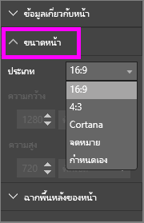
4. เลือก**อักษร**  บนพื้นที่รายงาน เฉพาะเนื้อหาที่พอดีภายในช่วง 816 x 1056 พิกเซล (ตัวอักษรขนาด) เท่านั้นที่จะยังคงอยู่ในส่วนสีขาวของพื้นที่รายงาน

   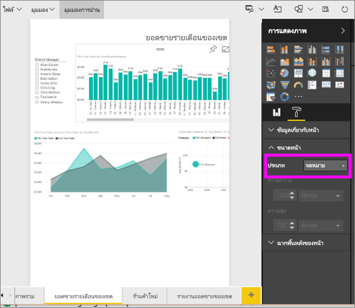
5. เลือก**ขนาดหน้า**อัตราส่วน **16:9**

   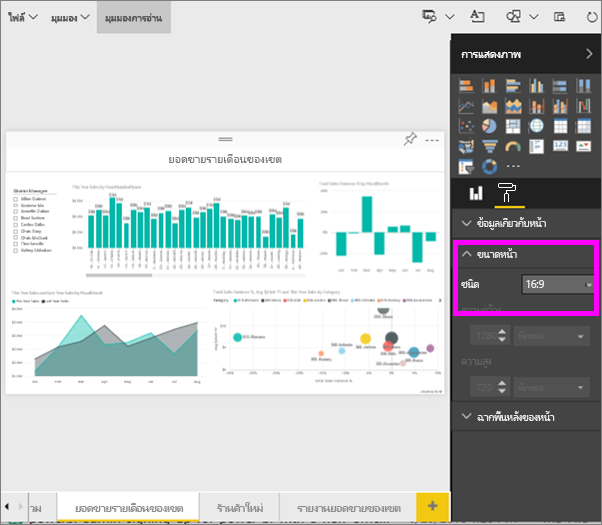

   หน้ารายงานแสดงโดยใช้อัตราส่วนความกว้าง 16 x ความสูง 9 ในการดูขนาดพิกเซลจริงที่กำลังใช้งานอยู่นั้น ให้ดูเขตข้อมูลความกว้างและความสูงสีเทา (ความละเอียด 1280x720) มีพื้นที่ว่างจำนวนมากรอบ ๆ พื้นที่รายงาน ทั้งนี้เนื่องจากก่อนหน้านี้เราได้ตั้งค่า**มุมมอง**เป็น "ให้พอดีกับความกว้าง"
7. สำรวจตัวเลือก**ขนาดหน้ากระดาษต่อไป**

## ใช้มุมมองหน้าและขนาดหน้าร่วมกัน
ใช้มุมมองหน้าและขนาดหน้าร่วมกันเพื่อสร้างรายงานที่มีลักษณะดีที่สุดเมื่อแชร์กับเพื่อนร่วมงานหรือฝังในแอปพลิเคชันอื่น

ในแบบฝึกหัดนี้ คุณจะสร้างหน้ารายงานที่จะแสดงในแอปพลิเคชันที่มีพื้นที่ความกว้างประมาณ 500 พิกเซล x ความสูง 750 พิกเซล

โปรดทราบว่า ในขั้นตอนก่อนหน้านี้เราเห็นว่าหน้ารายงานของเราในขณะนี้แสดงที่ความละเอียดกว้าง 1280 x สูง 720 ดังนั้น เราทราบว่าเราจะต้องทำการปรับขนาดและจัดเรียงใหม่อย่างมากถ้าเราต้องการใส่ภาพทั้งหมดของเรา

1. ปรับขนาดและย้ายภาพเพื่อให้พอดีกับพื้นที่น้อยกว่าครึ่งหนึ่งของพื้นที่รายงานปัจจุบัน

    
2. เลือก**ขนาดหน้า** &gt; **กำหนดเอง**
3. ตั้งค่าความกว้างเป็น 500 และตั้งค่าความสูงเป็น 750

    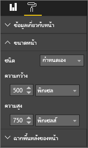
4. ปรับแต่งหน้ารายงานเพื่อให้ดูดีที่สุด สลับไปมาระหว่าง**มุมมอง > ขนาดจริง**และ**มุมมอง > ปรับพอดีกับหน้า**เพื่อทำการปรับเปลี่ยน

    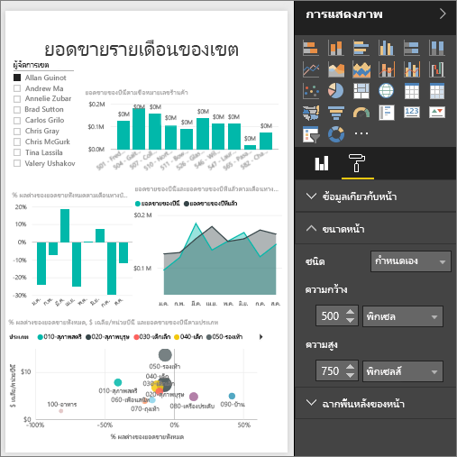

## ขั้นตอนถัดไป
[สร้างรายงานสำหรับ Cortana](../service-cortana-answer-cards.md)

กลับไปยัง[หน้าแสดงการตั้งค่าในรายงาน Power BI](../power-bi-report-display-settings.md)

มีคำถามเพิ่มเติมหรือไม่? [ลองไปที่ชุมชน Power BI](http://community.powerbi.com/)
