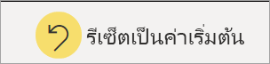

# รายงานใน Power BI

[!INCLUDE[consumer-appliesto-yyny](../includes/consumer-appliesto-yyny.md)]

[!INCLUDE [power-bi-service-new-look-include](../includes/power-bi-service-new-look-include.md)]

รายงาน Power BI มีมุมมองแบบหลากหลายมุมมองในชุดข้อมูล พร้อมด้วยวิชวลที่แสดงถึงผลลัพธ์และข้อมูลเชิงลึกที่แตกต่างจากชุดข้อมูลนั้น  รายงานอาจมีวิชวลเดียวหรือมีหน้าที่เต็มไปด้วยวิชวล คุณอาจเป็นบุคคลที่*ออกแบบ*รายงานได้ ทั้งนี้ขึ้นอยู่กับบทบาทงานของคุณ คุณยังอาจเป็นบุคคลที่*ใช้ประโยชน์*หรือใช้งานรายงานได้ บทความนี้เหมาะสำหรับ*ลูกค้า*

A. รายงานนี้มีหกหน้า (หรือแท็บ) และคุณกำลังดูหน้า **ความคิดเห็น**    
B. ในหน้านี้จะมีวิชวลที่แตกต่างกัน 5 ภาพและชื่อเรื่องของหน้า    
C. บานหน้าต่าง *ตัวกรอง* แสดงตัวกรองตัวเดียวที่ใช้กับหน้ารายงานทั้งหมด เมื่อต้องการยุบบานหน้าต่างตัวกรอง ให้เลือกลูกศร ( **>** )    
D. แบนเนอร์ Power BI แสดงชื่อของรายงานและวันที่อัปเดตล่าสุด เลือกลูกศรเพื่อเปิดเมนูที่แสดงชื่อของเจ้าของรายงาน    
E. แถบการดำเนินการมีการดำเนินการที่คุณสามารถใช้ในรายงานนี้ได้  ตัวอย่างเช่น คุณสามารถเพิ่มข้อคิดเห็น ดูบุ๊กมาร์ก หรือส่งออกข้อมูลจากรายงานได้  เลือก**ตัวเลือกเพิ่มเติม** (...) เพื่อแสดงรายการฟังก์ชันการทำงานเพิ่มเติมของรายงาน    

ถ้าคุณไม่คุ้นเคยกับ Power BI คุณสามารถเรียนรู้ข้อมูลพื้นฐานได้โดยการอ่าน[แนวคิดพื้นฐานสำหรับผู้ใช้บริการของ Power BI](end-user-basic-concepts.md) รายงานจะพร้อมใช้งานสำหรับการดู แชร์ และใส่คำอธิบายประกอบบนอุปกรณ์เคลื่อนที่ สำหรับข้อมูลเพิ่มเติม ดู[สำรวจรายงานในแอปสำหรับอุปกรณ์เคลื่อน Power BI](mobile/mobile-reports-in-the-mobile-apps.md)

## ข้อดีของรายงาน

Power BI สร้างรายงานโดยอ้างอิงจากชุดข้อมูลเดียว *ผู้ออกแบบ*รายงานจะสร้างวิชวลในรายงานที่แสดงถึงนักเก็ตของข้อมูล วิชวลไม่คงที่  วิชวลเหล่านี้จะอัปเดตเมื่อมีการเปลี่ยนแปลงข้อมูลพื้นฐาน คุณสามารถโต้ตอบกับวิชวลและตัวกรองเมื่อคุณเจาะลึกลงในข้อมูลเพื่อค้นหาข้อมูลเชิงลึก และค้นหาคำตอบ รายงานจะสามารถปรับแต่งและโต้ตอบได้อย่างมากเช่นเดียวกับแดชบอร์ด

### โต้ตอบกับเนื้อหาอย่างปลอดภัย

ขณะที่คุณสำรวจและโต้ตอบกับเนื้อหาของคุณเช่น การกรอง การแบ่งส่วน การสมัครใช้งาน และการส่งออก คุณจะไม่สามารถแบ่งรายงานได้ การทำงานของคุณไม่มีผลต่อชุดข้อมูลพื้นฐานหรือแชร์เนื้อหาต้นฉบับ ซึ่งนำไปใช้กับแดชบอร์ด รายงาน และแอป

> [!NOTE]
> โปรดทราบว่าคุณจะทำให้ข้อมูลให้เสียหายไม่ได้ Power BI เป็นพื้นที่ที่ดีที่สุดสำหรับคุณในการสำรวจ และการทดลองโดยไม่ต้องกังวลว่าคุณจะทำให้ข้อมูลเสียหาย

### บันทึกการเปลี่ยนแปลงของคุณหรือแปลงกลับเป็นค่าเริ่มต้น

ซึ่งไม่ได้หมายความว่า คุณไม่สามารถบันทึกการเปลี่ยนแปลง แต่การเปลี่ยนแปลงเหล่านั้นมีผลเฉพาะกับการดูเนื้อหาของคุณเท่านั้น เมื่อต้องการแปลงกลับไปยังมุมมองเริ่มต้นของรายงาน ให้เลือก**รีเซ็ตเป็นค่าเริ่มต้น**

## แดชบอร์ดเทียบกับรายงาน

เรามักจะสับสนระหว่าง[แดชบอร์ด](end-user-dashboards.md)กับรายงานเนื่องจากทั้งสองเป็นพื้นที่ที่กรอกข้อมูลด้วยวิชวลเหมือนกัน แต่แดชบอร์ดกับรายงานมีความแตกต่างที่สำคัญบางประการ  

| **ขีดความสามารถ** | **แดชบอร์ด** | **รายงาน** |
| --- | --- | --- |
| หน้า |หนึ่งหน้า |อย่างน้อยหนึ่งหน้า |
| แหล่งข้อมูล |อย่างน้อยหนึ่งรายงานและอย่างน้อยหนึ่งชุดข้อมูลต่อแดชบอร์ด |ชุดข้อมูลเดียวต่อรายงาน |
| การกรอง |ไม่สามารถกรองหรือแบ่งส่วนได้ |มีหลายวิธีในการกรอง ทำไฮไลท์ และแบ่งส่วน |
| ตั้งค่าการแจ้งเตือน |สามารถสร้างการแจ้งเตือนไปยังอีเมลของคุณเมื่อแดชบอร์ดเป็นไปตามเงื่อนไขบางประการ |ไม่ใช่ |
| ลักษณะการทำงาน |สามารถตั้งค่าแดชบอร์ดหนึ่งเป็นแดชบอร์ดที่แนะนำของคุณได้ |ไม่สามารถสร้างรายงานที่แนะนำได้ |
| สามารถดูตารางชุดข้อมูลพื้นฐานและพื้นที่ข้อมูลได้ |ไม่ สามารถส่งออกข้อมูลได้ แต่ไม่สามารถมองเห็นตารางชุดข้อมูลและเขตข้อมูลในแดชบอร์ดได้ |ได้ สามารถดูตารางชุดข้อมูล และเขตข้อมูล และค่าที่คุณมีสิทธิ์ในการดู |
| การเลือกกำหนด |ไม่ใช่  |สามารถกรอง ส่งออก ดูเนื้อหาที่เกี่ยวข้อง เพิ่มบุ๊กมาร์ก สร้างรหัส QR วิเคราะห์ใน Excel และอื่น ๆ |

<!--| Available in Power BI Desktop |No |Yes, can create and view reports in Desktop |
| Pinning |Can pin existing visuals (tiles) only from current dashboard to your other dashboards |Can pin visuals (as tiles) to any of your dashboards. Can pin entire report pages to any of your dashboards. | -->

## ผู้ออกแบบรายงานและผู้ใช้รายงาน

คุณอาจเป็น*ผู้ออกแบบ*รายงานเพื่อใช้งานด้วยตนเอง หรือเพื่อแชร์กับเพื่อนร่วมงาน ทั้งนี้ขึ้นอยู่กับบทบาทของคุณ คุณต้องการเรียนรู้วิธีการสร้างและแชร์รายงาน

หรือคุณอาจเป็น*ผู้ใช้*ที่ได้รับรายงานจากผู้อื่น คุณต้องการเรียนรู้วิธีการทำความเข้าใจและโต้ตอบกับรายงาน ถ้าคุณเป็น*ผู้ใช้*รายงาน ลิงก์เหล่านี้มีไว้สำหรับคุณ:

* เริ่มต้นด้วย[การแนะนำบริการของ Power BI](end-user-basic-concepts.md) เพื่อให้คุณทราบจุดที่จะค้นหารายงานและเครื่องมือรายงาน
* เรียนรู้วิธีการ[เปิดรายงาน](end-user-report-open.md)และการโต้ตอบทั้งหมดที่[ลูกค้าสามารถใช้งานได้](end-user-reading-view.md)
* สร้างความคุ้นเคยกับรายงานโดยเข้าดูหนึ่งใน[ตัวอย่าง](../create-reports/sample-tutorial-connect-to-the-samples.md)ของเรา  
* หากต้องการดูชุดข้อมูลที่รายงานใช้ และดูว่าแดชบอร์ดใดที่แสดงภาพจากรายงาน (*ปักหมุด*) ให้[ดูเนื้อหาที่เกี่ยวข้องในบริการของ Power BI](end-user-related.md)

> [!TIP]
> ถ้าคุณไม่พบสิ่งที่คุณกำลังค้นหาที่นี่ ใช้ตารางเนื้อหาทางด้านซ้ายเพื่อเรียกดูบทความใน*รายงาน*ทั้งหมด

## ขั้นตอนถัดไป

[เปิดและดูรายงาน](end-user-report-open.md)    
[แดชบอร์ดในบริการของ Power BI](end-user-dashboards.md)

