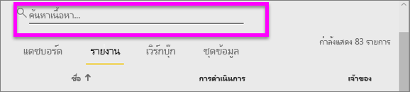
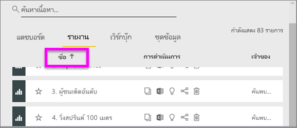
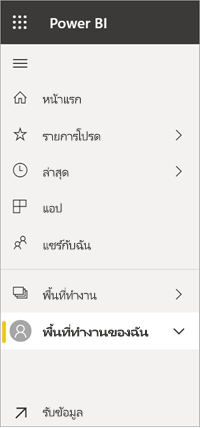
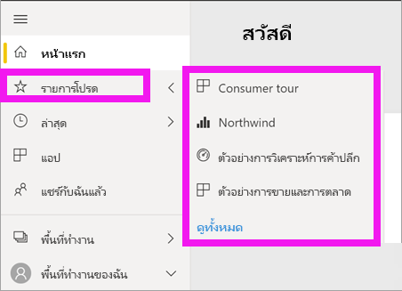

# การนำทาง: ค้นหาและการเรียงลำดับเนื้อหาของคุณในบริการ Power BI
เรานำเสนอแนวทางในการนำทางเนื้อหาของคุณในบริการของ Power BI หลายวิธี เนื้อหาดังกล่าวจะได้รับการจัดการภายในพื้นที่ทำงานของคุณซึ่งแยกตามประเภท: แดชบอร์ดและรายงาน  นอกจากนี้ยังมีการจัดระเบียบเนื้อหาแยกตามการใช้งาน: รายการโปรด ล่าสุด แอปฯ แชร์กับฉัน และที่แนะนำ สำหรับการนำทางแบบครบวงจร *หน้าหลัก*ของ Power BI จัดระเบียบเนื้อหาทั้งหมดในหน้าเดียว เส้นทางที่แตกต่างเหล่านี้ในเนื้อหาของคุณช่วยให้คุณสามารถค้นหาสิ่งที่คุณต้องการได้อย่างรวดเร็วในบริการของ Power BI  

## นำทางภายในพื้นที่ทำงาน

โดยทั่วไป *ผู้บริโภค*ของ Power BI จะมีพื้นที่ทำงานเดียวเท่านั้น: **พื้นที่ทำงานของฉัน** **พื้นที่ทำงานของฉัน** จะมีเนื้อหาหากคุณดาวน์โหลดตัวอย่าง Microsoft หรือสร้างหรือดาวน์โหลดแดชบอร์ด รายงาน หรือแอปของคุณเอง  

ภายใน **พื้นที่ทำงานของฉัน** บริการของ Power BI แยกเนื้อหาของคุณตามประเภท: แดชบอร์ด รายงาน สมุดงาน และชุดข้อมูล คุณจะเห็นองค์กรนี้เมื่อคุณเลือกพื้นที่ทำงานหนึ่ง ในตัวอย่างนี้ **พื้นที่ทำงานของฉัน**มีแดชบอร์ดหนึ่งรายการ รายงานหนึ่งรายการ ไม่มีสมุดงาน และชุดข้อมูลหนึ่งชุด

________________________________________
## การนำทางโดยใช้เขตข้อมูลค้นหา
ใช้มุมมองเนื้อหา **พื้นที่ทำงานของฉัน** เพื่อค้นหา กรอง และเรียงลำดับเนื้อหาของคุณ ในเขตข้อมูลการค้นหา ให้พิมพ์ชื่อทั้งหมดหรือบางส่วนของแดชบอร์ด รายงาน สมุดงาน หรือเจ้าของ  

หากคุณมีเนื้อหาเพียงเล็กน้อยเท่านั้น คุณไม่จำเป็นต้องค้นหาและเรียงลำดับ  แต่เมื่อคุณมีรายการแดชบอร์ดและรายงานจำนวนมาก คุณจะพบว่าการค้นหาและเรียงลำดับมีประโยชน์มาก ตัวอย่างเช่น รายชื่อรายงานด้านล่างมี 83 รายการ 

นอกจากนี้คุณยังสามารถเรียงลำดับเนื้อหาตามชื่อหรือเจ้าของ สังเกตลูกศรชี้ขึ้นที่ด้านขวาของ **ชื่อ** ขณะนี้เรากำลังจัดเรียงชื่อ 83 รายการตามตัวอักษรจากน้อยไปหามาก หากต้องการเปลี่ยนลำดับการจัดเรียงให้เป็นจากมากไปน้อย ให้เลือก **ชื่อ** ลูกศรชี้ขึ้นจะเปลี่ยนเป็นลูกศรชี้ลง

ไม่ใช่ทุกคอลัมน์ที่จะสามารถจัดเรียงได้ วางเมาส์เหนือส่วนหัวของคอลัมน์เพื่อค้นหาว่าสามารถเรียงลำดับได้หรือไม่

___________________________________________________________________
## การนำทางโดยใช้แถบนำทางด้านซ้าย
แถบนำทางด้านซ้ายแยกประเภทเนื้อหาของคุณด้วยในรูปแบบที่ช่วยให้คุณค้นหาสิ่งที่คุณต้องการได้อย่างรวดเร็ว  

- เนื้อหาที่แชร์กับคุณอยู่ใน**แชร์กับฉัน**
- เนื้อหาที่คุณดูล่าสุดอยู่ใน**ล่าสุด** 
- สามารถดูแอปของคุณได้โดยเลือกที่**แอป**
- **หน้าหลัก**คือมุมมองหน้าเดียวของเนื้อหาที่สำคัญที่สุดของคุณ รวมถึงเนื้อหาที่แนะนำและแหล่งการเรียนรู้

นอกจากนี้ คุณสามารถแท็กเนื้อหาเป็น[รายการโปรด](end-user-favorite.md)และ[ที่แนะนำ](end-user-featured.md)ได้ เลือกแดชบอร์ดหรือรายงานหนึ่งรายการที่คุณคาดว่าจะดูบ่อยที่สุด และตั้งเป็นเนื้อหา *ที่โดดเด่น* ของคุณ แต่ละครั้งที่คุณเปิดบริการของ Power BI แดชบอร์ดที่โดดเด่นของคุณจะปรากฏเป็นรายการแรก คุณมีแดชบอร์ดและแอปฯจำนวนมากที่คุณเยี่ยมชมบ่อยครั้งหรือไม่? การตั้งค่าแดชบอร์ดและแอปเหล่านั้นเป็นรายการโปรด จะทำให้แดชบอร์ดและแอปพร้อมใช้งานเสมอจากแถบนำทางด้านซ้ายของคุณ

.

## ข้อควรพิจารณาและการแก้ไขปัญหา
* สำหรับชุดข้อมูล เจ้าของไม่สามารถใช้งาน **เรียงลำดับตาม**ได้

## ขั้นตอนถัดไป
[เรียงลำดับวิชวลในรายงาน](end-user-change-sort.md)

มีคำถามเพิ่มเติมหรือไม่? [ลองไปที่ชุมชน Power BI](http://community.powerbi.com/)
