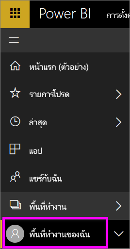
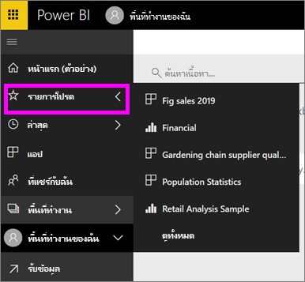

# การนำทาง: ค้นหาและการเรียงลำดับเนื้อหาของคุณในบริการ Power BI
มีหลายวิธีในการนำทางเนื้อหาของคุณในบริการ Power BI เนื้อหาดังกล่าวจะได้รับการจัดการภายในพื้นที่ทำงานแยกตามประเภท: แดชบอร์ด รายงาน สมุดงาน และชุดข้อมูล  นอกจากนี้ยังมีการจัดระเบียบเนื้อหาแยกตามการใช้งาน: รายการโปรด ล่าสุด แอปฯ แชร์กับฉัน และที่แนะนำ สำหรับการนำทางแบบครบวงจร หน้าหลักจัดระเบียบเนื้อหาทั้งหมดในหน้าเดียว เส้นทางที่แตกต่างกันเหล่านี้ที่เข้ามาในเนื้อหาของคุณอนุญาตให้คุณค้นหาสิ่งที่คุณต้องการในบริการ Power BI ได้อย่างรวดเร็ว  

## นำทางภายในพื้นที่ทำงาน

โดยทั่วไป *ผู้บริโภค*ของ Power BI จะมีพื้นที่ทำงานเดียวเท่านั้น: **พื้นที่ทำงานของฉัน** **พื้นที่ทำงานของฉัน**จะมีเนื้อหาหากคุณได้ดาวน์โหลดตัวอย่าง Microsoft หรือสร้าง หรือดาวน์โหลดเนื้อหาของคุณเอง  

ภายใน **พื้นที่ทำงานของฉัน** บริการ Power BI แยกเนื้อหาของคุณตามประเภท: แดชบอร์ด รายงาน สมุดงาน และชุดข้อมูล คุณจะเห็นองค์กรนี้เมื่อคุณเลือกพื้นที่ทำงานหนึ่ง ในตัวอย่างนี้ **พื้นที่ทำงานของฉัน**มีแดชบอร์ดหนึ่งรายการ รายงานสองรายการ ไม่มีสมุดงาน และชุดข้อมูลสองชุด

________________________________________

## นำทางโดยใช้แถบนำทางด้านซ้าย
แถบนำทางด้านซ้ายแยกประเภทเนื้อหาของคุณด้วยวิธีที่ทำให้ง่ายต่อการค้นหาสิ่งที่คุณต้องการได้อย่างรวดเร็ว  

- เนื้อหาที่แชร์กับคุณอยู่ใน**แชร์กับฉัน**
- เนื้อหาที่คุณดูล่าสุดอยู่ใน**ล่าสุด** 
- สามารถดูแอปของคุณได้โดยเลือกที่**แอป**
- **หน้าหลัก**คือมุมมองหน้าเดียวของเนื้อหาที่สำคัญที่สุดของคุณ รวมถึงเนื้อหาที่แนะนำและแหล่งการเรียนรู้

นอกจากนี้ คุณสามารถแท็กเนื้อหาเป็น[รายการโปรด](end-user-favorite.md)และ[ที่แนะนำ](end-user-featured.md)ได้ เลือกแดชบอร์ดหนึ่งที่คุณคาดว่าจะดูบ่อยที่สุด และตั้งค่าเป็นแดชบอร์ด*ที่แนะนำ*ของคุณ แต่ละครั้งที่คุณเปิดบริการ Power BI แดชบอร์ดที่แสดงของคุณจะปรากฏเป็นรายการแรก คุณมีแดชบอร์ดและแอปฯจำนวนมากที่คุณเยี่ยมชมบ่อยครั้งหรือไม่? การตั้งค่าแดชบอร์ดและแอปฯเหล่านั้นเป็นรายการโปรด จะทำให้แดชบอร์ดและแอปฯพร้อมใช้งานเสมอจากแถบนำทางด้านซ้ายของคุณ

.

## ข้อควรพิจารณาและการแก้ไขปัญหา
* สำหรับชุดข้อมูล เจ้าของไม่สามารถใช้งาน **เรียงลำดับตาม**ได้

## ขั้นตอนถัดไป
[Power BI แนวคิดพื้นฐาน](end-user-basic-concepts.md)

มีคำถามเพิ่มเติมหรือไม่ [ลองไปที่ชุมชน Power BI](http://community.powerbi.com/)