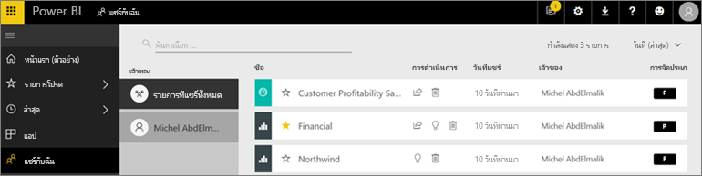
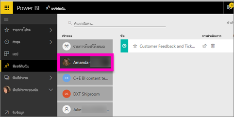

# แสดงแดชบอร์ดและรายงานที่ได้แชร์กับฉัน
## แชร์กับฉัน

เมื่อเพื่อนร่วมงานแชร์เนื้อหากับคุณ ใช้ปุ่ม**แชร์** ซึ่งปรากฏในที่เก็บ**แชร์กับฉัน** สามารถดูแดชบอร์ดหรือรายงานได้จาก **แชร์กับฉัน** และไม่สามารถดูได้จาก **แอป**

ดู Amanda ่อธิบายรายการเนื้อหา**แชร์กับฉัน** และแสดงให้เห็นวิธีการนำทางและกรองรายการ แล้ว ทำตามคำแนะนำทีละขั้นตอนด้านล่างวิดีโอเพื่อลองทำด้วยตนเอง เพื่อที่คุณจะสามารถดูแดชบอร์ดที่แชร์กับคุณ คุณจำเป็นต้องมีสิทธิ์การใช้งาน Power BI Pro อ่าน[Power BI Premium คืออะไร](../service-premium-what-is.md)สำหรับรายละเอียด

<iframe width="560" height="315" src="https://www.youtube.com/embed/G26dr2PsEpk" frameborder="0" allowfullscreen></iframe>

คุณจะมีตัวเลือกมากมายในการโต้ตอบกับแดชบอร์ดและรายงาน ตามการอนุญาตที่ได้รับจากตัวออกแบบ ซึ่งรวมถึงการทำสำเนาของแดชบอร์ด เปิดรายงาน[ในมุมมองการอ่าน](end-user-reading-view.md)และแชร์อีกครั้งกับเพื่อนร่วมงานคนอื่นๆ

## ดูการดำเนินการได้จากที่เก็บ**แชร์กับฉัน**
* เลือกไอคอนเครื่องหมายดอกจันเพื่อ[ตั้งแดชบอร์ดหรือรายงานเป็นรายการโปรด](end-user-favorite.md)
* ลบแดชบอร์ดหรือรายงาน  
* สามารถแชร์แดชบอร์ดหรือรายงานบางอย่างได้อีก  
* นอกจากนี้ หากคุณมีรายการยาว [ใช้เขตข้อมูลค้นหาและการจัดเรียงเพื่อหาสิ่งที่คุณต้องการ](end-user-search-sort.md)
  
  > [!NOTE]
  > สำหรับข้อมูลเกี่ยวกับการจัดประเภท EGRC ให้เลือกปุ่มการจัดประเภท หรือ[เยี่ยมชมจัดประเภทข้อมูลแดชบอร์ด](../service-data-classification.md)
  > 
  > 
* เลือกชื่อของแดชบอร์ดเพื่อเปิดและสำรวจ เมื่อคุณเปิดแดชบอร์ดที่ใช้ร่วมกัน คุณสามารถใช Q&A เพื่อถามคำถามเกี่ยวกับข้อมูลพื้นฐาน หรือเลือกไทล์เพื่อเปิดและโต้ตอบกับรายงานในมุมมองการอ่าน

## กรองแดชบอร์ดที่แชร์โดยเจ้าของ
เนื้อหาในหน้าจอ**แชร์กับฉัน** คุณสามารถเพิ่มเติมการกรองอื่นๆโดยเจ้าของเนื้อหาได้ ตัวอย่าง ถ้าฉันเลือก**Amanda** ฉันเห็นแดชบอร์ดที่ Amanda ได้แชร์กับฉันเท่านั้น

