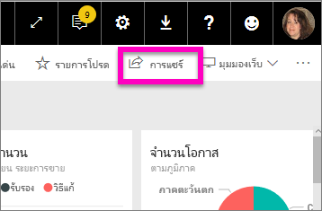

# ดูรายการแดชบอร์ด Power BI ที่ใช้ร่วมกันกับคุณ
## แชร์กับฉัน

เมื่อเพื่อนร่วมงานแชร์แดชบอร์ดกับคุณ ชื่อเรื่องจะถูกเพิ่มเในรายการ**แชร์กับฉัน** แดชบอร์ดพร้อมใช้งานจาก**แชร์กับฉัน**และไม่พร้อมใช้งานจากพื้นที่ทำงาน หรือจาก**แอป**

ดู Amanda ่อธิบายรายการเนื้อหา**แชร์กับฉัน** และแสดงให้เห็นวิธีการนำทางและกรองรายการ แล้ว ทำตามคำแนะนำทีละขั้นตอนด้านล่างวิดีโอเพื่อลองทำด้วยตนเอง เพื่อที่คุณจะสามารถดูแดชบอร์ดที่แชร์กับคุณ คุณจำเป็นต้องมีสิทธิ์การใช้งาน Power BI Pro อ่าน[Power BI Premium คืออะไร](../service-premium.md)สำหรับรายละเอียด

<iframe width="560" height="315" src="https://www.youtube.com/embed/G26dr2PsEpk" frameborder="0" allowfullscreen></iframe>

คุณจะมีตัวเลือกมากมายเพื่อโต้ตอบกับแดชบอร์ดและรายงานที่สำคัญ โดยขึ้นอยู่กับสิทธิ์ที่เจ้าของให้คุณ ซึ่งรวมถึงการทำสำเนาของแดชบอร์ด เปิดรายงาน[ในมุมมองการอ่าน](end-user-reading-view.md)และแชร์อีกครั้งกับเพื่อนร่วมงานคนอื่นๆ

## การดำเนินการที่พร้อมใช้งานจากหน้าจอ**แชร์กับฉัน**
* เลือกไอคอนเครื่องหมายดอกจัน[เพิ่มแดชบอร์ดเป็นรายการโปรด](end-user-favorite.md)
* [ลบแดชบอร์ด](end-user-delete.md)
* บางแดชบอร์ดสามารถแชร์อีกครั้งได้  
* นอกจากนี้ ถ้ารายการของแดชบอร์ดยาวขึ้น[ให้ใช้เขตข้อมูลการค้นหาและค้นหาสิ่งที่คุณต้องการเรียงลำดับ](end-user-search-filter-sort.md)
  
  > [!NOTE]
  > สำหรับข้อมูลเกี่ยวกับการจัดประเภท EGRC ให้เลือกปุ่มการจัดประเภท หรือ[เยี่ยมชมจัดประเภทข้อมูลแดชบอร์ด](../service-data-classification.md)
  > 
  > 
* เลือกชื่อของแดชบอร์ดเพื่อเปิดและสำรวจ เมื่อคุณเปิดแดชบอร์ดที่ใช้ร่วมกัน คุณสามารถใช Q&A เพื่อถามคำถามเกี่ยวกับข้อมูลพื้นฐาน หรือเลือกไทล์เพื่อเปิดและโต้ตอบกับรายงานในมุมมองการอ่าน

## กรองแดชบอร์ดที่แชร์โดยเจ้าของ
เนื้อหาในหน้าจอ**แชร์กับฉัน** คุณสามารถเพิ่มเติมการกรองอื่นๆโดยเจ้าของเนื้อหาได้ ตัวอย่าง ถ้าฉันเลือก**Amanda** ฉันเห็นแดชบอร์ดที่ Amanda ได้แชร์กับฉันเท่านั้น

## ขั้นตอนถัดไป
[Power BI แนวคิดพื้นฐาน](end-user-basic-concepts.md)  
[Power BI Premium คืออะไร](../service-premium.md)  

มีคำถามเพิ่มเติมหรือไม่ [ลองถามชุมชน Power BI](http://community.powerbi.com/)

