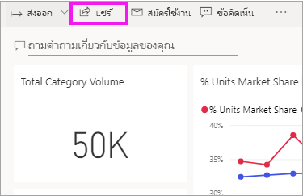
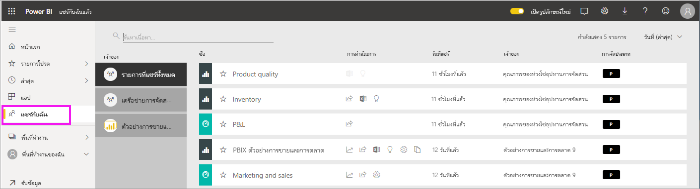
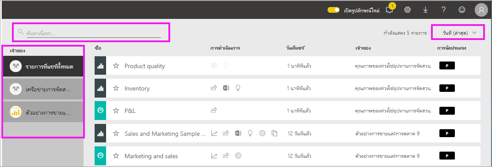

# แสดงแดชบอร์ดและรายงานที่ได้แชร์กับฉัน

[!INCLUDE[consumer-appliesto-yyny](../includes/consumer-appliesto-yyny.md)]

[!INCLUDE [power-bi-service-new-look-include](../includes/power-bi-service-new-look-include.md)]

เมื่อเพื่อนร่วมงานแชร์เนื้อหากับคุณ ใช้ปุ่ม**แชร์** ซึ่งปรากฏในที่เก็บ**แชร์กับฉัน** สามารถดูแดชบอร์ดหรือรายงานได้จาก **แชร์กับฉัน** และไม่สามารถดูได้จาก **แอป**

ดู Amanda ่อธิบายรายการเนื้อหา**แชร์กับฉัน** และแสดงให้เห็นวิธีการนำทางและกรองรายการ แล้ว ทำตามคำแนะนำทีละขั้นตอนด้านล่างวิดีโอเพื่อลองทำด้วยตนเอง เพื่อที่คุณจะสามารถดูแดชบอร์ดที่แชร์กับคุณ คุณจำเป็นต้องมีสิทธิ์การใช้งาน Power BI Pro อ่าน[Power BI Premium คืออะไร](../admin/service-premium-what-is.md)สำหรับรายละเอียด
    

> [!NOTE]
> วิดีโอนี้ใช้บริการ Power BI รุ่นเก่า
    

<iframe width="560" height="315" src="https://www.youtube.com/embed/G26dr2PsEpk" frameborder="0" allowfullscreen></iframe>

## โต้ตอบกับเนื้อหาแชร์

คุณมีตัวเลือกในการโต้ตอบกับแดชบอร์ดแบบแชร์และรายงานแชร์ ขึ้นอยู่กับสิทธิ์ที่*ผู้ออกแบบ*กำหนดให้กับคุณ ซึ่งรวมถึงการทำสำเนาของแดชบอร์ด เปิดรายงาน[ในมุมมองการอ่าน](end-user-reading-view.md)และแชร์อีกครั้งกับเพื่อนร่วมงานคนอื่นๆ

### ดูการดำเนินการได้จากที่เก็บ**แชร์กับฉัน**
การดำเนินการที่คุณสามารถใช้ได้จะขึ้นอยู่กับค่าปรับตั้งที่กำหนดโดย*ผู้ออกแบบ*เนื้อหา ตัวเลือกบางส่วนของคุณอาจได้แก่
* เลือกไอคอนรูปดาวเพื่อ[ทำรายการโปรดแดชบอร์ดหรือรายงาน](end-user-favorite.md)
* ลบแดชบอร์ดหรือรายงาน  .
* สามารถแชร์แดชบอร์ดหรือรายงานบางอย่างได้อีก  .
* [เปิดรายงานในไอคอนส่งออก Excel](end-user-export.md) 
* [ดูข้อมูลเชิงลึก](end-user-insights.md)ที่ Power BI พบในสำหรับข้อมูลดังกล่าว
  
  > [!NOTE]
  > ดูรายละเอียดการแยกประเภท EGRC โดยเลือก **การแยกประเภท** หรือ [ดูการแยกประเภทข้อมูลแดชบอร์ด](../create-reports/service-data-classification.md)
  > 

## ค้นหาและจัดเรียงแดชบอร์ดแชร์
หากรายการเนื้อหาของคุณยาวเกินไป คุณมีหลายตัวเลือกในการค้นหาสิ่งที่คุณต้องการ คุณสามารถใช้เขตข้อมูลค้นหา จัดเรียงจากวันที่ หรือเลือกจากคอลัมน์ **ผู้ดูแล**    

