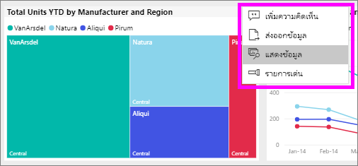
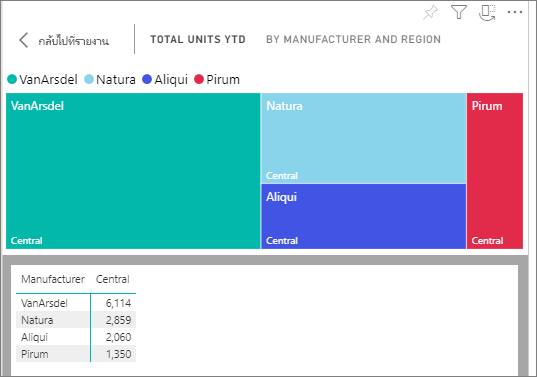
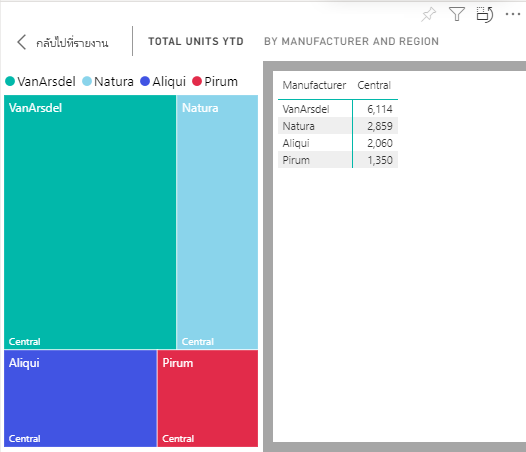

# แสดงข้อมูลพร้อมรายงาน Power BI

[!INCLUDE[consumer-appliesto-yyny](../includes/consumer-appliesto-yyny.md)]

[!INCLUDE [power-bi-service-new-look-include](../includes/power-bi-service-new-look-include.md)]

ระบบจะสร้างการแสดงผลด้วยภาพของ Power BI ขึ้นโดยใช้ข้อมูลจากชุดข้อมูลเบื้องต้น หากคุณสนใจที่เห็นเบื้องหลัง Power BI ให้คุณสามารถ*แสดง*ข้อมูลที่กำลังกำลังมีการใช้เพื่อสร้างภาพดังกล่าวในรายงาน เมื่อคุณเลือก**แสดงข้อมูล** Power BI จะแสดงข้อมูลด้านล่าง (หรือถัดจาก) การแสดงผลด้วยภาพ

จากแดชบอร์ด สามารถดูข้อมูลที่เกี่ยวข้องได้โดยใช้ [ส่งออกเป็น Excel](end-user-export.md)

## แสดงข้อมูลที่กำลังใช้เพื่อจัดทำส่วนการแสดงผลรายงาน
1. ในบริการของ Power BI ให้[เปิดรายงาน](end-user-report-open.md)แล้วเลือกการแสดงผลด้วยภาพ  
2. เมื่อต้องการแสดงข้อมูลเบื้องหลังวิชวล เลือก **ตัวเลือกเพิ่มเติม** (...) และเลือก **แสดงข้อมูล**
   
   
3. ตามค่าเริ่มต้น ข้อมูลจะแสดงที่ด้านล่างภาพ
   
   

4. หากต้องการเปลี่ยนการวางแนว โปรดเลือกเค้าโครงแนวตั้ง  บริเวณมุมบนขวาของการแสดงผลภาพ
   
   

## ขั้นตอนถัดไป
[การแสดงผลด้วยภาพในรายงาน Power BI](../visuals/power-bi-report-visualizations.md)    
[รายงาน Power BI](end-user-reports.md)    
