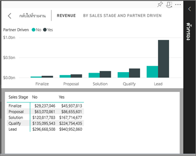
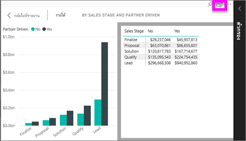

# แสดงข้อมูลที่ใช้เพื่อสร้างการแสดงภาพ
## แสดงข้อมูลในมุมมองการอ่าน
ภาพ Power BI จะสร้างขึ้นโดยใช้ข้อมูลจากชุดข้อมูลเบื้องต้น หากคุณสนใจที่เห็นเบื้องหลัง Power BI ให้คุณสามารถ*แสดง*ข้อมูลที่กำลังกำลังมีการใช้เพื่อสร้างภาพดังกล่าว เมื่อคุณเลือก**แสดงข้อมูล** Power BI แสดงข้อมูลด้านล่าง (หรือถัดจาก) การแสดงภาพ

## การใช้ *แสดงข้อมูล* ในมุมมองการอ่านของบริการ Power BI
1. ในบริการ Power BI เปิดรายงาน (ในมุมมองการอ่าน) และเลือกภาพหนึ่ง  
2. เมื่อต้องแสดงข้อมูลของภาพ ให้เลือกจุดไข่ปลา (...) แล้วเลือก**แสดงข้อมูล**
   
   
3. ตามค่าเริ่มต้น ข้อมูลจะแสดงที่ด้านล่างภาพ
   
   

4. หากต้องการเปลี่ยนการวางแนว โปรดเลือกเค้าโครงแนวตั้ง  บริเวณมุมบนขวาของการแสดงผลภาพ
   
   

## ขั้นตอนถัดไป
[การแสดงภาพในรายงาน Power BI](../visuals/power-bi-report-visualizations.md)    
[รายงาน Power BI](end-user-reports.md)    
