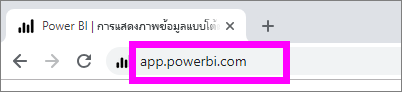
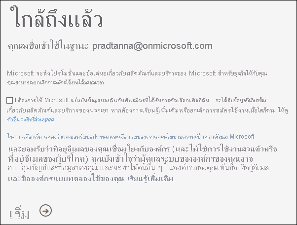
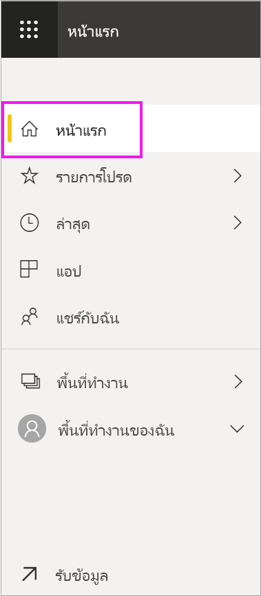
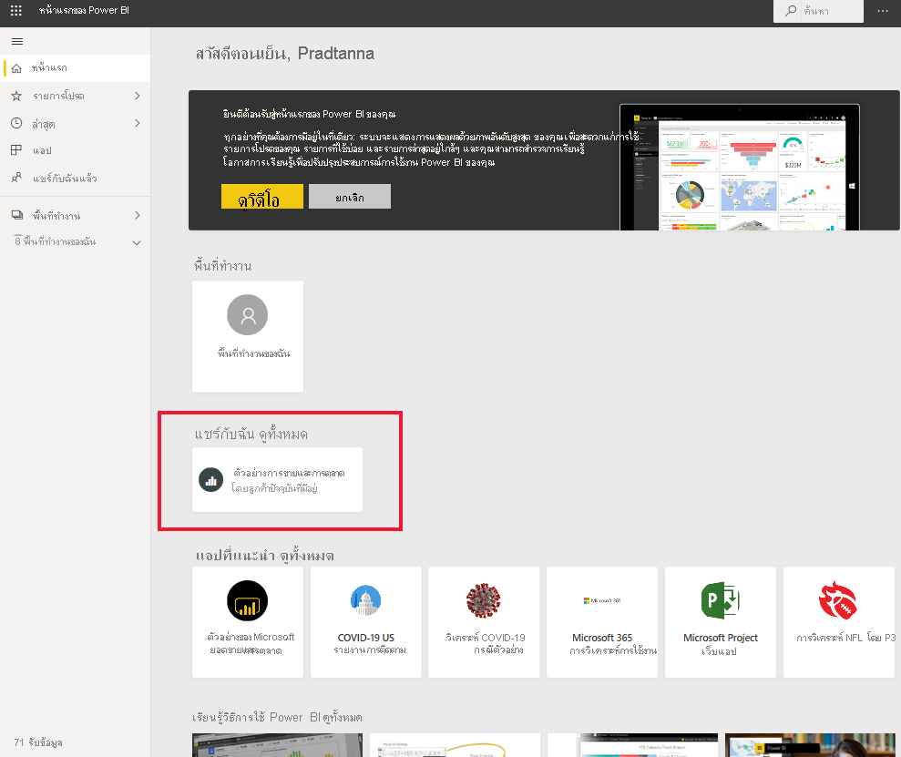
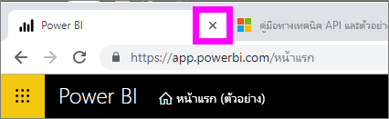
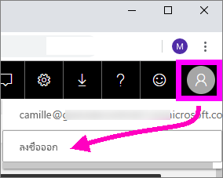

# ลงชื่อเข้าใช้บริการ Power BI

[!INCLUDE[consumer-appliesto-yynn](../includes/consumer-appliesto-yynn.md)]

## บัญชี Power BI
ก่อนที่คุณจะสามารถลงชื่อเข้าใช้ Power BI คุณต้องมีบัญชี มีสองวิธีในการรับบัญชี Power BI วิธีแรกคือเมื่อองค์กรของคุณซื้อสิทธิ์การใช้งาน Power BI สำหรับพนักงานขององค์กร และวิธีที่สองคือเมื่อ [บุคคลลงทะเบียนทดลองใช้ฟรีหรือมีสิทธิ์การใช้งานส่วนบุคคล](../fundamentals/service-self-service-signup-for-power-bi.md) บทความนี้ครอบคลุมถึงสถานการณ์แรก

## ลงชื่อเข้าใช้เป็นครั้งแรก

### ขั้นตอนที่ 1: เปิดบริการ Power BI
บริการ Power BI ทำงานในเบราว์เซอร์ 

- ถ้าคุณได้รับอีเมลจากเพื่อนร่วมงานที่มีลิงก์ไปยังแดชบอร์ดหรือรายงาน ให้เลือกลิงก์เพื่อ **เปิดรายงานนี้** หรือ **เปิดแดชบอร์ดนี้**

        

- หรือ เปิดเบราว์เซอร์ที่คุณชื่นชอบและพิมพ์ **app.powerbi.com**

        

### ขั้นตอนที่ 2: พิมพ์ที่อยู่อีเมลของคุณ
ในครั้งแรกที่คุณลงชื่อเข้าใช้ Microsoft จะตรวจสอบเพื่อดูว่าคุณมีบัญชี Microsoft 365 อยู่แล้วหรือไม่ ในตัวอย่างด้านล่าง Pradtanna มีสิทธิ์การใช้งานสำหรับบริการอื่นๆ ของ Microsoft อยู่แล้ว 

กรอกรหัสผ่านของคุณ นี่คือรหัสผ่านบัญชี Microsoft 365 ของคุณ โดยเป็นอีเมลและรหัสผ่านเดียวกันกับที่คุณใช้สำหรับผลิตภัณฑ์อื่นๆ ของ Microsoft เช่น Outlook และ Office  ทั้งนี้ขึ้นอยู่กับวิธีการตั้งค่าบัญชีของคุณ คุณอาจได้รับพร้อมท์แจ้งให้ป้อนรหัสที่ส่งไปยังอีเมลหรืออุปกรณ์เคลื่อนที่ของคุณ   

ในบางครั้งผู้ดูแลระบบส่วนกลางของคุณจะมอบหมายสิทธิ์การใช้งานและส่งอีเมลพร้อมกับข้อมูลนี้ให้คุณ ค้นหาในกล่องขาเข้าของคุณสำหรับอีเมลต้อนรับและทำตามคำแนะนำเพื่อลงชื่อเข้าใช้เป็นครั้งแรก ใช้บัญชีอีเมลเดียวกันนี้สำหรับการลงชื่อเข้าใช้ของคุณ 
 
### ขั้นตอนที่ 3: ทบทวนข้อตกลงและเงื่อนไข
ทบทวนข้อตกลงและเงื่อนไข และหสกคุณยอมรับ ให้เลือกกล่องกาเครื่องหมายและเลือก **เริ่มต้น**

### ขั้นตอนที่ 4: ตรวจสอบหน้า landing page ของคุณ
เมื่อคุณเข้ามาเป็นครั้งแรก Power BI จะเปิด **หน้าแรก** ของ landing page ขึ้น ถ้า **หน้าแรก**  ไม่เปิดขึ้นให้เลือกจากบานหน้าต่างนำทาง 

คุณจะเห็นเนื้อหาทั้งหมดที่คุณได้รับอนุญาตให้ใช้ในหน้าแรก สำหรับตอนแรก อาจมีเนื้อหาไม่มากนัก แต่ไม่ต้องกังวล เพราะหน้าโฮมของคุณจะเปลี่ยนแปลงไปเมื่อคุณเริ่มใช้ Power BI กับเพื่อนร่วมงานของคุณ จดจำรายงานที่เพื่อนร่วมงานของคุณแชร์กับคุณทางอีเมลหรือไม่ รายงานนั้นจะอยู่บนหน้าแรกของ landing page ของคุณภายใต้หัวเรื่อง **แชร์กับฉัน**

หากคุณไม่ต้องการให้ Power BI เปิดหน้าแรกของคุณ คุณสามารถ[ตั้งค่า**ฟีเจอร**์แดชบอร์ดหรือรายงานที่สนใจ](end-user-featured.md)เพื่อเปิดทดแทนได้ 

## โต้ตอบกับเนื้อหาอย่างปลอดภัย
ในฐานะที่เป็น***ลูกค้า*** ผู้อื่นจะแชร์เนื้อหากับคุณ และคุณจะโต้ตอบกับเนื้อหานั้นเพื่อสำรวจข้อมูล และทำการตัดสินใจทางธุรกิจ  ในขณะที่คุณกรอง แบ่ง ทำการสมัครเป็นสมาชิก ส่งออก และปรับขนาด ไม่ต้องกังวลไป งานของคุณจะไม่ส่งผลกระทบต่อชุดข้อมูลพื้นฐานหรือเนื้อหาที่มีการแชร์ดั้งเดิม (แดชบอร์ดและรายงาน) Power BI เป็นพื้นที่ปลอดภัยสำหรับคุณในการสำรวจและทดสอบ ซึ่งไม่ได้หมายความว่า คุณไม่สามารถบันทึกการเปลี่ยนแปลงของคุณ - คุณสามารถ แต่การเปลี่ยนแปลงเหล่านั้นมีผลเฉพาะกับมุมมองของเนื้อหา**ของคุณ**เท่านั้น และการย้อนกลับไปยังมุมมองเริ่มต้นดั้งเดิมนั้นง่าย เพียงแค่การคลิกปุ่ม

## ลงชื่อออกจากบริการ Power BI
เมื่อคุณปิดหรือลงชื่อออกจาก Power BI การเปลี่ยนแปลงของคุณจะได้รับการบันทึกเพื่อให้คุณสามารถหยิบขึ้นมาได้ทันทีเมื่อออกจากระบบ

หากต้องการปิด Power BI ให้ปิดแท็บเบราว์เซอร์ที่คุณใช้งานอยู่ 

 

หากคุณแชร์คอมพิวเตอร์ เราขอแนะนำให้ออกจากระบบทุกครั้งที่คุณปิด Power BI  ในการออกจากระบบ ให้เลือกรูปโปรไฟล์ของคุณแล้วเลือก **ออกจากระบบ** จากมุมขวาบน  

 

## การแก้ไขปัญหาและข้อควรพิจารณา
- หากคุณลงทะเบียน Power BI เป็นรายบุคคล ให้ลงชื่อเข้าใช้ด้วยที่อยู่อีเมลที่คุณใช้ในกาลงทะเบียน

- บางคนใช้ Power BI มากกว่าหนึ่งบัญชี ถ้าเป็นเช่นนั้นเมื่อลงชื่อเข้าใช้ระบบจะทำให้คุณพร้อมท์ให้เลือกบัญชีจากรายการ 

## ขั้นตอนถัดไป
[ดูแอป Power BI](end-user-app-view.md)
