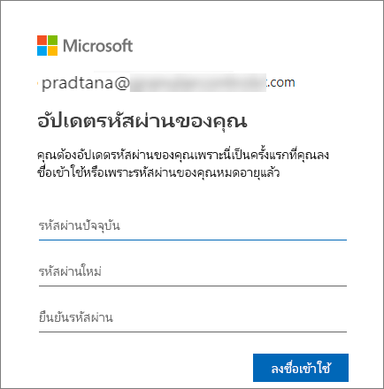

# ลงชื่อเข้าใช้บริการ Power BI

[!INCLUDE[consumer-appliesto-yyny](../includes/consumer-appliesto-yyny.md)]

## บัญชี Power BI
ก่อนที่คุณจะสามารถลงชื่อเข้าใช้ Power BI คุณต้องมีบัญชี มีสองวิธีในการรับบัญชี Power BI วิธีแรกคือเมื่อบริษัทของคุณซื้อสิทธิ์การใช้งาน Power BI สำหรับพนักงาน และวิธีที่สองคือเมื่อบุคคลลงทะเบียนทดลองใช้ฟรีหรือมีสิทธิ์การใช้งานส่วนบุคคล บทความนี้ครอบคลุมถึงสถานการณ์แรก

## ลงชื่อเข้าใช้เป็นครั้งแรก

### ขั้นตอนที่ 1: เปิดเบราว์เซอร์
บริการ Power BI ทำงานในเบราว์เซอร์  ดังนั้นขั้นตอนที่หนึ่งคือการเปิดเบราว์เซอร์ที่คุณชื่นชอบและพิมพ์ **app.powerbi.com**

### ขั้นตอนที่ 2: พิมพ์ที่อยู่อีเมลของคุณ
ครั้งแรกที่คุณลงชื่อเข้าใช้ คุณจะถูกถามถึงที่อยู่อีเมลของคุณ  อีเมล์ที่อยู่นี้เป็นที่อยู่บัญชีของที่ทำงานหรือโรงเรียนเพื่อใช้ในการสมัครใช้งาน Power BI  

ดูในกล่องจดหมายขาเข้าของคุณสำหรับอีเมลจากผู้ดูแลระบบ Power BI ของคุณ ผู้ดูแลระบบส่วนใหญ่จะส่งอีเมลต้อนรับ ซึ่งในอีเมลประกอบด้วยรหัสผ่านชั่วคราวของคุณ ใช้บัญชีอีเมลนี้สำหรับการลงชื่อเข้าใช้ 

 
### ขั้นตอนที่ 3: สร้างรหัสผ่านใหม่
ถ้าผู้ดูแลระบบ Power BI ของคุณส่งรหัสผ่านชั่วคราวมาให้ กรุณาป้อนรหัสดังกล่าวในเขตข้อมูล **รหัสผ่านปัจจุบัน** ถ้าคุณยังไม่ได้รับรหัสผ่านใดๆ ในอีเมล กรุณาติดต่อผู้ดูแลระบบ Power BI ของคุณ

ถ้าคุณต้องการให้ Power BI จดจำข้อมูลประจำตัวของคุณให้เลือก **ใช่** 

### ขั้นตอนที่ 4: ตรวจสอบหน้า landing page ของคุณ
เมื่อคุณเข้ามาเป็นครั้งแรก Power BI จะเปิด **หน้าแรก** ของ landing page ขึ้น ถ้า **หน้าแรก**  ไม่เปิดขึ้นให้เลือกจากบานหน้าต่างนำทาง 

คุณจะเห็นเนื้อหาทั้งหมดที่คุณได้รับอนุญาตให้ใช้ในหน้าแรก สำหรับตอนแรก อาจมีเนื้อหาไม่มากนัก แต่ไม่ต้องกังวล เพราะหน้าโฮมของคุณจะเปลี่ยนแปลงไปเมื่อคุณเริ่มใช้ Power BI กับเพื่อนร่วมงานของคุณ 

หากคุณไม่ต้องการให้ Power BI เปิดหน้าแรกของคุณ คุณสามารถ[ตั้งค่า**ฟีเจอร**์แดชบอร์ดหรือรายงานที่สนใจ](end-user-featured.md)เพื่อเปิดทดแทนได้ 

## โต้ตอบกับเนื้อหาอย่างปลอดภัย
ในฐานะที่เป็น***ลูกค้า*** ผู้อื่นจะแชร์เนื้อหากับคุณ และคุณจะโต้ตอบกับเนื้อหานั้นเพื่อสำรวจข้อมูล และทำการตัดสินใจทางธุรกิจ  ในขณะที่คุณกรอง แบ่ง ทำการสมัครเป็นสมาชิก ส่งออก และปรับขนาด ไม่ต้องกังวลไป งานของคุณจะไม่ส่งผลกระทบต่อชุดข้อมูลพื้นฐานหรือเนื้อหาที่มีการแชร์ดั้งเดิม (แดชบอร์ดและรายงาน) Power BI เป็นพื้นที่ปลอดภัยสำหรับคุณในการสำรวจและทดสอบ ซึ่งไม่ได้หมายความว่า คุณไม่สามารถบันทึกการเปลี่ยนแปลงของคุณ - คุณสามารถ แต่การเปลี่ยนแปลงเหล่านั้นมีผลเฉพาะกับมุมมองของเนื้อหา**ของคุณ**เท่านั้น และการย้อนกลับไปยังมุมมองเริ่มต้นดั้งเดิมนั้นง่าย เพียงแค่การคลิกปุ่ม

## ลงชื่อออกจากบริการ Power BI
เมื่อคุณปิดหรือลงชื่อออกจาก Power BI การเปลี่ยนแปลงของคุณจะได้รับการบันทึกเพื่อให้คุณสามารถหยิบขึ้นมาได้ทันทีเมื่อออกจากระบบ

หากต้องการปิด Power BI ให้ปิดแท็บเบราว์เซอร์ที่คุณใช้งานอยู่ 

 

หากคุณแชร์คอมพิวเตอร์ เราขอแนะนำให้ออกจากระบบทุกครั้งที่คุณปิด Power BI  ในการออกจากระบบ ให้เลือกรูปโปรไฟล์ของคุณแล้วเลือก **ออกจากระบบ** จากมุมขวาบน มิฉะนั้น แค่ปิดแท็บเบราว์เซอร์เมื่อคุณทำเสร็จแล้ว

 

## การแก้ไขปัญหาและข้อควรพิจารณา
- หากคุณลงทะเบียน Power BI เป็นรายบุคคล ให้ลงชื่อเข้าใช้ด้วยที่อยู่อีเมลที่คุณใช้ในกาลงทะเบียน

- บางคนใช้ Power BI มากกว่าหนึ่งบัญชี ถ้าเป็นเช่นนั้นเมื่อลงชื่อเข้าใช้ระบบจะทำให้คุณพร้อมท์ให้เลือกบัญชีจากรายการ 

## ขั้นตอนถัดไป
[ดูแอป Power BI](end-user-app-view.md)
