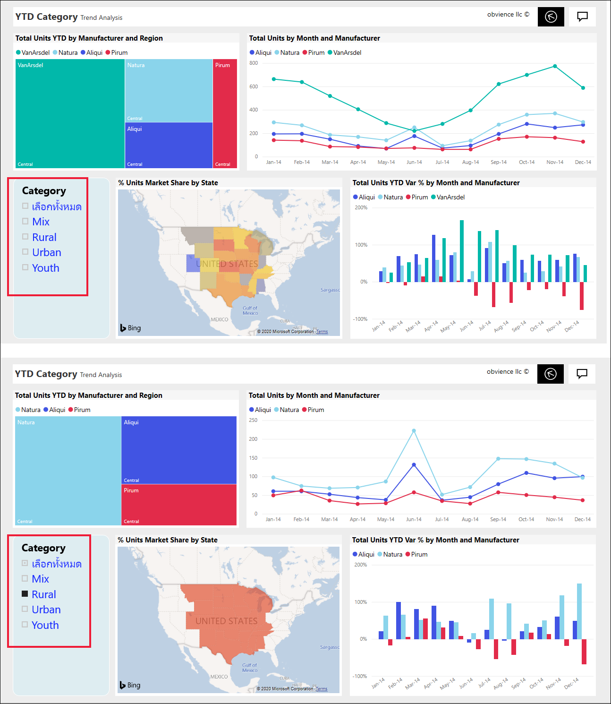
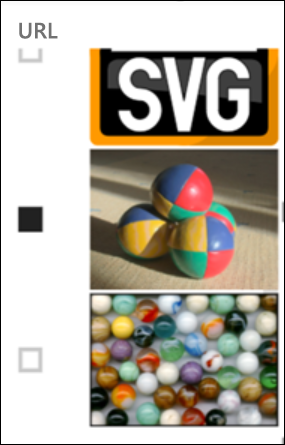
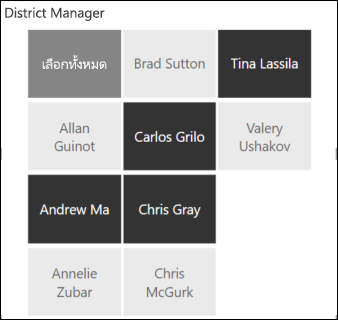
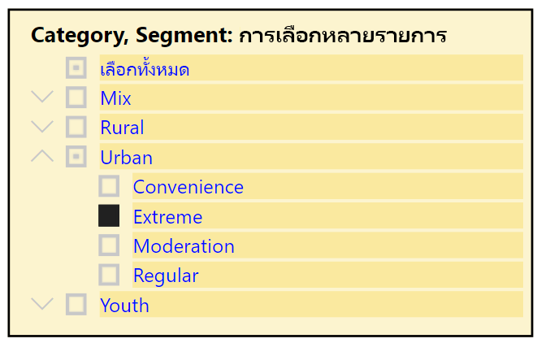
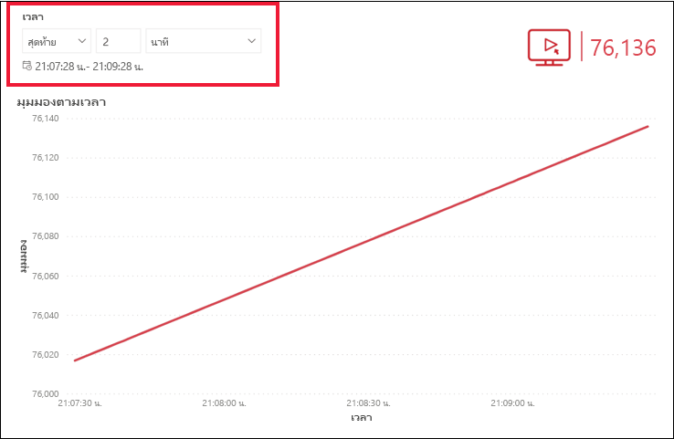
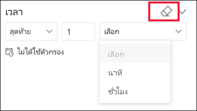

# ตัวแบ่งส่วนข้อมูลในบริการ Power BI

[!INCLUDE[consumer-appliesto-ynnn](../includes/consumer-appliesto-yynn.md)]

ตัวแบ่งส่วนข้อมูลเป็นภาพชนิดหนึ่งที่กรองวิชวลอื่นๆ บนหน้ารายงาน เมื่อใช้รายงาน Power BI คุณจะพบตัวแบ่งส่วนข้อมูลหลายชนิด รูปภาพด้านบน แสดงตัวแบ่งส่วนข้อมูลเดียวกัน แต่เป็นรายการเลือกที่แตกต่างกัน ให้สังเกตลักษณะการกรองวิชวลอื่น ๆ บนหน้าของรายการที่เลือกแต่ละรายการ  

## วิธีการใช้ตัวแบ่งส่วนข้อมูล
ขณะที่สร้างรายงาน *นักออกแบบ*จะเพิ่มตัวแบ่งส่วนข้อมูลเพื่อช่วยบอกเล่าเรื่องราว และมอบเครื่องมือในการสำรวจข้อมูลของคุณให้แก่คุณ

### ตัวแบ่งส่วนช่วงตัวเลข
 ตัวแบ่งส่วนข้อมูลช่วงตัวเลขด้านบน จะช่วยคุณสำรวจยอดขายทั้งหมดตาม: ภูมิศาสตร์, หน่วยในสต็อก และวันที่สั่งซื้อ ใช้จุดจับเพื่อเลือกช่วง 

### ตัวแบ่งส่วนข้อมูลของช่องทำเครื่องหมายแนวตั้งพื้นฐาน

ในตัวแบ่งส่วนข้อมูลของช่องทำเครื่องหมายพื้นฐาน ให้ทำเครื่องหมายที่กล่องช่องทำเครื่องหมายอย่างน้อยหนึ่งกล่อง เพื่อดูผลกระทบเกี่ยวกับวิชวลอื่นๆ บนหน้า เมื่อต้องการเลือกมากกว่าหนึ่งกล่อง ให้ใช้ CTRL-select ในบางครั้ง *นักออกแบบ*รายงานจะตั้งค่าตัวแบงส่วนข้อมูลเพื่ออนุญาตให้เฉพาะคุณเลือกหนึ่งค่าต่อครั้ง 

### ตัวแบ่งส่วนรูปภาพและรูปทรง
เมื่อตัวเลือกตัวแบ่งส่วนข้อมูลเป็นรูปภาพหรือรูปทรง ทำให้รายการที่คุณเลือกคล้ายคลึงกับการใช้ช่องทำเครื่องหมาย คุณสามารถเลือกรูปภาพหรือรูปทรงอย่างน้อยหนึ่งภาพที่จะปรับใช้ตัวแบ่งส่วนข้อมูลกับวิชวลอื่นๆ ในหน้าดังกล่าว 

    

    

### ตัวแบ่งส่วนข้อมูลลำดับชั้น

ในตัวแบ่งส่วนข้อมูลที่มีลำดับชั้น ให้ใช้เครื่องหมายบั้งเพื่อขยายและยุบลำดับชั้น ส่วนหัวจะอัปเดตเพื่อแสดงรายการที่คุณเลือก

### ตัวแบ่งส่วนเวลาแบบสัมพัทธ์
ด้วยสถานการณ์การรีเฟรชอย่างรวดเร็วที่เกิดขึ้นใหม่ ความสามารถในการกรองไปยังหน้าต่างที่มีขนาดเล็กกว่าจะมีประโยชน์มาก
การใช้ตัวแบ่งเวลาแบบสัมพัทธ์จะทำให้คุณสามารถใช้ตัวกรองตามเวลากับข้อมูลวันที่หรือเวลาในรายงานของคุณ ตัวอย่างเช่น คุณสามารถใช้ตัวแบ่งส่วนเวลาแบบสัมพัทธ์ เพื่อแสดงเฉพาะการดูวิดีโอภายใน 2 วัน ชั่วโมง หรือนาทีที่ผ่านมา 

## ปิดใช้งานตัวแบ่งส่วนข้อมูล
เมื่อต้องการปิดใช้งานตัวแบ่งส่วนข้อมูล ให้เลือกไอคอนยางลบ

## ขั้นตอนถัดไป
สำหรับข้อมูลเพิ่มเติม ให้ดูบทความต่อไปนี้:

[ชนิดการแสดงภาพใน Power BI](end-user-visualizations.md)

