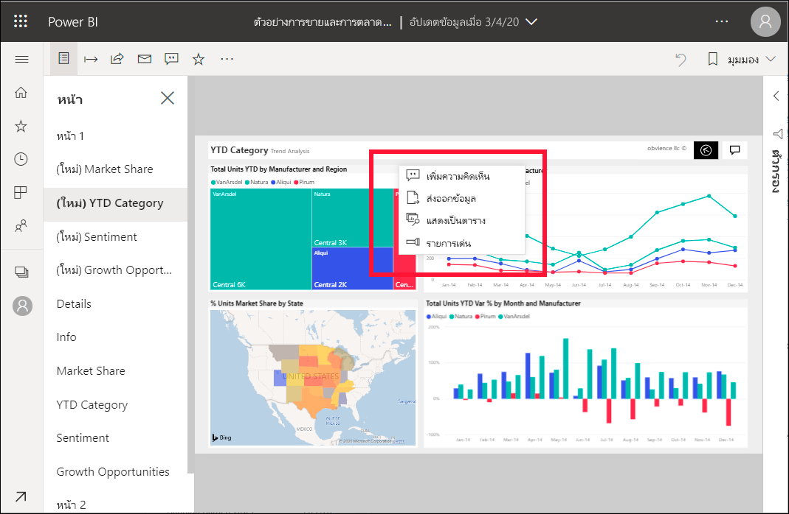
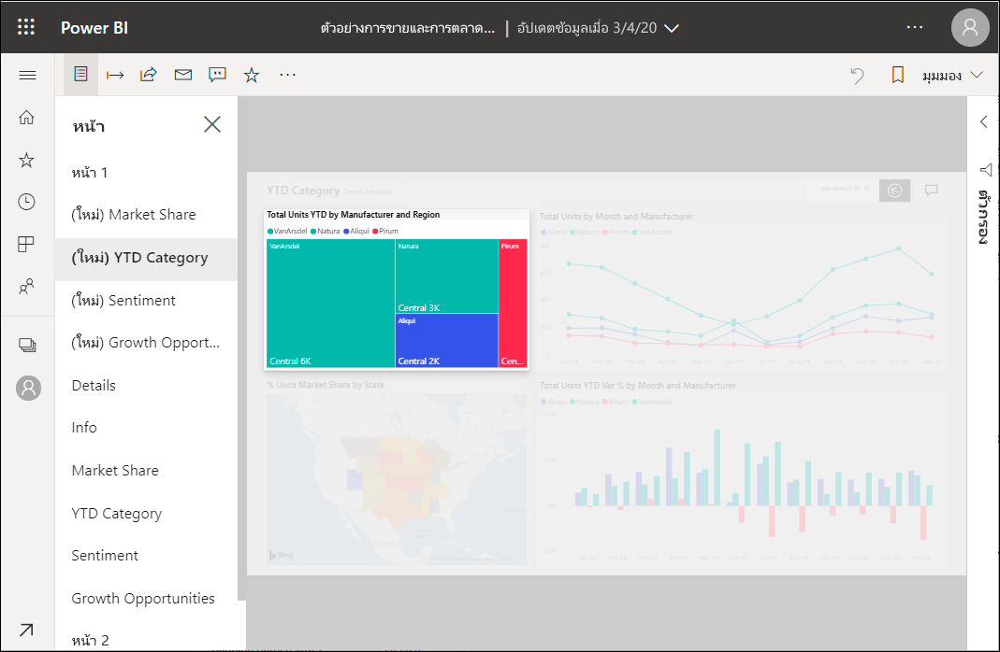

# เพิ่มการแสดงผลด้วยภาพไปยังรายงาน Power BI

[!INCLUDE[consumer-appliesto-yyny](../includes/consumer-appliesto-yyny.md)]

ด้วยสปอตไลท์ คุณสามารถดึงดูดความสนใจไปยังการแสดงผลด้วยภาพที่เฉพาะเจาะจงบนหน้ารายงานได้  ถ้าเลือกโหมดสปอตไลต์ เมื่อคุณเพิ่มบุ๊กมาร์ก โหมดดังกล่าวจะถูกเก็บไว้ในบุ๊กมาร์ก

## การใช้สปอตไลต์

1. [เปิดรายงานในt](end-user-report-open.md) Power BI

2. ตัดสินใจว่าการแสดงผลด้วยภาพใดที่คุณต้องการไฮไลท์บนหน้ารายงาน เลือกเมนูดรอปดาวน์**การดำเนินการเพิ่มเติม (...)**  

    

3. เลือกตัวเลือกสำหรับ**สปอตไลท์** การแสดงผลด้วยภาพที่เลือกไว้จะถูกเน้นซึ่งทำให้ภาพอื่นๆ ทั้งหมดบนหน้าจะเลือนหายไปใกล้กับความโปร่งใส 

    

## ขั้นตอนถัดไป

* [แสดงไทล์แดชบอร์ดหรือวิชวลรายงานในโหมดโฟกัส](end-user-focus.md)

