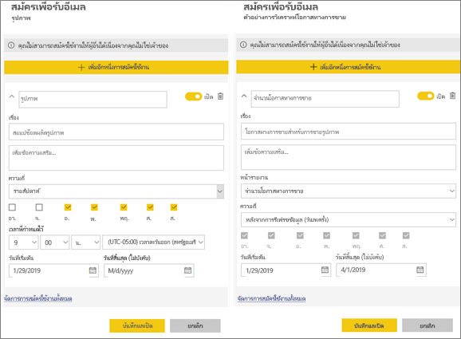

# บอกรับรายงานหรือแดชบอร์ดใน Power BI service 
ไม่เคยที่จะเท่าทันแดชบอร์ดและรายงานที่สำคัญที่สุดของคุณอย่างนี้มาก่อน สมัครใช้งานหน้ารายงานและแดชบอร์ดที่สำคัญที่สุดคุณ และ Power BI จะส่งอีเมสแนปช็อตถึงคุณ คุณบอก Power BI ความถี่ที่คุณต้องการรับอีเมล: รายวัน รายสัปดาห์ หรือเมื่อรีเฟรชข้อมูล คุณสามารถกำหนดเวลาเฉพาะสำหรับ Power BI เพื่อส่งอีเมลได้  

อีเมลและสแนปช็อตจะใช้ภาษาที่ถูกตั้งในการตั้งค่า Power BI (ดู[ภาษาที่รองรับและประเทศ/ภูมิภาคสำหรับ Power BI](../supported-languages-countries-regions.md)) ถ้าไม่กำหนดภาษา Power BI จะใช้ภาษาตามการตั้งค่าตำแหน่งที่ตั้งในเบราว์เซอร์ปัจจุบันของคุณ เมื่อต้องการดู หรือตั้งค่าการกำหนดลักษณะภาษาของคุณ ให้เลือกไอคอนรูปเฟือง   >  **ตั้งค่า > ทั่วไป > ภาษา** 

เมื่อคุณได้รับอีเมล อีเมลนี้จะรวมลิงก์เพื่อ "ไปยังรายงาน/แดชบอร์ด" บนอุปกรณ์เคลื่อนท่ีที่่ติดตั้งแอป Power BI ให้เลือกลิงก์นี้เพื่อเปิดใช้แอป (โดยเป็นค่าตรงข้ามกับค่าเริ่มต้นการดำเนินการเปิดรายงานหรือแดชบอร์ดบนเว็บไซต์ Power BI)

## ข้อกำหนด
**การสร้าง**การบอกรับเป็นคุณลักษณะของ Power BI Pro   

## สมัครใช้งานแดชบอร์ดหรือหน้ารายงาน
ไม่ว่าคุณกำลังสมัครใช้งานแดชบอร์ดหรือรายงาน กระบวนการจะคล้ายกัน ปุ่มเดียวกันนี้ช่วยให้คุณสามารถบอกรับแดชบอร์ดหรือรายงานของบริการ Power BI
 
.

1. เปิดแดชบอร์ดหรือรายงาน
2. จากแถบเมนูด้านบน ให้เลือก**สมัครใช้งาน**หรือเลือกไอคอนซองจดหมาย
   
   

   
    
    หน้าจอด้านซ้ายจะปรากฏขึ้นเมื่อคุณอยู่บนแดชบอร์ดและเลือก **สมัครใช้งาน** หน้าจอด้านขวาจะปรากฏขึ้นเมื่อคุณอยู่บนหน้ารายงานและเลือก **สมัครใช้งาน** เมื่อต้องการสมัครใช้งานมากกว่าหนึ่งหน้าในรายงาน ให้เลือก**เพิ่มการสมัครใช้งานอื่น**และเลือกหน้าอื่น 

3. ใช้แถบเลื่อนสีเหลืองเพื่อเปิดการสมัครใช้งานและปิด  ตั้งค่าแถบเลื่อนเป็นปิดจะไม่ลบการสมัครใช้งาน เมื่อต้องลบการสมัครใช้งาน เลือกไอคอนถังขยะ

4. หรือเพิ่มรายละเอียดข้อความอีเมล 

5. เลือก **ความถี่** สำหรับการสมัครใช้งาน  คุณอาจเลือกรายวัน รายสัปดาห์ หรือหลังจากรีเฟรชข้อมูล (รายวัน)  หากต้องการรับอีเมลการสมัครสมาชิกเฉพาะในบางวัน ให้เลือก **รายสัปดาห์** แล้วเลือกวันที่คุณต้องการรับ  ตัวอย่างเช่น หากคุณต้องการรับอีเมลการสมัครรับข้อมูลในวันทำงานเท่านั้นให้เลือก **รายสัปดาห์** สำหรับความถี่ของคุณ และยกเลิกการเลือกช่องสำหรับวันเสาร์และอาทิตย์   

6. กำหนดเวลาที่จะส่งอีเมลโดยเลือกรายวันหรือรายสัปดาห์สำหรับความถี่ของคุณและป้อน **กำหนดเวลา** **เวลา** สำหรับการสมัครใช้งาน   

7. กำหนดเวลาวันที่เริ่มต้นและสิ้นสุดโดยป้อนวันที่ในเขตข้อมูลวันที่ ตามค่าเริ่มต้น เวลาเริ่มต้นสำหรับการสมัครใช้งานของคุณจะเป็นวันที่คุณสร้างขึ้นและวันที่สิ้นสุดจะเป็นหนึ่งปีต่อมา เมื่อการสมัครใช้งานถึงวันที่สิ้นสุด การทำงานจะหยุดจนกว่าคุณจะเปิดใช้งานอีกครั้ง  คุณจะได้รับการแจ้งเตือนก่อนวันที่สิ้นสุดตามกำหนดเพื่อถามว่าคุณต้องการที่จะขยายเวลาออกไปไหม     

5. ให้เลือก**บันทึกและปิด**เมื่อต้องบันทึกการสมัครใช้งาน คุณจะได้รับอีเมลและสแนปช็อตของแดชบอร์ดหรือรายงานบนกำหนดการที่คุณตั้งค่าไว้ สมัครใช้งานทั้งหมดที่มีความถี่ในการตั้งค่าเป็น **หลังจากรีเฟรชข้อมูล** จะส่งอีเมลหลังจากรีเฟรชตามกำหนดครั้งแรกในวันนั้นเท่านั้น
   
   
   
    การรีเฟรชหน้ารายงานจะไม่รีเฟรชชุดข้อมูล เฉพาะเจ้าของชุดข้อมูลเท่านั้นที่สามารถรีเฟรชชุดข้อมูลได้ด้วยตนเอง ค้นหาชื่อของชุดข้อมูลเบื้องต้น โดยเลือก**มุมมองที่เกี่ยวข้อง**จากแถบเมนูด้านบน
   
    

## จัดการการสมัครใช้งานของคุณ
เฉพาะคุณเท่านั้นที่สามารถจัดการกับการบอกรับได้ เลือก**บอกรับ**อีกครั้ง และเลือก**จัดการการสมัครใช้งานทั้งหมด** จากมุมล่างซ้าย (ดูสกรีนช็อตด้านล่าง) 

การสมัครใช้งานจะสิ้นสุดลง ถ้าสิทธิ์การใช้งาน Pro หมดอายุ แดชบอร์ดหรือรายงานจะถูกลบโดยเจ้าของ หรือบัญชีผู้ใช้ที่ใช้ในการสมัครใช้งานจะถูกลบ

## ข้อควรพิจารณาและการแก้ไขปัญหา
* สำหรับการสมัครอีเมล์แดชบอร์ด ไทล์ใดก็ตามที่ใช้ความปลอดภัยระดับแถว (RLS) จะไม่แสดง  สำหรับการสมัครใช้งานอีเมล์รายงาน ถ้าชุดข้อมูลใช้ RLS คุณจะไม่สามารถสร้างการสมัครใช้งาน
* การสมัครใช้งานหน้ารายงานจะถูกผูกกับชื่อของหน้ารายงาน หากคุณบอกรับหน้ารายงานและเปลี่ยนชื่อ คุณจะต้องสร้างการบอกรับใหม่
* หากคุณไม่สามารถใช้คุณสมบัติการสมัครใช้งานได้ ให้ติดต่อผู้ดูแลระบบของคุณ องค์กรของคุณอาจปิดใช้งานคุณสมบัตินี้เพื่อการตรวจสอบความถูกต้องหรือด้วยเหตุผลอื่น  
* การสมัครใช้งานด้วยอีเมล่ไม่รองรับ[รูปแบบกำหนดเอง](../power-bi-custom-visuals.md)ส่วนใหญ่  ข้อยกเว้นคือ รูปแบบกำหนดเองเหล่านั้น[ได้รับการรับรอง](../power-bi-custom-visuals-certified.md)  
* การสมัครใช้งานด้วยอีเมล่ไม่รองรับรูปแบบ R วิชวลแบบกำหนดเองส่วนใหญ่  
* สำหรับการบอกรับแดชบอร์ดโดยเฉพาะ ยังไม่รองรับไทล์บางประเภท  ซึ่งรวมถึง สตรีมไทล์ วิดีโอไทล์ ไทล์เนื้อหาเว็บแบบกำหนดเอง     
* การสมัครใช้งานอาจใช้ไม่ได้บนแดชบอร์ดหรือรายงานที มีรูปภาพมีขนาดใหญ่มาก เนื่องจากอีเมลจำกัดความจุ    
* Power BI หยุดรีเฟรชชั่วคราวบนชุดข้อมูลที่เกี่ยวข้องกับแดชบอร์ดและรายงานที่มีการเยี่ยมชมในมากกว่าสองเดือน โดยอัตโนมัติ  อย่างไรก็ตาม ถ้าคุณเพิ่มการสมัครใช้งานแดชบอร์ดหรือรายงาน จะไม่สามารถหยุดชั่วคราวถึงแม้ว่าจะไม่ได้เข้าเยี่ยมชม    

## ขั้นตอนถัดไป
* มีคำถามเพิ่มเติมหรือไม่? [ลองถามชุมชน Power BI](http://community.powerbi.com/)    
* [อ่านโพสต์ในบล็อก](https://powerbi.microsoft.com/blog/introducing-dashboard-email-subscriptions-a-360-degree-view-of-your-business-in-your-inbox-every-day/)

