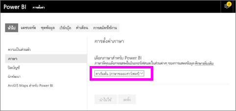
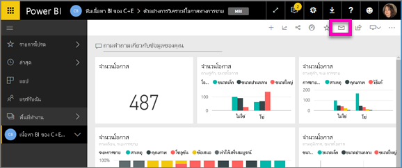
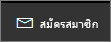
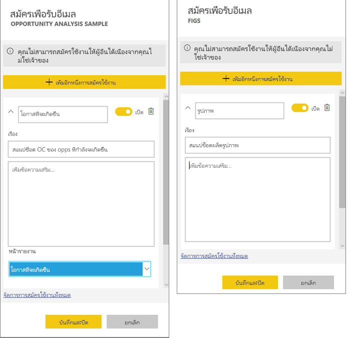
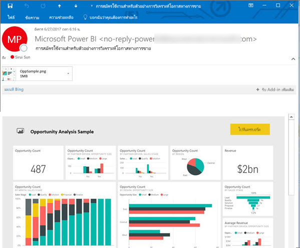
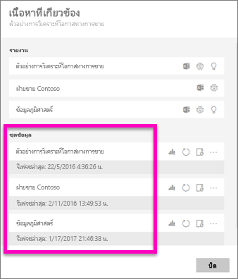
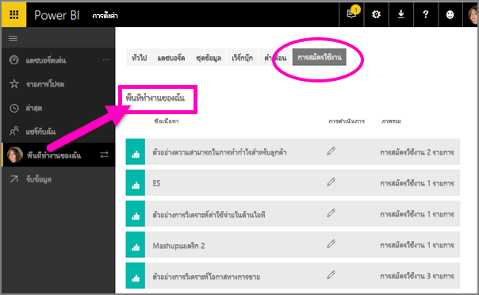

# บอกรับรายงานหรือแดชบอร์ดใน Power BI service 
ไม่เคยที่จะเท่าทันแดชบอร์ดและรายงานที่สำคัญที่สุดของคุณอย่างนี้มาก่อน สมัครใช้งานหน้ารายงานและแดชบอร์ดที่สำคัญที่สุดคุณ และ Power BI จะส่งอีเมสแนปช็อตถึงคุณ คุณบอก Power BI ความถี่ที่คุณต้องการรับอีเมล จากวันละครั้งถึงหนึ่งครั้งต่อสัปดาห์ 

อีเมลและสแนปช็อตจะใช้ภาษาที่ถูกตั้งในการตั้งค่า Power BI (ดู[ภาษาที่รองรับและประเทศ/ภูมิภาคสำหรับ Power BI](../supported-languages-countries-regions.md)) ถ้าไม่กำหนดภาษา Power BI จะใช้ภาษาตามการตั้งค่าตำแหน่งที่ตั้งในเบราว์เซอร์ปัจจุบันของคุณ เมื่อต้องการดู หรือตั้งค่าการกำหนดลักษณะภาษาของคุณ ให้เลือกไอคอนรูปเฟือง   >  **ตั้งค่า > ทั่วไป > ภาษา** 

เมื่อคุณได้รับอีเมล อีเมลนี้จะรวมลิงก์เพื่อ "ไปยังรายงาน/แดชบอร์ด" บนอุปกรณ์เคลื่อนท่ีที่่ติดตั้งแอป Power BI ให้เลือกลิงก์นี้เพื่อเปิดใช้แอป (โดยเป็นค่าตรงข้ามกับค่าเริ่มต้นการดำเนินการเปิดรายงานหรือแดชบอร์ดบนเว็บไซต์ Power BI)

## ข้อกำหนด
- **การสร้าง**การบอกรับเป็นคุณลักษณะของ Power BI Pro 
- เนื่องจากมีการส่งอีเมลการบอกรับเมื่อมีการปรับปรุงข้อมูลหรือรีเฟรชชุดข้อมูลที่สำคัญ ไม่สามารถบอกรับชุดข้อมูลที่ไม่มีการปรับปรุงข้อมูลหรือรีเฟรชได้

## สมัครใช้งานแดชบอร์ดหรือหน้ารายงาน
ไม่ว่าคุณกำลังสมัครใช้งานแดชบอร์ดหรือรายงาน กระบวนการจะคล้ายกันมาก ปุ่มเดียวกันนี้ช่วยให้คุณสามารถบอกรับแดชบอร์ดหรือรายงานของบริการ Power BI
 
.

1. เปิดแดชบอร์ดหรือรายงาน
2. จากแถบเมนูด้านบน ให้เลือก**สมัครใช้งาน**หรือเลือกไอคอนซองจดหมาย
   
   

3. ใช้แถบเลื่อนสีเหลืองเพื่อเปิดการสมัครใช้งานและปิด  ตั้งค่าแถบเลื่อนเป็นปิดจะไม่ลบการสมัครใช้งาน เมื่อต้องลบการสมัครใช้งาน เลือกไอคอนถังขยะ

4. หรือเพิ่มรายละเอียดข้อความอีเมล 

    ในภาพถ่ายหน้าจอด้านล่างนี้ โปรดสังเกตว่า เมื่อคุณสมัครใช้งานรายงานหนึ่ง จริง ๆ แล้วคุณกำลังสมัครใช้งานไปยัง*หน้า*รายงาน  เมื่อต้องการสมัครใช้งานมากกว่าหนึ่งหน้าในรายงาน ให้เลือก**เพิ่มการสมัครใช้งานอื่น**และเลือกหน้าอื่น 
      
   

5. ให้เลือก**บันทึกและปิด**เมื่อต้องบันทึกการสมัครใช้งาน คุณจะได้รับอีเมลหรือสแนปช็อตของหน้าแดชบอร์ดหรือรายงานทุกครั้งที่ชุดข้อมูลที่สำคัญเปลี่ยน ถ้าแดชบอร์ดหรือรายงานรีเฟรชมากกว่าหนึ่งครั้งต่อวัน ระบบจะส่งอีเมลหลังจากรีเฟรชแรกเท่านั้น  
   
   
   
การรีเฟรชหน้ารายงานจะไม่รีเฟรชชุดข้อมูล เฉพาะเจ้าของชุดข้อมูลเท่านั้นที่สามารถรีเฟรชชุดข้อมูลได้ด้วยตนเอง ค้นหาชื่อของชุดข้อมูลเบื้องต้น โดยเลือก**มุมมองที่เกี่ยวข้อง**จากแถบเมนูด้านบน
   

## วิธีกำหนดกำหนดการของอีเมล
ตารางต่อไปนี้อธิบายความถี่ของที่คุณจะได้รับ tuทั้งหมดขึ้นอยู่กับวิธีการเชื่อมต่อของชุดข้อมูล ว่าแดชบอร์ดหรือรายงานใดถูกอ้าง (DirectQuery การเชื่อมต่อสด นำเข้าไปยัง Power BI หรือ Excel ใน OneDrive หรือ SharePoint Online) และในการสมัครใช้งานตัวเลือกพร้อมใช้งานและถูกเลือก (รายวัน ทุกสัปดาห์ หรือไม่มี)

|  | **DirectQuery** | **เชื่อมต่อแบบสด** | **รีเฟรชตามกำหนดกเวลา (นำเข้า)** | **ไฟล์ Excel ใน OneDrive/SharePoint Online** |
| --- | --- | --- | --- | --- |
| **ความถีที่่รายงาน/แดชบอร์ดจะได้รับการรีเฟรช** |ทุกๆ 15 นาที |Power BI จะตรวจสอบทุก 15 นาที และถ้ามีการเปลี่ยนแปลงชุดข้อมูล รายงานจะถูกรีเฟรช |ผู้ใช้เลือก ไม่ ทุกวัน หรือทุกสัปดาห์ ทุกวันไดจะได้ถึง 8 ครั้ง ทุกสัปดาห์ ที่จริงเป็นการกำหนดการรายสัปดาห์ที่ผู้ใชจะ้สร้างและตั้งค่าการเป็นสัปดาห์ละครั้งสองสามครั้ง และมักจะเป็นแบบทุกวัน |ทุกชั่วโมง |
| **มีการไม่ให้ผู้ใช้อีเมลสมัครเกินใช้งานได้อย่างไร** |มีตัวเลือก รายวัน หรือรายสัปดาห์ |ไม่มีตัวเลือก: อีเมลจะถูกส่งไปให้ผู้ใช้ถ้ามีรายงานรีเฟรชแต่ไม่มีมากกว่าหนึ่งครั้งต่อวัน |ถ้ากำหนดการรีเฟรชเป็นรายวัน ตัวเลือกคือรายสัปดาห์และรายวัน  ถ้ากำหนดการรีเฟรชเป็นรายสัปดาห์ ตัวเลือกคือรายสัปดาหเท่านั้น |ไม่มีตัวเลือก ผู้ใช้จะได้รับอีเมลเมื่อใดก็ ตามที่มีการปรับปรุงชุดข้อมูล แต่ไม่มากกว่าหนึ่งครั้งต่อวัน |

## จัดการการสมัครใช้งานของคุณ
เฉพาะคุณเท่านั้นที่สามารถจัดการกับการบอกรับได้ เลือก**บอกรับ**อีกครั้ง และเลือก**จัดการการบอกรับทั้งหมด**(ดูสกรีนช็อตด้านล่างในขั้นตอนที่ 4 ด้านบน) 

การสมัครใช้งานจะสิ้นสุดลง ถ้าสิทธิ์การใช้งาน Pro หมดอายุ แดชบอร์ดหรือรายงานจะถูกลบโดยเจ้าของ หรือบัญชีผู้ใช้ที่ใช้ในการสมัครใช้งานจะถูกลบ

## ข้อควรพิจารณาและการแก้ไขปัญหา
* สำหรับการสมัครอีเมล์แดชบอร์ด ไทล์ใดก็ตามที่ใช้ความปลอดภัยระดับแถว (RLS) จะไม่แสดง  สำหรับการสมัครใช้งานอีเมล์รายงาน ถ้าชุดข้อมูลใช้ RLS คุณจะไม่สามารถสร้างการสมัครใช้งาน
* การสมัครใช้งานหน้ารายงานจะถูกผูกกับชื่อของหน้ารายงาน หากคุณบอกรับหน้ารายงานและเปลี่ยนชื่อ คุณจะต้องสร้างการบอกรับใหม่
* องค์กรของคุณอาจกำหนดค่าการตั้งค่าบางอย่างใน Azure Active Directory ซึ่งอาจจำกัดความสามารถในการใช้การบอกรับอีเมลใน Power BI  ซึ่งรวมถึงการรับรองความถูกต้องแบบหลายปัจจัยหรือข้อจำกัดช่วง IP เมื่อเข้าถึงแหล่งข้อมูล
* สำหรับการสมัครใช้งานโดยใช้อีเมลบนชุดข้อมูลที่เชื่อมต่อสด คุณจะได้รับอีเมลเมื่อข้อมูลมีการเปลี่ยนแปลง ดังนั้น ถ้าเกิดรีเฟรชขึ้นแต่ไม่มีการเปลี่ยนแปลงข้อมูล Power BI จะไม่ส่งอีเมล
* การสมัครใช้งานด้วยอีเมล่ไม่รองรับ[รูปแบบกำหนดเอง](../power-bi-custom-visuals.md)ส่วนใหญ่  ข้อยกเว้นหนึ่งคือ รูปแบบกำหนดเองเหล่านั้น[ได้รับการรับรอง](../power-bi-custom-visuals-certified.md)  
* การสมัครใช้งานด้วยอีเมล่ไม่รองรับรูปแบบ R วิชวลแบบกำหนดเองส่วนใหญ่  
* ไทล์ใดก็ตามที่ใช้ความปลอดภัยระดับแถว (RLS) จะไม่แสดง
* สมัครใช้งานด้วยอีเมล จะได้รับตัวกรองรายงานสถานะเริ่มต้นและตัวแบ่งส่วนข้อมูล การเปลี่ยนแปลงใด ๆ กับค่าเริ่มต้นที่คุณทำหลังการสมัครใช้งานจะไม่แสดงในอีเมล    
* สำหรับการบอกรับแดชบอร์ดโดยเฉพาะ ยังไม่รองรับไทล์บางประเภท  ซึ่งรวมถึง สตรีมไทล์ วิดีโอไทล์ ไทล์เนื้อหาเว็บแบบกำหนดเอง     
* การสมัครใช้งานอาจใช้ไม่ได้บนแดชบอร์ดหรือรายงานที มีรูปภาพมีขนาดใหญ่มาก เนื่องจากอีเมลจำกัดความจุ    
* Power BI หยุดรีเฟรชชั่วคราวบนชุดข้อมูลที่เกี่ยวข้องกับแดชบอร์ดและรายงานที่มีการเยี่ยมชมในมากกว่า 2 เดือน โดยอัตโนมัติ  อย่างไรก็ตาม ถ้าคุณเพิ่มการสมัครใช้งานแดชบอร์ดหรือรายงาน จะไม่สามารถหยุดชั่วคราวถึงแม้ว่าจะไม่ได้เข้าเยี่ยมชม    

## ขั้นตอนถัดไป
* มีคำถามเพิ่มเติมหรือไม่? [ลองถามชุมชน Power BI](http://community.powerbi.com/)    
* [อ่านโพสต์ในบล็อก](https://powerbi.microsoft.com/blog/introducing-dashboard-email-subscriptions-a-360-degree-view-of-your-business-in-your-inbox-every-day/)

