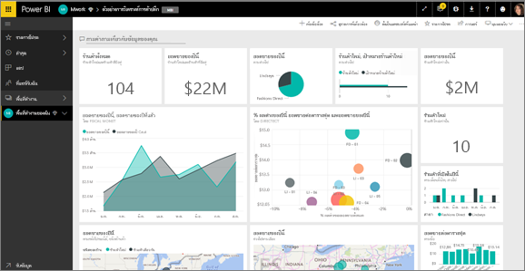
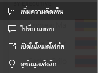
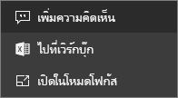
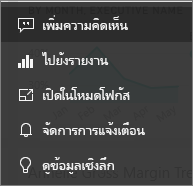

# ไทล์แดชบอร์ดใน Power BI
ไทล์เป็นสแนปช็อตของข้อมูลของคุณที่ปักหมุดไปยังแดชบอร์ดโดย *ผู้ออกแบบ* คุณสามารถสร้างไทล์จากรายงาน ชุดข้อมูล แดชบอร์ด กล่องคำถามของ Q&A, Excel และ SQL Server Reporting Services (SSRS) และอื่น ๆ ได้  ภาพถ่ายหน้าจอนี้แสดงไทล์ต่าง ๆ มากมายที่ปักหมุดไปยังแดชบอร์ดหนึ่ง

นอกเหนือจากไทล์ที่ปักหมุดจากรายงาน *ผู้ออกแบบ*สามารถเพิ่มไทล์แบบเดี่ยวได้โดยตรงบนแดชบอร์ดผ่านตัวเลือก **เพิ่มไทล์** ไทล์แบบเดี่ยวรวมถึง: กล่องข้อความ รูปภาพ วิดีโอ ข้อมูลสตรีมมิ่ง และเนื้อหาบนเว็บ

ต้องการความช่วยเหลือในการทำความเข้าใจเกี่ยวกับบล็อกที่ประกอบเป็น Power BI หรือไม่?  ดู[Power BI - แนวคิดพื้นฐาน](end-user-basic-concepts.md)

## โต้ตอบกับไทล์บนแดชบอร์ด

1. เลื่อนเหนือไทล์เพื่อแสดงจุดไข่ปลา
   
    
2. เลือกจุดไข่ปลาเพื่อเปิดเมนูการดำเนินการไทล์ ตัวเลือกที่ใช้ได้แตกต่างกันไปตามประเภทภาพและวิธีที่ใช้ในการสร้างไทล์ นี่คือตัวอย่างบางส่วนของสิ่งที่คุณอาจเห็น

    - ไทล์ที่สร้างขึ้นโดยใช้ Q&A
   
        

    - ไทล์ที่สร้างขึ้นจากสมุดงาน
   
        

    - ไทล์ที่สร้างขึ้นจากรายงาน
   
        
   
    จากตรงนี้คุณสามารถ:
   
   * [เปิดรายงานที่ถูกใช้เพื่อสร้างไทล์นี้](end-user-reports.md)   
   
   * [เปิดคำถามของ Q&A ที่ถูกใช้เพื่อสร้างไทล์](end-user-reports.md)  
   

   * [เปิดสมุดงานที่ถูกใช้เพื่อสร้างไทล์นี้](end-user-reports.md)   
    * [ดูไทล์ในโหมดโฟกัส](end-user-focus.md)   
     * [เรียกใช้ข้อมูลเชิงลึก](end-user-insights.md) 
    * [เพิ่มข้อคิดเห็นและเริ่มการอภิปราย](end-user-comment.md) 

3. เมื่อต้องปิดเมนูการดำเนินการ เลือกพื้นที่ว่างในพื้นที่ใช้งาน

### เลือก (คลิกที่) ไทล์
เมื่อคุณเลือกไทล์หนึ่ง สิ่งที่จะเกิดขึ้นถัดไปขึ้นอยู่กับวิธีที่ไทล์ถูกสร้างขึ้น และขึ้นอยู่กับว่าไทล์ดังกล่าวมี[ลิงก์แบบกำหนดเอง](../service-dashboard-edit-tile.md)หรือไม่ หากมีีการลิงก์แบบกำหนดเอง การเลือกไทล์จะนำคุณไปที่ลิงก์นั้น มิฉะนั้น การเลือกไทล์จะนำคุณไปยังรายงาน สมุดงาน Excel Online รายงาน SSRS ที่อยู่ภายในองค์กร หรือการถามตอบที่ถูกใช้เพื่อสร้างไทล์ดังกล่าว

> [!NOTE]
> ข้อยกเว้นนี้คือ ไทล์วิดีโอที่สร้างขึ้นโดยตรงบนแดชบอร์ดโดยใช้ **เพิ่มไทล์** การเลือกไทล์วิดีโอ (ที่ถูกสร้างขึ้นด้วยวิธีนี้) ทำให้วิดีโอเล่นบนแดชบอร์ดดังกล่าว   
> 
> 

## ข้อควรพิจารณาและการแก้ไขปัญหา
* ถ้ามีการบันทึกรายงานที่ใช้เพื่อสร้างการแสดงภาพไม่ได้รับการบันทึก ดังนั้น การเลือกไทล์จะไม่ก่อให้เกิดการดำเนินการใด ๆ
* ถ้าไทล์ดังกล่าวถูกสร้างขึ้นจากสมุดงานใน Excel Online และคุณไม่มีอย่างน้อยหนึ่งสิทธิ์ในการอ่านสำหรับสมุดงานนั้น การเลือกไทล์จะไม่เปิดสมุดงานใน Excel Online
* สำหรับไทล์ที่สร้างขึ้นโดยตรงบนแดชบอร์ดโดยใช้**เพิ่มไทล์** ถ้ามีการตั้งค่าไฮเปอร์ลิงก์แบบกำหนดเอง การเลือกชื่อเรื่อง ชื่อเรื่องรอง และหรือไทล์จะเปิด URL นั้น  มิฉะนั้น ตามค่าเริ่มต้น การเลือกหนึ่งไทล์จากไทล์เหล่านี้ที่ถูกสร้างขึ้นโดยตรงบนแดชบอร์ดสำหรับรูปภาพหนึ่ง โค้ดของเว็บ หรือกล่องข้อความ จะไม่ก่อให้เกิดการดำเนินการใด
* ถ้าคุณไม่มีสิทธิ์ในรายงานภายใน SSRS การเลือกไทล์ที่สร้างขึ้นจาก SSRS จะสร้างหน้าที่ระบุว่าคุณไม่มีการเข้าถึง (rsAccessDenied)
* ถ้าคุณไม่สามารถเข้าถึงเครือข่ายที่เซิร์ฟเวอร์ SSRS นั้นอยู่ การเลือกไทล์ที่สร้างขึ้นจาก SSRS จะสร้างหน้าที่บ่งชี้ว่าไม่สามารถค้นหาเซิร์ฟเวอร์ (HTTP 404) ได้ อุปกรณ์ของคุณจำเป็นต้องมีสิทธิ์เข้าถึงเครือข่ายไปยังเซิร์ฟเวอร์รายงานเพื่อดูรายงานดังกล่าว
* ถ้าการแสดงภาพต้นฉบับที่ใช้เพื่อสร้างไทล์เปลี่ยนแปลง ไทล์ดังกล่าวจะไม่เปลี่ยนแปลงไปด้วย  ตัวอย่างเช่น ถ้า *ผู้ออกแบบ* ปักหมุดแผนภูมิเส้นจากรายงาน จากนั้นคุณเปลี่ยนแผนภูมิเส้นเป็นแผนภูมิแท่ง ไทล์แดชบอร์ดจะยังคงแสดงแผนภูมิเส้น รีเฟรชข้อมูลแต่การชนิดแสดงภาพไม่เปลี่ยน

## ขั้นตอนถัดไป
[รีเฟรชข้อมูล](../refresh-data.md)

[Power BI แนวคิดพื้นฐาน](end-user-basic-concepts.md)
