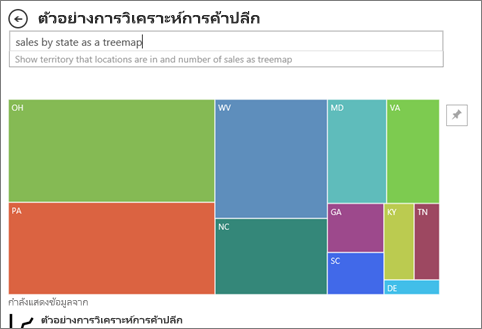

# ชนิดของวิชวลใน Power BI
คุณจะพบวิชวลในรายงาน แดชบอร์ด และถามตอบ (Q&A) ชนิดของวิชวลเหล่านี้บางส่วนถูกรวมเป็นแพคเกจเข้ากับ Power BI และบางส่วนเป็น *วิชวลแบบกำหนดเอง* วิชวลแบบกำหนดเองถูกสร้างขึ้นนอก Power BI และในแนวทางที่อนุญาตให้ *ผู้ออกแบบ* รายงานเพิ่มลงในรายงานและแดชบอร์ด Power BI ได้ 

บทความนี้เป็นภาพรวมของวิชวลที่ถูกรวมเป็นแพคเกจเข้ากับบริการ Power BI  นี่คือวิชวลที่คุณจะพบบ่อยที่สุด สำหรับข้อมูลเชิงลึกเกี่ยวกับวิชวลเหล่านี้ โปรดดูเอกสารประกอบของ[ผู้ออกแบบรายงาน *Power BI* เกี่ยวกับชนิดของวิชวล](../visuals/power-bi-visualization-types-for-reports-and-q-and-a.md)

> [!NOTE]
> หากต้องการเรียนรู้เกี่ยวกับวิชวลแบบกำหนดเอง ให้ค้นหาวิชวลเหล่านั้นในส่วน **วิชวล Power BI** ของ [Microsoft AppSource](https://appsource.microsoft.com/marketplace/apps?product=power-bi-visuals) สำหรับแต่ละวิชวล คุณจะพบคำอธิบาย ข้อมูลผู้สร้าง และภาพหน้าจอหรือวิดีโอ 

## รายการวิชวลที่พร้อมใช้งานใน Power BI
คุณสามารถพบวิชวลเหล่านี้ทั้งหมดได้ในแดชบอร์ดและรายงาน Power BI และ [ที่ระบุในถามตอบ (Q&A)](end-user-q-and-a.md) หากต้องการเรียนรู้วิธีการโต้ตอบกับวิชวล โปรดดูหัวข้อ [โต้ตอบกับวิชวลในรายงาน แดชบอร์ด และแอป](end-user-visualizations.md)

### แผนภูมิพื้นที่: พื้นฐาน (เป็นชั้น) และแบบเรียงซ้อน

แผนภูมิพื้นที่พื้นฐานจะยึดตามแผนภูมิเส้นที่มีพื้นที่ระหว่างแกนและเส้นเป็นบริเวณทึบ แผนภูมิพื้นที่เน้นให้เห็นปริมาณการเปลี่ยนแปลงตามเวลา และสามารถใช้เพื่อดึงความสนใจไปยังค่าผลรวมในทั่วทั้งแนวโน้ม ตัวอย่างเช่น เราสามารถลงจุดข้อมูลที่แสดงกำไรเมื่อเวลาผ่านไปในแผนภูมิพื้นที่เพื่อเน้นกำไรรวมได้

### แผนภูมิแท่งและแผนภูมิคอลัมน์

 

แผนภูมิแท่งเป็นมาตรฐานสำหรับการดูที่ีค่าเฉพาะในแต่ละประเภท

### การ์ด: หมายเลขเดียว

บัตรหมายเลขเดียวแสดงข้อเท็จจริงเดียว จุดข้อมูลเดียว บางครั้งตัวเลขเพียงตัวเดียวก็เป็นสิ่งสำคัญที่สุดที่คุณต้องการติดตามในแดชบอร์ด Power BI หรือรายงานของคุณ เช่น ยอดขายรวม ส่วนแบ่งตลาดแบบปีต่อปี ตลาดแชร์ปีปี หรือโอกาสทั้งหมด  

### การ์ด: หลายแถว

บัตรหลายแถวแสดงจุดข้อมูลอย่างน้อยหนึ่งจุดต่อหนึ่งแถว

### แผนภูมิผสม

แผนภูมิผสมรวมแผนภูมิคอลัมน์และแผนภูมิเส้นไว้ด้วยกัน การรวมแผนภูมิทั้งสองให้เป็นหนึ่งเดียว ช่วยให้คุณทำการเปรียบเทียบข้อมูลได้อย่างรวดเร็ว แผนภูมิผสมสามารถมีแกน Y หนึ่งหรือสองแกนดังนั้นอย่าลืมดูให้ละเอียด 

แผนภูมิผสม เป็นตัวเลือกที่ดี:
- เมื่อคุณมีแผนภูมิเส้นและแผนภูมิคอลัมน์ ที่ใช้แกน X เดียวกัน
- เพื่อเปรียบเทียบการวัดหลายรายการกับช่วงค่าที่แตกต่างกัน
- เพื่อแสดงตัวอย่างความสัมพันธ์ระหว่างหน่วยวัดสองหน่วยในวิชวลหนึ่งภาพ
- เพื่อตรวจสอบว่า หน่วยวัดหนึ่งบรรลุตามเป้าหมายที่ถูกกำหนดโดยอีกหน่วยวัดหนึ่งหรือไม่
- เพื่อประหยัดพื้นที่ทำงาน

### แผนภูมิโดนัท

แผนภูมิโดนัทจะคล้ายกับแผนภูมิวงกลม  โดยที่จะแสดงความสัมพันธ์ของส่วนต่าง ๆ ต่อส่วนทั้งหมด ความแตกต่างเพียงประการเดียว คือ ส่วนตรงกลางนั้นว่างเปล่า และมีพื้นที่ว่างสำหรับระบุป้ายชื่อหรือไอคอน

### แผนภูมิกรวย

แผนภูมิกรวยช่วยในการสร้างภาพของกระบวนการที่มีลำดับขั้น และรายการต่าง ๆ ให้จัดเรียงตามลำดับจากขั้นหนึ่งไปยังอีกขั้น  ตัวอย่างหนึ่งคือกระบวนการขายที่เริ่มต้นด้วยลูกค้าเป้าหมาย และลงท้ายด้วยการซื้อขาย

ยกตัวอย่างเช่น ช่วงระยะการขายที่มีการติดตามลูกค้าตามขั้นตอนดังนี้: ลูกค้าที่เป็นเป้าหมาย > ลูกค้าเป้าหมายที่มีคุณสมบัติ > ผู้ที่มีแนวโน้มจะเป็นลูกค้า > ทำสัญญา > ปิดการขาย มองอย่างรวดเร็ว รูปร่างของกรวยบ่งบอกสุขภาพของกระบวนการที่คุณกำลังติดตาม
แต่ละขั้นตอนกรวยการแสดงเปอร์เซ็นต์ของผลรวม ดังนั้น ในกรณีส่วนใหญ่ แผนภูมิกรวยจะมีรูปเหมือนกรวย - ด้วยขั้นตอนแรกที่ใหญ่ที่สุด และขั้นตอนถัด ๆ มาเล็กกว่าขั้นตอนก่อนหน้า แผนภูมิเป็นรูปต้นแพร์จะยังมีประโยชน์ -- สามารถใช้ระบุปัญหาในกระบวนการได้ แต่โดยทั่วไปแล้ว ขั้นแรกหรือขั้น "ทางเข้า" มีขนาดใหญ่ที่สุด

### แผนภูมิตัววัด

แผนภูมิหน้าปัดความเร็วมีโค้งวงกลม และแสดงเป็นค่าเดียวที่วัดความคืบหน้าตามเพื่อไปสู่เป้าหมาย/KPI เป้าหมาย หรือค่าเป้าหมาย ถูกแสดงทีละบรรทัด (needle) ความคืบสู่เป้าหมายที่ถูกแสดงด้วยการแรเงา และค่าที่แสดงว่าความคืบหน้าจะแสดงในเป็นหนาภายในส่วนโค้ง ค่าที่เป็นไปได้ทั้งหมดจะกระจายเท่าๆ กันตามส่วนโค้ง จากค่าต่ำสุด (ค่าซ้ายสุด) ไปสู่ค่าสูงสุด (ค่าขวาสุด)

ในตัวอย่างด้านบน เรามีผู้ค้าปลีกรถยนต์กำลังติดตามการขายเฉลี่ยของทีมขายของเราต่อเดือน เป้าหมายของเราคือ 140 และแสดงด้วยเข็มสีดำ การขายเฉลี่ยที่เป็นไปได้น้อยที่สุดคือ 0 และเราได้ตั้งค่าสูงสุดเป็น 200 การแรเงาสีน้ำเงินแสดงว่า ตอนนี้เราประมาณการว่ามีการขาย 120 ตัวในเดือนนี้ โชคดีทีี่เรายังคงมีสัปดาห์อื่นเพื่อจะทำให้ถึงเป้าหมาย

แผนภูมิหน้าปัดความเร็วเป็นทางเลือกที่ดีสำหรับ
- แสดงความคืบหน้าเพื่อจะบรรลุเป้าหมาย
- แสดงการวัดร้อยละ เช่น KPI
- แสดงความสมบูรณ์ของการวัดเดี่ยว
- แสดงข้อมูลที่สามารถสแกนและทำความเข้าใจได้อย่างรวดเร็ว

 ### แผนภูมิผู้มีอิทธิพลหลัก

แผนภูมิผู้มีอิทธิพลหลักแสดงผู้สนับสนุนหลักไปยังผลลัพธ์หรือค่าที่เลือก

ผู้มีอิทธิพลหลักเป็นตัวเลือกที่ยอดเยี่ยมเพื่อช่วยให้คุณเข้าใจปัจจัยที่ส่งผลต่อเมตริกหลัก ตัวอย่างเช่น *อะไรคือสิ่งที่มีอิทธิพลต่อลูกค้าในการสั่งซื้อครั้งที่สอง*หรือ*ทำไมยอดขายถึงสูงมากเมื่อเดือนมิถุนายนที่ผ่านมา* 

### KPI

ดัชนีประสิทธิภาพหลัก (KPI) เป็นภาพสัญลักษณ์ที่แสดงปริมาณความก้าวหน้าของงานที่ทำเพื่อมุ่งไปยังเป้าหมายที่วัดผลได้ 

KPI เป็นตัวเลือกที่ดีที่สุด:
- เมื่อต้องวัดความคืบหน้า (ฉันอยู่ข้างหน้าหรือข้างหลังสิ่งใด)
- เมื่อวัดระยะห่างจากเป้าหมาย (ฉันอยู่ห่างจากเป้าหมายหรือห่างจากจุดเริ่มเท่าใด)

### แผนภูมิเส้น

แผนภูมิเส้นเน้นรูปร่างโดยรวมของชุดข้อมูลค่าทั้งหมด โดยปกติแล้วจะดูเทียบกับเวลาที่ผ่านไป

### แผนที่: แผนที่พื้นฐาน

แผนที่พื้นฐานใช้เพื่อเชื่อมโยงข้อมูลเชิงหมวดหมู่และข้อมูลเชิงปริมาณเข้ากับตำแหน่งที่ตั้งเชิงพื้นที่

### แผนที่: แผนที่ ArcGIS

การรวมกันระหว่างแผนที่ ArcGIS และ Power BI ทำให้การนำเสนอจุดต่าง ๆ บนแผนที่ก้าวขึ้นไปอีกระดับ ตัวเลือกที่พร้อมใช้งานสำหรับแผนที่พื้นฐาน ชนิดตำแหน่งที่ตั้ง ธีม สไตล์สัญลักษณ์ และเลเยอร์อ้างอิงสร้างสร้างวิชวลแผนที่ที่มีข้อมูลครบครันและสวยงาม ชุดข้อมูลของเลเยอร์ข้อมูลที่น่าเชื่อถือ (เช่น ข้อมูลการสำรวจสำมะโนประชากร) บนแผนที่ที่มีการวิเคราะห์ข้อมูลเชิงพื้นที่บ่งบอกถึงความเข้าใจข้อมูลในวิชวลของคุณที่ลึกซึ้งขึ้น

### แผนที่: แผนที่แถบสี (Choropleth)

แผนที่แถบสีใช้เฉดสีหรือ หรือการปรับสีอ่อนแก่ หรือรูปแบบต่าง ๆ เพื่อแสดงว่าค่าแตกต่างกันมากเพียงใดในสัดส่วนทั่วทั้งภูมิศาสตร์หรือภูมิภาค เพื่อแสดงความแตกต่างเหล่านี้ที่สัมพันธ์กับเฉดสีที่อยู่ในช่วงจากสีอ่อน (ความถี่น้อยกว่า/ต่ำกว่า) ไปถึงเข้ม (ความถี่มากกว่า/สูงกว่า) ได้อย่างรวดเร็ว

### แผนที่: แผนที่รูปร่าง

แผนที่รูปร่างเปรียบเทียบภูมิภาคบนแผนที่โดยใช้สี แผนที่รูปร่างไม่สามารถแสดงตำแหน่งที่ตั้งทางภูมิศาสตร์อย่างแม่นยำของจุดข้อมูลบนแผนที่ได้ แต่วัตถุประสงค์หลักคือการเปรียบเทียบภูมิภาคบนแผนที่โดยการใช้สีแตกต่างกัน

### เมทริกซ์

วิชวลเมทริกซ์คือ ชนิดของภาพตาราง (ดู "ตาราง" ด้านล่าง) ที่สนับสนุนรูปแบบขั้น บ่อยครั้งที่ผู้ออกแบบรายงานจะรวมเมทริกซ์ในรายงานและแดชบอร์ดเพื่อให้ผู้ใช้สามารถเลือกองค์ประกอบอย่างน้อยหนึ่งองค์ประกอบ (แถว, คอลัมน์, เซลล์) ในเมทริกซ์เพื่อไฮไลต์ข้ามภาพอื่น ๆ ในหน้ารายงานได้  

### แผนภูมิวงกลม

แผนภูมิวงกลมจะแสดงความสัมพันธ์ของส่วนต่าง ๆ ต่อส่วนทั้งหมด 

### แผนภูมิริบบอน

แผนภูมิ Ribbon แสดงประเภทข้อมูลที่มีอันดับสูงสุด (ค่ามากที่สุด) แผนภูมิ Ribbon เหมาะกับการแสดงการเปลี่ยนแปลงอันดับ โดยที่ค่าอันดับสูงสุดจะแสดงอยู่ด้านบนสุดของแต่ละช่วงเวลาเสมอ

### แผนภูมิกระจาย แผนภูมิฟองอากาศ และแผนภูมิลงจุด

แผนภูมิกระจายจะมีแกนค่าสองแกนเสมอเพื่อแสดงข้อมูลตัวเลขหนึ่งชุดตามแกนแนวนอนและอีกชุดของค่าตัวเลขตามแกนแนวตั้ง แผนภูมิแสดงจุดที่จุดตัดของค่าตัวเลข x และ y เพื่อรวมค่าเหล่านี้ลงในจุดข้อมูลเดียว จุดข้อมูลเหล่านี้อาจถูกกระจายสม่ำเสมอกันหรืออาจไม่สม่ำเสมอกันตามแกนแนวนอน โดยขึ้นอยู่กับข้อมูลดังกล่าว

แผนภูมิฟองอากาศจะแทนที่จุดข้อมูลด้วยฟองอากาศ และขนาดของฟองอากาศแสดงมิติเพิ่มเติมของข้อมูล

แผนภูมิลงจุดนั้นเหมือนกันกับแผนภูมิฟองอากาศและแผนภูมิกระจาย ที่แตกต่างกันคือคุณสามารถลงข้อมูลเชิงตัวเลขหรือเชิงหมวดหมู่ตามแกน X ได้ ตัวอย่างนี้แสดงให้เห็นถึงการใช้สี่เหลี่ยมแทนที่วงกลม และลงจุดยอดขายตามแกน X

### ความหนาแน่นสูงกระจาย

จากคำนิยาม ข้อมูลความหนาแน่นสูง จะถูกสุ่มตัวอย่างเพื่อสร้างวิชวลให้รวดเร็วพอสมควรที่จะตอบสนองต่อการโต้ตอบได้ การสุ่มตัวอย่างความหนาแน่นสูงใช้อัลกอริทึมที่กำจัดจุดที่ทับซ้อนกันและทำให้มั่นใจได้ว่าจุดทั้งหมดในชุดข้อมูลจะถูกแสดงในภาพ ไม่เพียงแค่ลงจุดตัวอย่างของข้อมูลเท่านั้น  

แต่ยังช่วยให้ได้การผสมผสานที่ดีที่สุด ระหว่างการตอบสนอง, ตัวแทนข้อมูล และการคงจุดข้อมูลที่สำคัญในชุดข้อมูลโดยรวม

### ตัวแบ่งส่วนข้อมูล

ตัวแบ่งส่วนข้อมูลเป็นแผนภูมิแบบสแตนด์อโลนที่สามารถใช้เพื่อกรองภาพอื่น ๆ บนหน้าเว็บได้ ตัวแบ่งส่วนข้อมูลมีหลายรูปแบบ (หมวดหมู่ ช่วงวันที่ และอื่น ๆ) และสามารถจัดรูปแบบเพื่อให้เลือกได้เพียงค่าเดียว จำนวนมาก หรือทั้งหมด 

ตัวแบ่งส่วนข้อมูลเป็นตัวเลือกที่ดีเพื่อ:
- แสดงตัวกรองที่ใช้งานบ่อยหรือสำคัญ บนพื้นที่รายงานเพื่อให้ง่ายต่อการเข้าถึง
- ทำให้การดูสถานะตัวกรองปัจจุบันได้ง่ายขึ้น โดยไม่ต้องเปิดรายการดรอปดาวน์
- กรองตามคอลัมน์ที่ไม่จำเป็นและซ่อนอยู่ในตารางข้อมูล
- สร้างรายงานที่เฉพาะเจาะจงมากขึ้น โดยการใส่ตัวแบ่งส่วนข้อมูลข้างกับวิชวลที่สำคัญ

### รูปภาพเดี่ยว

รูปภาพแบบสแตนด์อโลนเป็นกราฟิกที่มีการเพิ่มไปยังรายงานหรือแดชบอร์ด 

### ตาราง

ตารางคือ เส้นตารางที่ประกอบด้วยข้อมูลที่เกี่ยวข้องในชุดที่สมเหตุผลของแถวและคอลัมน์ ซึ่งอาจยังประกอบด้วยส่วนหัวและแถวสำหรับผลรวมด้วย ตารางทำงานได้ดีกับข้อเปรียบเทียบเชิงปริมาณซึ่งเป็นการที่คุณดูหลายค่าสำหรับหนึ่งประเภท ตัวอย่างเช่น ตารางนี้แสดงการวัดที่แตกต่างกันห้า การวัดสำหรับประเภท

ตารางเป็นตัวเลือกที่ดีมาก:
- เมื่อต้องการดูและเปรียบเทียบข้อมูลโดยละเอียดและค่าที่แน่นอน (แทนการนำเสนอแบบเป็นภาพ)
- เพื่อแสดงข้อมูลในรูปแบบตาราง
- เพื่อแสดงข้อมูลตัวเลขตามประเภท

### แผนภูมิต้นไม้

แผนภูมิต้นไม้เป็นแผนภูมิพื้นที่ที่มีสี่เหลี่ยมผืนผ้าเติมสีจะมีค่าที่เป็นตัวแทนขนาด  แผนภูมิเหล่านี้อาจเป็นแบบชั้นโดยที่มีสี่เหลี่ยมผืนผ้าที่ซ้อนกันภายในสี่เหลี่ยมผืนผ้าหลัก ช่องว่างภายในสี่เหลี่ยมผืนผ้าแต่ละจัดไว้ตามค่าที่วัด และสี่เหลี่ยมผืนผ้าจัดเรียงในขนาดจากด้านบนซ้าย (มากที่สุด) ไปด้านล่างขวา (น้อยที่สุด)

ทรีแมปเป็นทางเลือกที่เหมาะสมอย่างยิ่ง ในกรณีต่อไปนี้:
- เมื่อต้องการแสดงข้อมูลแบบลำดับชั้นเป็นจำนวนมาก
- เมื่อไม่สามารถใช้แผนภูมิแท่งในการนำเสนอข้อมูลจำนวนมากได้อย่างมีประสิทธิภาพ
- เมื่อต้องการแสดงสัดส่วนระหว่างแต่ละองค์ประกอบกับข้อมูลทั้งหมด
- เมื่อต้องการแสดงรูปแบบของการแจกแจงข้อมูลของข้อมูลตัวเลขในแต่ละระดับของประเภทในลำดับชั้น
- เมื่อต้องการแสดงแอตทริบิวต์ที่ใช้การแสดงรหัสด้วยสีและขนาด
- เมื่อต้องการกำหนดรูปแบบ ค่าผิดปกติ ปัจจัยสนับสนุนที่สำคัญอย่างยิ่งและและข้อยกเว้น

### แผนภูมิแบบน้ำตก

แผนภูมิแบบน้ำตกจะแสดงผลรวมสะสมเป็นค่าที่เพิ่มขึ้นหรือลดลง แผนภูมินี้มีประโยชน์สำหรับการวิเคราะห์ว่าค่าเริ่มต้น (ตัวอย่างเช่น กำไรสุทธิ) ได้รับผลกระทบอย่างไร เมื่อมีการเปลี่ยนแปลงเชิงบวก และเชิงลบที่เกิดขึ้นอย่างต่อเนื่องในช่วงระยะเวลาหนึ่ง

คอลัมน์เป็นสีที่่แสดงรหัส เพื่อให้คุณสามารถระบุการเพิ่มขึ้นและการลดลงได้อย่างรวดเร็ว คอลัมน์ค่าเริ่มต้นและคอลัมน์ค่าสุดท้ายมักเริ่มต้นบนแกนนอนขณะที่ค่ากลางจะเป็นคอลัมน์แบบลอยตัว เนื่องจากมี "รูปร่าง" แบบนี้ จึงยังเรียกแผนภูมิแบบน้ำตกอีกชื่อหนึ่งว่าแผนภูมิแบบสะพาน

แผนภูมิแบบน้ำตกเป็นตัวเลือกที่เหมาะสมอย่างยิ่ง ในกรณีต่อไปนี้:
- เมื่อคุณมีการเปลี่ยนแปลงข้อมูลหน่วยวัดตลอดช่วงระยะเวลาหนึ่งหรือตามหมวดหมู่ที่แตกต่าง
- เมื่อต้องการตรวจสอบการเปลี่ยนแปลงหลักที่ส่งผลให้เกิดค่าผลรวม
- เมื่อต้องการลงจุดกำไรรายปีของบริษัทคุณ โดยแสดงแหล่งข้อมูลต่างๆ ของรายได้ และจนถึงกำไร (หรือขาดทุน) รวม
- เมื่อต้องการแสดงจำนวนพนักงานตอนต้นปีและปลายปีในบริษัทของคุณในหนึ่งปี
- เมื่อต้องการแสดงภาพจำนวนเงินที่หาได้และใช้จ่ายในแต่ละเดือน และยอดคงเหลือสะสมสำหรับบัญชีของคุณ

## บอกถามตอบ (Q&A) ว่าต้องใช้วิชวลแบบไหน
เมื่อพิมพ์คิวรีด้วยภาษาธรรมชาติในการถามตอบของ Power BI คุณสามารถระบุชนิดของวิชวลในคิวรีของคุณได้  ตัวอย่างเช่น:

"***ยอดขายตามรัฐเป็นแผนผังต้นไม้***"

## ขั้นตอนถัดไป
[โต้ตอบกับวิชวลในรายงาน แดชบอร์ด และแอป](end-user-visualizations.md)    
[อ้างอิงภาพที่ถูกต้องจาก sqlbi.com](http://www.sqlbi.com/wp-content/uploads/videotrainings/dashboarddesign/visuals-reference-may2017-A3.pdf)
