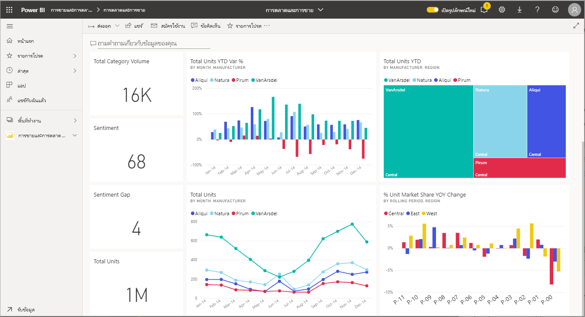
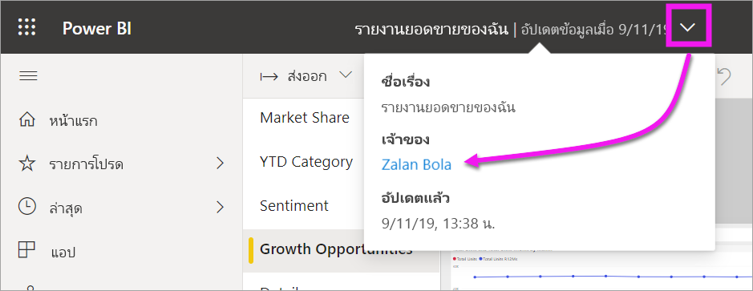

# โต้ตอบกับการแสดงผลด้วยภาพในรายงาน แดชบอร์ด และแอป

[!INCLUDE[consumer-appliesto-ynny](../includes/consumer-appliesto-ynny.md)]

ที่คุณสมบัติพื้นฐานที่สุด ***การแสดงภาพ*** (หรือ*ภาพ*) เป็นแผนภูมิชนิดที่สร้างขึ้น โดย*ตัวออกแบบ*ของ Power BI โดยใช้ข้อมูลในรายงานและชุดข้อมูล 

พบภาพบนแดชบอร์ดในรายงาน และสามารถสร้างการแสดงภาพโดยใช้ Power BI Q & A ได้ในทันที เมื่อผู้ออกแบบสร้างการแสดงภาพในรายงาน พวกเขาสามารถ *ปักหมุด* ภาพนั้นไปยังแดชบอร์ดได้ [การแสดงภาพบนแดชบอร์ดเรียกว่า *ไทล์*](end-user-tiles.md) แดชบอร์ดนี้มีไทล์แปดแผ่น 

> [!TIP]
> ขอแนะนำให้อ่านแนวคิดพื้นฐานในหัวข้อภาพรวมของ [Power BI แสำหรับ*ผู้ใช้*](end-user-basic-concepts.md)ก่อนอ่านเนื้อหานี้โดยละเอียดเพิ่มเติม

## ฉันสามารถทำอะไรกับวิชวลได้บ้าง?

วิชวลที่สร้างขึ้นโดย*ตัวออกแบบ*รายงานและแดชบอร์ด และแชร์กับ*ผู้ใช้* ในฐานะผู้ใช้ คุณมีหลายทางเลือกในการโต้ตอบกับวิชวลเพื่อเปิดเผยข้อมูลเชิงลึกและทำการตัดสินใจทางธุรกิจโดยใช้ข้อมูล ตัวเลือกส่วนใหญ่แสดงอยู่ในตารางด้านล่างพร้อมลิงก์ไปยังคำแนะนำทีละขั้นตอน

สำหรับตัวเลือกเหล่านี้ ผู้ดูแลระบบของคุณหรือ *ผู้ออกแบบ* สามารถปิดใช้งานความสามารถในการดูหรือใช้คุณลักษณะเหล่านี้ของคุณได้ และคุณลักษณะบางอย่างเหล่านี้จะทำงานกับการแสดงภาพที่เฉพาะเจาะจงเท่านั้น  หากคุณมีคำถามใด ๆ โปรดติดต่อผู้ดูแลระบบของคุณหรือเจ้าของรายงานหรือแดชบอร์ด หากต้องการค้นหาเจ้าของ ให้เลือกรายการแดชบอร์ดหรือรายงานแบบเลื่อนลง 

> [!IMPORTANT]
> แต่ก่อนอื่น มาดูคำถามและคำตอบ คำถามและคำตอบเป็นเครื่องมือค้นหาภาษาที่เป็นธรรมชาติของ Power BI คุณพิมพ์คำถามโดยใช้ภาษาธรรมชาติ คำตอบและคำตอบจะตอบคำถามในรูปแบบของวิชวล คำถามและคำตอบเป็นวิธีที่ผุ้ใช้สามารถสร้างวิชวลของตนเองได้ในทันที อย่างไรก็ตาม ไม่สามารถบันทึกวิชวลที่คุณสร้างด้วยคำถามและคำตอบได้ แต่ หากมีบางอย่างที่เฉพาะเจาะจงซึ่งคุณต้องการเรียนรู้จากข้อมูล และตัวออกแบบไม่ได้รวมไว้ในรายงานหรือบนแดชบอร์ด คำถามและคำตอบเป็นตัวเลือกที่ดีมาก เรียนรู้เพิ่มเติมเกี่ยวกับคำถามและคำตอบ ดู[คำถามและคำตอบสำหรับผู้ใช้](end-user-q-and-a.md)

|งาน  |บนแดชบอร์ด  |ในรายงาน  | ในคำถามและคำตอบ
|---------|---------|---------|--------|
|[เพิ่มข้อคิดเห็นในวิชวลสำหรับตัวคุณเอง หรือเริ่มการสนทนากับเพื่อนร่วมงานเกี่ยวกับวิชวล](end-user-comment.md)     |  ใช่       |   ใช่      |  ไม่  |
|[เปิดและสำรวจรายงานที่สร้างวิชวล](end-user-tiles.md)     |    ใช่     |   ไม่ระบุ      |  ไม่ |
|[ดูรายการตัวกรองและตัวแบ่งส่วนข้อมูลที่ส่งผลกระทบต่อวิชวล](end-user-report-filter.md)     |    ถ้าคุณเปิดในโหมดโฟกัส     |   ใช่      |  ไม่ |
|[เปิดและสำรวจการแสดงภาพในการถามตอบ (หาก *ผู้ออกแบบใช้* Q&A ในการสร้างการแสดงภาพ)](end-user-q-and-a.md)     |   ใช่      |   ไม่ระบุ      |  ไม่ระบุ  |
|[สร้างการแสดงภาพในการถามตอบ (สำหรับการสำรวจ คุณจะไม่สามารถบันทึกภาพนั้นได้) ](end-user-q-and-a.md)     |   ใช่      |   หากผู้ออกแบบเพิ่มการถามตอบไปยังรายงานแล้ว      |  ใช่  |
|[ขอให้ Power BI ค้นหาข้อเท็จจริงที่น่าสนใจหรือมีแนวโน้ม](end-user-insights.md)ในข้อมูลของวิชวลสำหรับคุณ  ภาพที่สร้างโดยอัตโนมัติเหล่านี้เรียกว่า *ข้อมูลเชิงลึก*     |    ใช่ สำหรับไทล์    |  ไม่       | ไม่   |
|[ดูวิชวลเดียวเมื่อใช้*โหมด*โฟกัส](end-user-focus.md)     | ใช่ สำหรับไทล์        |   ใช่ สำหรับวิชวล      | ไม่ระบุ  |
|[ค้นหาการรีเฟรชภาพครั้งล่าสุด](end-user-fresh.md)     |  ใช่       |    ใช่     | ไม่ระบุ  |
|[ดูครั้งละหนึ่งวิชวล โดยไม่มีขอบหรือบานหน้าต่างนำทาง โดยใช้*โหมด* เต็มหน้าจอ](end-user-focus.md)     |   ใช่      |  ใช่       | ตามค่าเริ่มต้น  |
|[พิมพ์](end-user-print.md)     |  ใช่       |   ใช่      | ไม่  |
|[เจาะลึกลงในวิชวล โดยการเพิ่ม และปรับเปลี่ยนตัวกรองวิชวล](end-user-report-filter.md)     |    ไม่     |   ใช่      | ไม่  |
|โฮเวอร์เหนือวิชวลเพื่อเปิดเผยรายละเอียดเพิ่มเติมและคำแนะนำเกี่ยวกับเครื่องมือ     |    ใช่     |   ใช่      | ใช่  |
|[กรองข้ามและเน้นข้ามสำหรับวิชวลอื่นบนหน้า](end-user-interactions.md)    |   ไม่      |   ใช่      | ไม่ระบุ  |
|[ดูข้อมูลที่ใช้เพื่อสร้างภาพ](end-user-show-data.md)     |  ไม่       |   ใช่      | ไม่  |
| [เปลี่ยนวิธีการจัดเรียงวิชวล](end-user-change-sort.md) | ไม่  | ใช่  | สามารถเปลี่ยนการเรียงลำดับของคำถามด้วยการเรียงคำใหม่  |
| เพิ่มสปอตไลต์สำหรับวิชวล | ไม่  | ใช่  |  ไม่ |
| [ส่งออกไปยัง Excel](end-user-export.md) | ใช่ | ใช่ | ไม่|
| [สร้างการแจ้งเตือน](end-user-alerts.md) เพื่อแจ้งให้คุณทราบเมื่อค่าเกินเกณฑ์มาตรฐานที่คุณกำหนดไว้  | ใช่  | ไม่  | ไม่ |
| [ใช้การกรองข้ามและการไฮไลท์ข้ามกับภาพอื่น ๆ บนหน้า](end-user-report-filter.md)  | ไม่      | ใช่  | ไม่ระบุ |
| [ดูรายละเอียดการแสดงภาพที่มีลำดับชั้น](end-user-drill.md)  | ไม่  | ใช่   | ไม่ |

## ขั้นตอนถัดไป
กลับไปยัง[แนวคิดพื้นฐานสำหรับผู้ใช้](end-user-basic-concepts.md)    
[เลือกวิชวลเพื่อเปิดรายงาน](end-user-report-open.md)    
[ชนิดของวิชวลที่พร้อมใช้งานใน Power BI](end-user-visual-type.md)