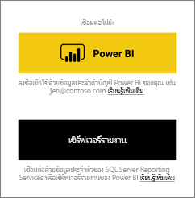
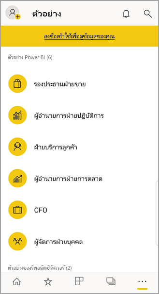

# เริ่มต้นใช้งานแอป Power BI สำหรับอุปกรณ์เคลื่อนที่ บนอุปกรณ์ Android
แอป Android สำหรับ Microsoft Power BI มอบประสบการณ์ BI บนอุปกรณ์เคลื่อนที่สำหรับ Power BI, เซิร์ฟเวอร์รายงาน Power BI และ Reporting Services ดูและโต้ตอบกับแดชบอร์ดของบริษัทของคุณ ภายในองค์กรและในคลาวด์ จากที่ใดก็ได้ ผ่านอุปกรณ์เคลื่อนที่ ที่รองรับระบบสัมผัสและดูข้อมูลสดได้ สำรวจข้อมูลในแดชบอร์ด และแชร์กับเพื่อนร่วมงานของคุณผ่านอีเมลหรือการส่งข้อความ 

คุณสร้างรายงาน Power BI ใน Power BI Desktop และเผยแพร่:

* [เผยแพร่ไปยังบริการของ Power BI](../../fundamentals/power-bi-overview.md) และสร้างแดชบอร์ด
* [เผยแพร่ภายในองค์กรไปยัง เซิร์ฟเวอร์รายงาน Power BI](../../report-server/quickstart-create-powerbi-report.md)

จากนั้น ในแอป Power BI สำหรับ Android คุณโต้ตอบกับแดชบอร์ดและรายงานของคุณ ไม่ว่าจะอยู่ภายในองค์กรหรืออยู่ในระบบคลาวด์

ดูว่า[มีอะไรใหม่ในแอป Power BI สำหรับอุปกรณ์เคลื่อนที่](../../mobile-whats-new-in-the-mobile-apps.md)

## ข้อกำหนดเบื้องต้น

### รับแอป

[ดาวน์โหลดแอป Power BI สำหรับ Android](https://go.microsoft.com/fwlink/?LinkID=544867) จาก Google Play
  
Power BI สามารถทำงานบนอุปกรณ์ Android ที่ใช้ระบบปฏิบัติการ Android 5.0 หรือใหม่กว่า เพื่อตรวจสอบอุปกรณ์ของคุณ ไปที่ **การตั้งค่า** > **เกี่ยวกับ** > **เวอร์ชันของ Android** 

**เริ่มต้นเมื่อคุณเปิดแอป**    
ถึงแม้ว่าคุณจะยังไม่ลงทะเบียนหรือลงชื่อเข้าใช้ หลังจากที่คุณเปิดแอปแล้วคุณสามารถพลิกดูหน้าลงชื่อเข้าใช้ สำหรับภาพรวมของสิ่งที่คุณสามารถทำได้ ด้วยแอป Power BI บนอุปกรณ์ Android ของคุณ แตะ**ข้าม** เพื่อดูและสำรวจตัวอย่าง และทดลองประสบการณ์การใช้งานกับแอป คุณสามารถ[กลับไปยังตัวอย่าง](mobile-android-app-get-started.md#try-the-power-bi-and-reporting-services-samples) เมื่อใดก็ตามที่คุณต้องการ จากโฮมเพจแดชบอร์ดได้

ดูว่า[มีอะไรใหม่ในแอป Power BI สำหรับอุปกรณ์เคลื่อนที่](../../mobile-whats-new-in-the-mobile-apps.md)

## ลงทะเบียนสำหรับบริการของ Power BI บนเว็บ
ถ้าคุณยังไม่ได้ลงทะเบียน ไปที่ [บริการของ Power BI](https://powerbi.com/) เพื่อลงทะเบียนบัญชีของคุณ สำหรับสร้างและจัดเก็บแดชบอร์ดและรายงาน และนำข้อมูลของคุณรวมเข้าด้วยกัน จากนั้น ลงชื่อเข้าใช้ Power BI จากอุปกรณ์ Android ของคุณเพื่อดูแดชบอร์ดของคุณเองจากที่ไหนก็ได้

1. ในบริการของ Power BI แตะ [ลงทะเบียน](https://go.microsoft.com/fwlink/?LinkID=513879) เพื่อสร้างบัญชี Power BI
2. เริ่มต้น[สร้างแดชบอร์ดและรายงานของคุณเอง](../../fundamentals/service-get-started.md)

## เริ่มต้นใช้งานแอป Power BI บนอุปกรณ์ของคุณ
1. บนอุปกรณ์ Android ของคุณ จากหน้าจอเริ่มต้น เปิดแอป Power BI สำหรับ Android
   
   
2. หากต้องการลงชื่อเข้าใช้ Power BI ให้แตะแท็บ **Power BI** และกรอกรายละเอียดการลงชื่อเข้าใช้ของคุณ

    ถ้าคุณได้รับข้อความว่า Power BI ไม่สามารถลงชื่อคุณเข้าใช้ ดูที่ ["ไม่สามารถรับรองความถูกต้องได้เนื่องจากใบรับรอง SSL ของบริษัทของคุณไม่น่าเชื่อถือ"](mobile-android-app-error-corporate-ssl-account-is-untrusted.md) สำหรับรายละเอียดวิธีการแก้ปัญหานี้

   หากต้องการลงชื่อเข้าใช้รายงานมือถือและ KPI ของ Reporting Services ของคุณให้แตะแท็บ **เซิร์ฟเวอร์รายงาน** และกรอกรายละเอียดการลงชื่อเข้าใช้ของคุณ
   
   

## ลองใช้ตัวอย่าง Power BI และ Reporting Services
แม้ว่าจะยังไม่ลงทะเบียน คุณสามารถดูและโต้ตอบกับตัวอย่าง Power BI และ Reporting Services ได้

หากต้องการเข้าถึงตัวอย่าง ให้แตะ **ตัวเลือกเพิ่มเติม** (...) บนแถบนำทางและเลือก **ตัวอย่าง**.

จำนวนตัวอย่างของ Power BI จะตามด้วยตัวอย่างของเซิร์ฟเวอร์รายงานหลายรายการ
   
   

   
   > [!NOTE]
   > ไม่สามารถใช้งานคุณลักษณะทั้งหมดได้ในตัวอย่าง ตัวอย่างเช่น คุณไม่สามารถดูรายงานตัวอย่างทีอยู่ใต้แดชบอร์ด คุณไม่สามารถแชร์ตัวอย่างกับผู้อื่นได ้และคุณไม่สามารถทำให้เป็นรายการโปรดของคุณได้ 
   > 
   >

## ค้นหาเนื้อหาของคุณในแอป Power BI สำหรับอุปกรณ์เคลื่อนที่

แตะแว่นขยายในส่วนหัวเพื่อเริ่มค้นหาเนื้อหา Power BI ของคุณ

## ดูแดชบอร์ดและรายงานโปรดของคุณ
แตะ **รายการโปรด** () บนแถบนำทางเพื่อดูหน้ารายการโปรดของคุณ 

อ่านข้อมูลเพิ่มเติมเกี่ยวกับ [รายการโปรดในแอป Power BI สำหรับอุปกรณ์เคลื่อนที่](mobile-apps-favorites.md)

## การสนับสนุนองค์กรสำหรับแอปสำหรับอุปกรณ์เคลื่อนที่ Power BI
องค์กรสามารถใช้ Microsoft Intune เพื่อจัดการอุปกรณ์และแอปพลิเคชัน รวมถึงแอป Power BI สำหรับอุปกรณ์เคลื่อนที่ สำหรับ Android และ iOS

Microsoft Intune ช่วยให้องค์กรควบคุมรายการ เช่น การบังคับใช้ Pin เพื่อเข้าใช้งาน การควบคุมวิธีจัดการกับข้อมูลโดยแอปพลิเคชัน หรือแม้แต่ารเข้ารหัสลับข้อมูลแอปพลิเคชันเมื่อไม่ได้ใช้งาน

> [!NOTE]
> ถ้าคุณใช้แอป Power BI สำหรับอุปกรณ์เคลื่อนที่ บนอุปกรณ์ Android ของคุณ และองค์กรของคุณได้กำหนดค่า Microsoft Intune MAM การรีเฟรชข้อมูลพื้นหลังจะถูกปิดใช้งาน Power BI จะรีเฟรชข้อมูลจากบริการของ Power BI บนเว็บ ในครั้งต่อไปที่คุณเข้าใช้งานแอป
> 
> 

อ่านเพิ่มเติมเกี่ยวกับ[การกำหนดค่าแอปโทรศัพท์เคลื่อนที่ Power BI ด้วย Microsoft Intune](../../admin/service-admin-mobile-intune.md) 

## ขั้นตอนถัดไป
ต่อไปนี้คือสิ่งอื่น ๆ ที่คุณสามารถทำได้ในแอปอุปกรณ์ Android สำหรับ Power BI ที่มีแดชบอร์ดและรายงานใน Power BI, รายงานและ KPI ในพอร์ทัลของเว็บเซิร์ฟเวอร์รายงาน Power BI หรือ Reporting Services

### แดชบอร์ดและรายงาน Power BI
* ดู[แอปของคุณ](../../collaborate-share/service-create-distribute-apps.md)
* ดู[แดชบอร์ด](../../mobile-apps-view-dashboard.md)ของคุณ
* สำรวจ[ไทล์บนแดชบอร์ดของคุณ](../../mobile-tiles-in-the-mobile-apps.md)
* เปิด[รายงาน Power BI](../../mobile-reports-in-the-mobile-apps.md)
* ดู[แอปของคุณ](../../collaborate-share/service-create-distribute-apps.md)
* [ใส่คำอธิบายประกอบ และแชร์ไทล์](mobile-annotate-and-share-a-tile-from-the-mobile-apps.md)
* แชร์[แดชบอร์ด](../../mobile-share-dashboard-from-the-mobile-apps.md)
* [สแกนรหัส QR Power BI](../../mobile-apps-qr-code.md) ด้วยมือถือ Android ของคุณ เพื่อเปิดไทล์แดชบอร์ดหรือรายงานที่เกี่ยวข้อง 
* ดู[การแจ้งเตือนเกี่ยวกับอัปเดตต่าง ๆ ในบัญชี Power BI ของคุณ](../../mobile-apps-notification-center.md) เช่นแดชบอร์ดที่เพื่อนร่วมงานแชร์ให้คุณ

### รายงานและ KPI บนพอร์ทัลของเว็บเซิร์ฟเวอร์รายงาน Power BI และ Reporting Services
* [ดูรายงานและ KPI บนพอร์ทัลของเว็บ](mobile-app-ssrs-kpis-mobile-on-premises-reports.md)ในแอป Power BI สำหรับอุปกรณ์เคลื่อนที่ สำหรับอุปกรณ์ Android
* สร้าง [KPI บนพอร์ทัลของเว็บ](https://docs.microsoft.com/sql/reporting-services/working-with-kpis-in-reporting-services)
* สร้าง [รายงานใน Power BI Desktop และเผยแพร่รายการนั้น ๆ บนพอร์ทัลของเว็บเซิร์ฟเวอร์รายงาน Power BI](../../report-server/quickstart-create-powerbi-report.md)

### อาจดูได้จาก
* [ดาวน์โหลดแอป Android](https://go.microsoft.com/fwlink/?LinkID=544867) จาก Android app store
* [Power BI คืออะไร](../../fundamentals/power-bi-overview.md)
* มีคำถามหรือไม่ [ลองถามชุมชน Power BI](https://community.powerbi.com/)
