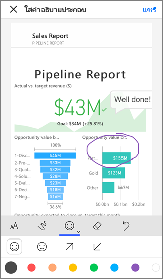
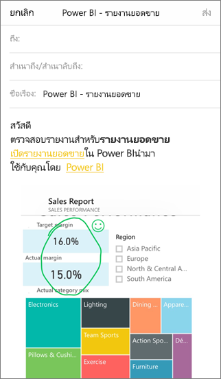

# ใส่คำอธิบายประกอบ และแชร์ไทล์ รายงาน หรือรูปภาพในแอปสำหรับอุปกรณ์เคลื่อนที่ของ Power BI
ใช้กับ

|  |  |  |  |
|:--- |:--- |:--- |:--- |
| iPhone |iPad |โทรศัพท์ Android |แท็บเล็ต Android |

คุณสามารถใส่คำอธิบายประกอบ และแชร์สแนปช็อตของไทล์ รายงาน หรือภาพจากอุปกรณ์เคลื่อนที่ Power BI สำหรับอุปกรณ์ iOS และ Android ผู้รับของคุณเห็นเหมือนกับเวลาที่คุณส่งเมล์ รวมถึงลิงก์ คุณสามารถส่งสแนปช็อตของไทล์ให้ทุกคน ไม่เพียงเพื่อนร่วมงานในโดเมนอีเมลเดียวกันเท่านั้น คุณสามารถเพิ่มคำอธิบายประกอบ บรรทัด ข้อความ หรือประทับตรา ก่อนที่คุณแชร์ได้

*รายงานที่มีคำอธิบายประกอบ*

จดหมายที่ มีสแนปช็อตของไทล์ รายงาน หรือรูปภาพที่ยังมีลิงก์ไปยังวัตถุจริงบน Power BI service ([https://powerbi.com](https://powerbi.com)) ผู้รับของคุณสามารถคลิกลิงก์ และไปยังที่ไทล์ รายงาน หรือรูปภาพวิชวล ถ้าคุณและพวกเขามีสิทธิ์การใช้งาน Power BI Pro หรือเนื้อหาอยู่ใน[ความจุพรีเมียม](../../service-premium-what-is.md)และคุณได้แชร์รายการกับบุคคลเหล่านั้น 

คุณสามารถ[แชร์ไทล์จากแอป mobile Power BI ให้กับอุปกรณ์ Windows 10](mobile-windows-10-phone-app-get-started.md) แช่นกัน แต่อย่าใส่คำอธิบายประกอบ

## เปิดไทล์สำหรับใส่คำอธิบายประกอบ
1. แตะไทล์เพื่อเปิดในโหมดโฟกัส
2. แตะไอคอนใส่คำอธิบายประกอบ  ในมุมขวาบนของไทล์
3. คุณพร้อมที่จะ[ใส่คำอธิบายประกอบและแชร์ไทล์](mobile-annotate-and-share-a-tile-from-the-mobile-apps.md#annotate-and-share-the-tile-report-or-visual)

## เปิดรายงานสำหรับใส่คำอธิบายประกอบ
1. เปิดรายงาน 
2. แตะไอคอนการใส่คำอธิบายประกอบ  ในมุมขวาบนของรายงาน
3. คุณพร้อมที่จะ[ใส่คำอธิบายประกอบและแชร์รายงาน](mobile-annotate-and-share-a-tile-from-the-mobile-apps.md#annotate-and-share-the-tile-report-or-visual)

## เปิดรูปภาพสำหรับใส่คำอธิบายประกอบ
1. ในรายงาน แตะรูปภาพ จากนั้นแตะไอคอนขยายเพื่อเปิดในโหมดโฟกัส 
   
    
2. แตะไอคอนใส่คำอธิบายประกอบ  ในมุมขวาบนของรูปภาพ
3. คุณพร้อมที่จะ[ใส่คำอธิบายประกอบและแชร์รูปภาพ](mobile-annotate-and-share-a-tile-from-the-mobile-apps.md#annotate-and-share-the-tile-report-or-visual)

## ใส่คำอธิบายประกอบ และแชร์ไทล์ รายงาน หรือรูปภาพ
1. นี่คือวิธีคุณเขียนคำอธิบาย  
   
   
   
   *แถบคำอธิบายประกอบใน iPhones และ iPads*
   
   
   
   *แถบคำอธิบายประกอบในอุปกรณ์ Android*
   
   * เมื่อต้องวาดเส้นของสีและความหนาที่ต่างกัน ให้แตะไอคอนเส้นหยัก เลือกความกว้างและสี แล้ววาด  
   * เมื่อต้องพิมพ์ข้อคิดเห็น แตะ**AA** ให้เลือกขนาด สี และชนิดข้อความ  
   * เมื่อต้องวางตราประทับ(เช่นอิโมติคอน) บนไทล์ แตะหน้ายิ้ม เลือกสี และแตะจุดที่คุณต้องการ   
2. หลังจากที่ใส่คำอธิบายประกอบ ให้แตะ**แชร์**ในมุมขวาบน
3. เปิดแอปอีเมล์ของคุณ พิมพ์ชื่อของผู้รับ และปรับเปลี่ยนข้อความถ้าคุณต้องการ  
   
   
   
   อีเมล์มีรูปภาพ และการเชื่อมโยงไปยังไทล์เฉพาะ รายงาน หรือรูปภาพวิชวล 
4. แตะ**ส่ง**

## ขั้นตอนถัดไป
* [แชร์แดชบอร์ดจากแอป Power BI mobile ](mobile-share-dashboard-from-the-mobile-apps.md)
* มีคำถามหรือไม่ [ลองถามชุมชน Power BI](https://community.powerbi.com/)

