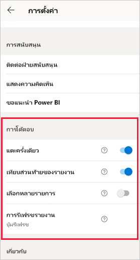
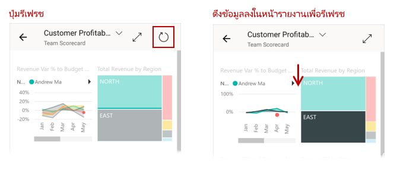
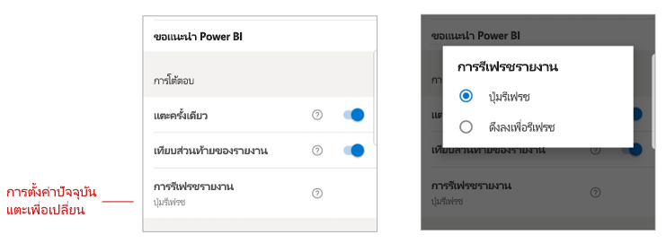

# กำหนดค่าการตั้งค่าการโต้ตอบของรายงาน

## ภาพรวม

แอป Power BI สำหรับอุปกรณ์เคลื่อนที่มีจำนวนการตั้งค่า "การโต้ตอบ" ที่สามารถกำหนดค่าได้ที่ช่วยให้คุณสามารถควบคุมวิธีการที่คุณโต้ตอบกับข้อมูลของคุณ และเพื่อกำหนดวิธีที่องค์ประกอบบางอย่างในแอป Power BI สำหรับอุปกรณ์เคลื่อนที่ทำงาน ในขณะนี้มีการตั้งค่าสำหรับ
* [การโต้ตอบแบบแตะครั้งเดียวเทียบกับการโต้ตอบแบบแตะสองครั้งบนวิชวลรายงาน](#single-tap)
* [ส่วนท้ายของรายงานแบบเทียบชิดขอบเทียบกับส่วนท้ายรายงานแบบไดนามิก](#docked-report-footer-android-phones) (Android)
* [การรีเฟรชรายงานโดยใช้ปุ่มเทียบกับการรีเฟรชแบบดึงลง](#report-refresh-android-phones) (Android)

เมื่อต้องการไปที่การตั้งค่าการโต้ตอบ ให้แตะรูปภาพโปรไฟล์ของคุณเพื่อเปิด[แผงด้านข้าง](./mobile-apps-home-page.md#header) เลือก **การตั้งค่า**และค้นหาส่วน **การโต้ตอบ**

>[!NOTE]
>การตั้งค่าการโต้ตอบสำหรับปุ่มรีเฟรชและสำหรับการเทียบชิดขอบส่วนท้ายของรายงานจะยังไม่มีผลกับรายงานของเซิร์ฟเวอร์รายงาน สิ่งนี้จะเปลี่ยนไปเมื่อมีการเปิดตัวเซิร์ฟเวอร์รายงานในเดือนมกราคม 2020

## การตั้งค่าการโต้ตอบ

### แตะครั้งเดียว
เมื่อคุณดาวน์โหลดแอป Power BI สำหรับอุปกรณ์เคลื่อนที่ จะมีการตั้งค่าสำหรับการโต้ตอบแบบแตะครั้งเดียว ซึ่งหมายความว่าเมื่อคุณแตะในวิชวลเพื่อทำการดำเนินการบางอย่างเช่น การเลือกรายการตัวแบ่งส่วนข้อมูล การเน้นข้าม การคลิกที่ลิงก์หรือปุ่ม ฯลฯ การแตะทั้งสองเลือกวิชวลและดำเนินการตามที่คุณต้องการ

ถ้าคุณต้องการ คุณสามารถปิดการโต้ตอบแบบแตะครั้งเดียวได้ จากนั้นคุณจะสามารถใช้การแตะแบบสองครั้งได้ ด้วยการแตะสองครั้ง การแตะครั้งแรกที่วิชวลเพื่อเลือก และจากนั้นแตะอีกครั้งในวิชวลเพื่อดำเนินการตามที่คุณต้องการ

### ส่วนท้ายของรายงานที่เทียบชิดขอบ (โทรศัพท์ Android)

การตั้งค่าส่วนท้ายของรายงานที่เทียบชิดขอบจะกำหนดว่าส่วนท้ายรายงานยังคงเทียบชิดขอบหรือไม่ (เช่น คงที่และมองเห็นได้เสมอ) ที่ด้านล่างของรายงาน หรือซ่อนและปรากฏขึ้นใหม่ตามการดำเนินการของคุณในรายงานเช่น การเลื่อน

บนโทรศัพท์ Android การตั้งค่าส่วนท้ายของรายงานที่เทียบชิดขอบจะ **เปิด** ตามค่าเริ่มต้น ซึ่งหมายความว่าส่วนท้ายของรายงานจะถูกเทียบชิดขอบและแสดงอยู่ที่ด้านล่างของรายงานเสมอ สลับการตั้งค่าเป็น **ปิด** ถ้าคุณต้องการให้ส่วนท้ายรายงานแบบไดนามิกที่ปรากฏและหายไป โดยขึ้นอยู่กับการดำเนินการของคุณในรายงาน

### การรีเฟรชรายงาน (โทรศัพท์ Android)

การตั้งค่าการรีเฟรชรายงานจะกำหนดวิธีการเริ่มต้นรีเฟรชรายงานของคุณ คุณสามารถเลือกจะเพิ่มปุ่มรีเฟรชลงในส่วนหัวของรายงานทั้งหมด หรือใช้การดำเนินการดึงเพื่อรีเฟรช (ดึงลงเล็กน้อยจากบนลงล่าง) ในหน้ารายงานเพื่อรีเฟรชรายงาน รูปด้านล่างแสดงทางเลือกสองทาง 

บนโทรศัพท์ Android ปุ่มรีเฟรชจะถูกเพิ่มตามค่าเริ่มต้น

เมื่อต้องการเปลี่ยนการตั้งค่าการรีเฟรชรายงาน ให้ไปที่รายการรีเฟรชรายงานในการตั้งค่าการโต้ตอบ การตั้งค่าปัจจุบันจะแสดงขึ้น แตะค่าเพื่อเปิดป็อปอัพที่คุณสามารถเลือกค่าใหม่ได้

## การกำหนดค่าระยะไกล

การโต้ตอบยังสามารถกำหนดค่าจากระยะไกลโดยผู้ดูแลระบบโดยใช้เครื่องมือ MDM ที่มีไฟล์การกำหนดค่าแอป ด้วยวิธีนี้ คุณสามารถปรับมาตรฐานประสบการณ์การโต้ตอบรายงานทั่วทั้งองค์กร หรือกลุ่มผู้ใช้เฉพาะในองค์กร ดู [กำหนดค่าการโต้ตอบโดยใช้การจัดการอุปกรณ์เคลื่อนที่](./mobile-app-configuration.md) สำหรับรายละเอียด

## ขั้นตอนถัดไป
* [การตอบโต้กับรายงาน](./mobile-reports-in-the-mobile-apps.md#interact-with-reports)
* [กำหนดค่าการโต้ตอบโดยใช้การจัดการอุปกรณ์เคลื่อนที่](./mobile-app-configuration.md)
