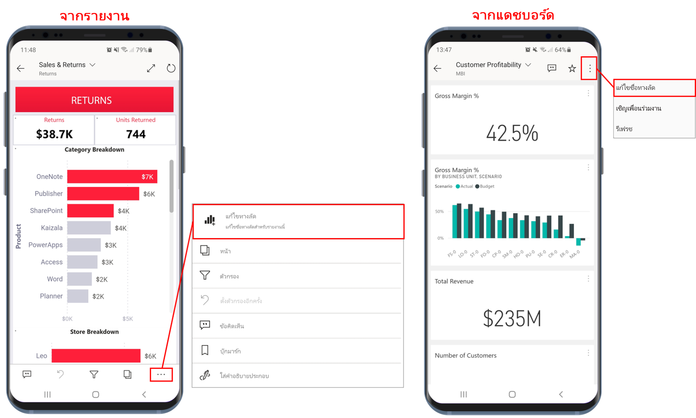

# ใช้ทางลัดแอปแอนดรอยด์ในแอป Power BI สำหรับแอนดรอยด์

นำไปใช้กับ:

|  |  |
|:--- |:--- |
| โทรศัพท์ Android |แท็บเล็ต Android |

แอป Power BI สำหรับอุปกรณ์เคลื่อนที่บนแอนดรอยด์มีวิธีการรับรายงานหรือแดชบอร์ดที่คุณต้องการโดยไม่ต้องเลื่อนผ่านแอปแบบง่าย ๆ สองวิธี: **ทางลัดบนหน้าจอหลักของอุปกรณ์**และ**ทางลัดตัวเปิดใช้แอป** 
 * **ทางลัดบนหน้าจอหลักของอุปกรณ์**: คุณสามารถสร้างทางลัดไปยังรายงานหรือแดชบอร์ด และปักหมุดไปไว้บนหน้าจอหลักของอุปกรณ์ของคุณได้ รายงานหรือแดชบอร์ดไม่จำเป็นต้องอยู่ในหนึ่งในพื้นที่ทำงานของคุณ เพราะคุณสามารถสร้างทางลัดไปยังรายงานและแดชบอร์ดที่อยู่ภายในแอป หรือแม้กระทั่งรายงานหรือแดชบอร์ดที่อยู่กับผู้เช่าภายนอก (B2B) ได้ด้วย
 * **ทางลัดเปิดใช้แอป**: คุณสามารถเข้าถึงรายงานและแดชบอร์ดที่ดูบ่อยได้โดยตรง โดยการแตะที่ไอคอนตัวเปิดใช้แอปบนหน้าจอหลักของอุปกรณ์ของคุณเพื่อเปิดตัวเปิดใช้แอป เมนูการเข้าถึงด่วนจะมีทางลัดไปยังรายการที่มีการดูบ่อยสามรายการ รายการเหล่านี้จะเปลี่ยนแปลงไปเป็นระยะ โดยแอป Power BI สำหรับอุปกรณ์เคลื่อนที่จะติดตามสิ่งที่คุณดูบ่อยครั้งแล้วปรับเปลี่ยนทางลัดให้เหมาะสม

 >[!NOTE]
 >ทางลัดของแอปสำหรับแอนดรอยด์จะสามารถใช้งานได้ตั้งแต่แอนดรอยด์เวอร์ชัน 8 ขึ้นไป

## สร้างทางลัดไปยังรายงานหรือแดชบอร์ดต่าง ๆ

คุณสามารถสร้างทางลัดไปยังรายงานหรือแดชบอร์ดต่าง ๆ ได้

1. บนเมนูแอคชัน คลิก **ตัวเลือกเพิ่มเติม...** แล้วเลือก **เพิ่มทางลัด**

   

   และี้ถ้าแอป Power BI เห็นว่าคุณมักเข้าถึงรายการใดบ่อย ๆ แอปจะแนะนำให้คุณสร้างทางลัดไปยังรายการนั้น ซึ่งสามารถทำได้สองวิธี:
   * ในรายงานและแดชบอร์ดที่ดูบ่อย จะมีตัวเลือก**เพิ่มทางลัด** ปรากฏขึ้นในแบนเนอร์เมื่อคุณเปิดรายการ
   * ถ้าคุณมักใช้ลิงก์เพื่อเข้าถึงรายงาน (เช่น จากอีเมลที่ใช้ร่วมกัน คำอธิบายประกอบ ฯลฯ) หลังการใช้ลิงก์สองสามครั้งจะมีหน้าต่างแสดงขึ้นมาเพื่อถามคุณว่าคุณต้องการสร้างทางลัดหรือไม่ การเลือก **ใช่** จะเปิดกล่องโต้ตอบ **เพิ่มทางลัด** ขึ้นมา (ดูด้านล่าง) ส่วนการเลือก **ยังไม่ต้องการในขณะนี้** จะนำคุณไปยังรายการที่คุณต้องการเข้าถึง
   
   ประสบการณ์ทั้งสองแบบจะเป็นดังภาพที่แสดงอยู่ด้านล่าง

   

 1. กล่องโต้ตอบ **เพิ่มทางลัด** จะแสดงขึ้นเป็นตัวเลือกพร้อมชื่อของรายการของคุณ คุณสามารถแก้ไขชื่อได้หากคุณต้องการ เมื่อดำเนินการเสร็จสิ้นแล้ว ให้เลือก **เพิ่ม**

    

1. ระบบจะขอให้คุณยืนยันว่าคุณต้องการเพิ่มทางลัดหรือไม่ แตะ **เพิ่ม** เพื่อเพิ่มทางลัดไปไว้บนหน้าจอหลักของอุปกรณ์ของคุณ

   

   ทางลัดของแดชบอร์ดหรือไอคอนรายงานจะเพิ่มลงไปที่หน้าจอหลักของอุปกรณ์ของคุณตามชื่อที่คุณป้อนไว้

   

## แก้ไขชื่อทางลัด

หากคุณต้องการแก้ไขชื่อทางลัด ที่เมนูแอคชันให้เลือก **ตัวเลือกเพิ่มเติม...** แล้วเลือก **แก้ไขชื่อทางลัด**

 

## ใช้แอป Power BI สำหรับอุปกรณ์เคลื่อนที่เพื่อเข้าถึงเนื้อหาที่ดูบ่อย

คุณสามารถใช้ตัวเปิดใช้แอป Power BI สำหรับอุปกรณ์เคลื่อนที่เพื่อไปยังรายการที่เข้าถึงบ่อยได้โดยตรง

แตะตัวเปิดใช้แอปค้างไว้เพื่อแสดงเมนูการเข้าถึงด่วนของรายการที่ดูบ่อย จากนั้นแตะที่ทางลัดเพื่อเปิดรายการที่ต้องการ

คุณสามารถสร้างทางลัดไปยังรายการแบบถาวรได้โดยการลากไอคอนทางลัดที่ต้องการไปที่หน้าจอหลักของอุปกรณ์ของคุณ

## ขั้นตอนถัดไป
* [ค้นหาและเข้าถึงเนื้อหาของคุณด้วย Google Search](mobile-app-find-access-google-search.md)
* ถ้าคุณใช้งานแอปบน iOS และต้องการใช้ทางลัดผ่าน Siri โปรดศึกษาที่[การใช้ทางลัดผ่าน Siri ในแอป Power BI Mobile สำหรับ iOS](mobile-apps-ios-siri-shortcuts.md)
* [รายการโปรดในแอป Power BI สำหรับอุปกรณ์เคลื่อนที่](mobile-apps-favorites.md)
