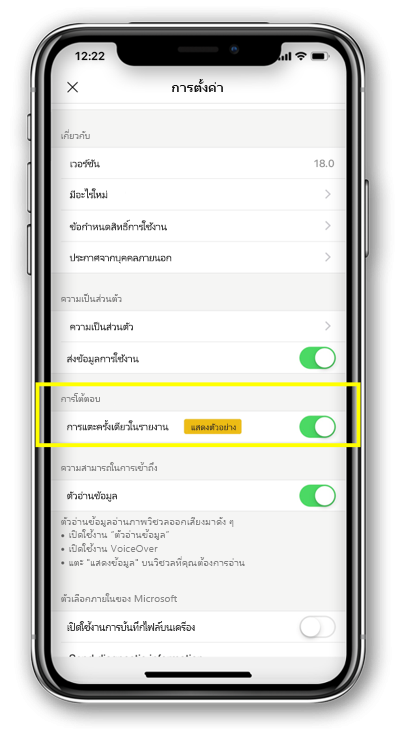

# กำหนดค่าการโต้ตอบรายงานแตะเดียวหรือแตะสองครั้ง (ตัวอย่าง)
นำไปใช้กับ:

|  |  | 
|:--- |:--- |
| iPhones |โทรศัพท์ Android |

รายงาน Power BI คือ มุมมองแบบโต้ตอบของข้อมูลของคุณที่มีการแสดงผลด้วยภาพที่แสดงการค้นพบและข้อมูลเชิงลึกแตกต่างจากข้อมูลนั้น

คุณสามารถกำหนดค่าวิธีการโต้ตอบกับข้อมูลของคุณ คุณสามารถตัดสินใจได้ถ้า คุณต้องมีการโต้ตอบแตะเดียว หรือแตะการโต้ตอบ

* มีการโต้ตอบแตะ ของคุณแตะแรกบนวิชวลเลือก และเพียงแตะที่สองในวิชวลดำเนินการ เองเช่นการเลือกรายการตัวแบ่งส่วนข้อมูล เน้นไขว้ หรือคลิกบนการเชื่อมโยง ปุ่ม และอื่น ๆ

* มีการโต้ตอบแตะเดียว แตะครั้งเดียวไม่ทั้ง- เลือกวิชวล และดำเนินการกระทำ

เริ่มต้นจาก Power BI เวอร์ชันแอ 18.0 สำหรับ iOS และ 112540 สำหรับ Android ติดตั้งใหม่ทั้งหมดจะถูกกำหนดค่า ด้วยการแตะเดียวเป็นลักษณะการทำงานเริ่มต้น
ผู้ใช้ที่มีการติดตั้งบนโทรศัพท์ Power BI และจะอัปเกรดเป็นเวอร์ชันใหม่ เหล่านี้ จะนำเสนอไปยังแตะเดียว

## เปลี่ยนลักษณะการทำงานโต้ตอบ

เมื่อต้องเปลี่ยนลักษณะการทำงานโต้ตอบ คุณสามารถไปที่การตั้งค่าแอป และเปิด หรือ ปิดการปฏิสัมพันธ์แตะเดียว

บทความนี้ใช้สำหรับทั้งแนวนอน และรายงานโทรศัพท์

## ขั้นตอนถัดไป
* [ดูและโต้ตอบกับรายงาน Power BI ที่ปรับให้เหมาะสมกับโทรศัพท์ของคุณ](mobile-apps-view-phone-report.md)
* มีคำถามหรือไม่ [ลองถามชุมชน Power BI](http://community.powerbi.com/)

