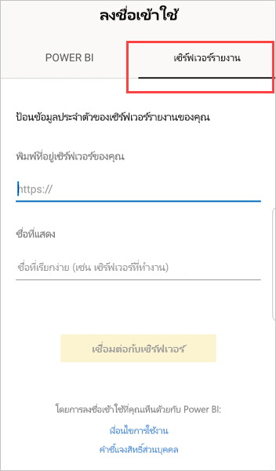
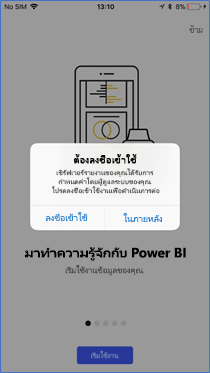

# ดูรายงานจากรีพอร์ตเซิร์ฟเวอร์ภายในองค์กรและ KPI ในแอป Power BI สำหรับอุปกรณ์เคลื่อนที่

แอป Power BI สำหรับอุปกรณ์เคลื่อนที่ให้คุณใช้งานในระบบสัมผัสที่เชื่อมต่อแบบสดเพื่อเข้าถึงข้อมูลทางธุรกิจภายในองค์กรของคุณในเซิร์ฟเวอร์รายงาน Power BI และ SQL Server 2016 Reporting Services (SSRS)

นำไปใช้กับ:

|  |  |  |  |
|:--- |:--- |:--- |:--- |
| iPhone |iPad |โทรศัพท์ Android |แท็บเล็ต Android |

## ขั้นแรก
**แอปสำหรับอุปกรณ์เคลื่อนที่เป็นตำแหน่งที่คุณดูเนื้อหา Power BI ไม่ใช่ตำแหน่งที่คุณสร้างเนื้อหา**

* คุณและผู้สร้างรายงานคนอื่นๆ ในองค์กรของคุณ[สร้างรายงาน Power BI ด้วย Power BI Desktop จากนั้นเผยแพร่รายงานนั้นไปยังพอร์ทัลเว็บของเซิร์ฟเวอร์รายงาน Power BI](../../report-server/quickstart-create-powerbi-report.md) 
* คุณสร้าง [KPI ในพอร์ทัลเว็บ](https://docs.microsoft.com/sql/reporting-services/working-with-kpis-in-reporting-services)จัดระเบียบในโฟลเดอร์ และทำเครื่องหมายรายการโปรดของคุณเพื่อให้คุณสามารถค้นหาได้ง่ายขึ้น 
* คุณ[สร้างรายงานสำหรับอุปกรณ์เคลื่อนที่จาก Reporting Services](https://docs.microsoft.com/sql/reporting-services/mobile-reports/create-mobile-reports-with-sql-server-mobile-report-publisher) ด้วย SQL Server 2016 Enterprise Edition Mobile Report Publisher และเผยแพร่รายงานนนั้นไปยัง[พอร์ทัลเว็บของ Reporting Services](https://docs.microsoft.com/sql/reporting-services/web-portal-ssrs-native-mode)  

จากนั้น ในแอป Power BI สำหรับอุปกรณ์เคลื่อนที่เชื่อมต่อกับรีพอร์ตเซิร์ฟเวอร์ได้ถึงห้าตัวเมื่อต้องการดูรายงาน Power BI และ KPI ที่ถูกจัดระเบียบในโฟลเดอร์หรือถูกเก็บรวบรวมเป็นรายการโปรด 

## สำรวจตัวอย่างในแอปสำหรับอุปกรณ์เคลื่อนที่โดยไม่มีการเชื่อมต่อเซิร์ฟเวอร์
แม้ว่าคุณไม่สามารถเข้าถึงพอร์ทัลเว็บของ Reporting Services คุณยังสามารถสำรวจฟีเจอร์ของรายงานสำหรับอุปกรณ์เคลื่อนที่ของ Reporting Services และ KPI 

1. แตะรูปโปรไฟล์ของคุณที่มุมบนซ้ายจากนั้น แตะ**การตั้งค่า**บนแผงบัญชีที่เลื่อนออก

2. ในหน้าการตั้งค่าที่เปิด แตะ**ตัวอย่าง Reporting Services** จากนั้น เรียกดูเพื่อโต้ตอบกับตัวอย่าง KPI และรายงานสำหรับอุปกรณ์เคลื่อนที่
   
   

## เชื่อมต่อกับเซิร์ฟเวอร์ภายในองค์กร
คุณสามารถดูรายงาน Power BI สำหรับองค์กร รายงานจาก Reporting Services และ KPI ในแอป Power BI สำหรับอุปกรณ์เคลื่อนที่ 

1. บนอุปกรณ์เคลื่อนที่ เปิดแอป Power BI
2. ถ้าคุณยังไม่ได้ลงชื่อเข้าใช้ Power BI แตะ**รีพอร์ตเซิร์ฟเวอร์**
   
   
   
   หากคุณล็อกอินในแอป Power BI แล้ว ให้แตะรูปโปรไฟล์ของคุณที่มุมบนซ้ายจากนั้น แตะ**การตั้งค่า**บนแผงบัญชีที่เลื่อนออก
3. บนหน้าการตั้งค่าที่เปิดขึ้น ให้แตะ**เชื่อมต่อกับเซิร์ฟเวอร์**
   
    

    แอปสำหรับอุปกรณ์เคลื่อนที่จำเป็นต้องเข้าถึงเซิร์ฟเวอร์ในลักษณะบางอย่าง มีสองสามวิธีดำเนินการดังกล่าว:
     * การใช้เครือข่ายเดียวกัน/การใช้ VPN เป็นวิธีง่ายที่สุด
     * จำเป็นต้องใช้พร็อกซีของแอปพลิเคชันบนเว็บเพื่อเชื่อมต่อจากภายนอกองค์กร ดู[ใช้ OAuth เพื่อเชื่อมต่อกับ Reporting Services ](mobile-oauth-ssrs.md)สำหรับรายละเอียด
     * เปิดการเชื่อมต่อ (พอร์ต) ในไฟร์วอลล์

4. กรอกที่อยู่เซิร์ฟเวอร์และตั้งชื่อเซอร์ฟเวอร์ หากคุณต้องการ ใช้รูปแบบนี้สำหรับที่อยู่เซิร์ฟเวอร์:
   
     `https://<servername>/reports`
   
     OR
   
     `https://<servername>/reports`
   
   ใส่**http**หรือ**https**ด้านหน้าของสตริงการเชื่อมต่อ
   
    
5. เมื่อคุณพิมพ์ที่อยู่เซิร์ฟเวอร์และตั้งชื่อเซิร์ฟเวอร์เมื่อต้องการแล้ว แตะ**เชื่อมต่อ** จากนั้นกรอกชื่อผู้ใช้และรหัสผ่านของคุณเมื่อมีข้อความขึ้นเตือน
6. ในตอนนี้คุณเห็นเซิร์ฟเวอร์ในหน้าต่างบัญชีในตัวอย่างนี้ เรียกว่า "Work Server"
   
   

## เชื่อมต่อกับเซิร์ฟเวอร์รายงานภายในองค์กรใน iOS หรือแอนดรอยด์

ถ้าคุณกำลังดู Power BI ในแอปสำหรับอุปกรณ์ iOS หรือแอนดรอยด์ ผู้ดูแลระบบ IT ของคุณอาจมีนโยบายการกำหนดค่าแอป ถ้าเป็นเช่นนั้น ประสบการณ์การเชื่อมต่อกับเซิร์ฟเวอร์รายงานของคุณถูกทำให้ง่ายขึ้น และคุณไม่ต้องใส่ข้อมูลมากเท่าเดิมเมื่อคุณเชื่อมต่อกับเซิร์ฟเวอร์รายงาน 

1. คุณจะเห็นข้อความว่า แอปสำหรับอุปกรณ์เคลื่อนที่ของคุณได้กำหนดค่าสำหรับเซิร์ฟเวอร์รายงานแล้ว แตะ**ลงชื่อเข้าใช้**

    

2.  บนหน้า**เชื่อมต่อกับเซิร์ฟเวอร์** รายละเอียดของเซิร์ฟเวอร์รายงานได้ถูกกรอกให้แล้ว แตะ**เชื่อมต่อ**

    

3. พิมพ์รหัสผ่านเพื่อรับรองความถูกต้อง จากนั้นแตะ**ลงชื่อเข้าใช้** 

    

ตอนนี้ คุณสามารถดูและโต้ตอบกับ KPI และรายงาน Power BI ที่จัดเก็บบนเซิร์ฟเวอร์รายงาน

## ดูรายงาน Power BI และ KPI ในแอป Power BI
รายงาน Power BI รายงานสำหรับอุปกรณ์เคลื่อนที่ของ Reporting Services และ KPI จะแสดงอยู่ในโฟลเดอร์เดียวกันบนพอร์ทัลเว็บของ Reporting Services 

* แตะรายงาน Power BI . การแตะจะเปิดโหมดแนวนอน และคุณสามารถโต้ตอบกับไฟล์ในแอป Power BI ได้

    > [!NOTE]
  > ดูรายละเอียดลงและขึ้นในขณะนี้ไม่ได้เปิดใช้งานในรายงานของ Power BI บนเซิร์ฟเวอร์รายงาน Power BI
  
    
* ใน Power BI Desktop เจ้าของรายงานสามารถ[ปรับรายงาน](../../desktop-create-phone-report.md)ให้เหมาะสมสำหรับแอป Power BI สำหรับอุปกรณ์เคลื่อนที่ได้ บนโทรศัพท์มือถือ รายงานที่ปรับให้เหมาะสมจะมีไอคอนพิเศษและแบบการจัดหน้า
  
    
* แตะ KPI เพื่อดูในโหมดโฟกัส
  
    

## ดู KPI และรายงานที่เป็นรายการโปรดของคุณ
คุณสามารถเพิ่ม KPIs และรายงานให้เป็นรายการโปรดบนพอร์ทัลเว็บ จากนั้น ดูข้อมูลดังกล่าวได้ในโฟลเดอร์หนึ่งที่สะดวกบนอุปกรณ์เคลื่อนที่ พร้อมกับแดชบอร์ดโปรด Power BI ของคุณ

* แตะ**รายการโปรด** บนแถบนำทาง
  
   
  
   KPI และรายงานโปรดจากพอร์ทัลเว็บของคุณจะอยู่บนหน้านี้ทั้งหมด พร้อมกับแดชบอร์ด Power BI ในบริการของ Power BI:
  
   

## ยุติการเชื่อมต่อกับรีพอร์ตเซิร์ฟเวอร์
1. เปิดหน้าต่างบัญชี แตะ**การตั้งค่า**
2. แตะชื่อเซิร์ฟเวอร์ที่คุณไม่ต้องการเชื่อมต่อ
3. แตะ**ถอดเซิร์ฟเวอร์**

## ขั้นตอนถัดไป
* [Power BI คืออะไร](../../fundamentals/power-bi-overview.md)  
* มีคำถามหรือไม่ [ลองถามชุมชน Power BI](https://community.powerbi.com/)

