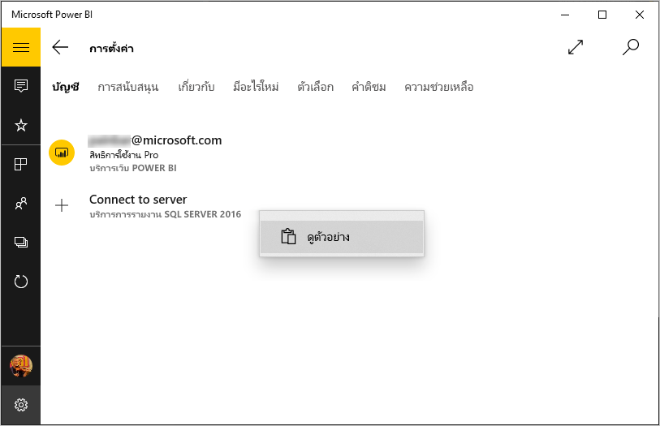

# ดรายงานอุปกรณ์มือถือของ Reporting Services (SSRS) และ KPI ในแอปสำหรับอุปกรณ์เคลื่อนที่ Power BI สำหรับ Windows 10
แอปสำหรับอุปกรณ์เคลื่อนที่ Power BI สำหรับ Windows 10 มีคุณลักษณะการเข้าถึงผ่านอุปกรณ์เคลื่อนที่แบบสดและรองรับระบบสัมผัส เพื่อเข้าใช้งานข้อมูลทางธุรกิจที่สำคัญภายในองค์กรของคุณใน SQL Server 2016 Reporting Services 

## สิ่งแรกที่ต้องทำ
[สร้างรายงานอุปกรณ์มือถือของ Reporting Services](https://msdn.microsoft.com/library/mt652547.aspx) ด้วย SQL Server 2016 Enterprise Edition Mobile Report Publisher แล้วเผยแพร่รายงานอุปกรณ์มือถือนั้นไปยัง [พอร์ทัลของเว็บ Reporting Services](https://msdn.microsoft.com/library/mt637133.aspx) สร้าง KPI อย่างเหมาะสมในพอร์ทัลของเว็บ จัดระเบียบรายงานอุปกรณ์มือถือในโฟลเดอร์ แล้วทำเครื่องหมายเป็นรายการโปรดของคุณ เพื่อให้คุณสามารถค้นหาได้ง่าย 

จากนั้น ในแอปสำหรับอุปกรณ์เคลื่อนที่ Power BI สำหรับ Windows 10 ให้ดูรายงานอุปกรณ์มือถือและ KPI ที่จัดระเบียบไว้ในโฟลเดอร์หรือเก็บรวบรวมไว้เป็นรายการโปรด 

> [!NOTE]
> อุปกรณ์ของคุณจะต้องสามารถใช้งาน Windows 10 ได้ แอปสามารถทำงานได้เต็มประสิทธิภาพในอุปกรณ์ที่มี RAM อย่างน้อย 1 GB และที่เก็บข้อมูลภายใน 8 GB
> 
> 

## สำรวจตัวอย่างโดยไม่มีเซิร์ฟเวอร์ SQL Server 2016 Reporting Services
แม้ว่าคุณไม่สามารถเข้าถึงพอร์ทัลของเว็บ Reporting Services ได้ แต่ยังสามารถสำรวจดูคุณลักษณะต่างๆ ในรายงานอุปกรณ์มือถือของ Reporting Services ได้

1. ในอุปกรณ์ที่ใช้งาน Windows 10 ของคุณ ให้เปิดแอป Power BI
2. แตะปุ่มการนำทางส่วนกลาง  ในมุมบนซ้าย
3. แตะไอคอน **การตั้งค่า**  คลิกขวา หรือแตะค้าง **เชื่อมต่อกับเซิร์ฟเวอร์** แล้วแตะ **ดูตัวอย่าง**
   
   
4. เปิดโฟลเดอร์รายงานการขายปลีกหรือรายงานการขาย เพื่อสำรวจ KPI และรายงานอุปกรณ์มือถือของโฟลเดอร์เหล่านี้
   
   

เรียกดูตัวอย่าง เพื่อโต้ตอบกับ KPI และรายงานอุปกรณ์มือถือ

## เชื่อมต่อกับรีพอร์ตเซิร์ฟเวอร์ของ Reporting Services
1. ที่ด้านล่างของแถบนำทางด้านซ้าย ให้แตะ **การตั้งค่า** 
2. แตะ **เชื่อมต่อกับเซิร์ฟเวอร์**
3. กรอกที่อยู่เซิร์ฟเวอร์ รวมทั้งชื่อผู้ใช้และรหัสผ่านของคุณ ใช้รูปแบบนี้สำหรับที่อยู่เซิร์ฟเวอร์:
   
     `http://<servername>/reports` OR   `https://<servername>/reports`
   
   > [!NOTE]
   > ใส่ **http**หรือ**https** ที่ด้านหน้าของสตริงการเชื่อมต่อ
   > 
   > 
   
    แตะ **ตัวเลือกขั้นสูง** เพื่อตั้งชื่อให้เซิร์ฟเวอร์ ถ้าต้องการ
4. แตะเครื่องหมายถูก เพื่อเชื่อมต่อ 
   
   ในตอนนี้ คุณจะเห็นเซิร์ฟเวอร์อยู่ในแถบนำทางด้านซ้าย
   
   
   
   >[!TIP]
   >แตะปุ่มการนำทางส่วนกลาง  ได้ตลอดเวลา เพื่อสลับไปมาระหว่างรายงานอุปกรณ์มือถือของ Reporting Services ของคุณกับแดชบอร์ดของคุณในบริการของ Power BI 
   > 

## ดู KPI และรายงานอุปกรณ์มือถือของ Reporting Services ในแอป Power BI
KPI และรายงานอุปกรณ์มือถือของ Reporting Services จะปรากฏอยู่ในโฟลเดอร์เดียวกันซึ่งอยู่ในพอร์ทัลของเว็บ Reporting Services

* แตะ KPI เพื่อดูในโหมดโฟกัส
  
    
* แตะรายงานอุปกรณ์มือถือ เพื่อเปิด และโต้ตอบกับรายงานอุปกรณ์มือถือนั้นในแอป Power BI
  
    

## ดู KPI และรายงานที่เป็นรายการโปรดของคุณ
คุณสามารถทำเครื่องหมายให้ KPI และรายงานอุปกรณ์มือถือต่างๆ ในพอร์ทัลของเว็บ Reporting Services ของคุณเป็นรายการโปรด จากนั้นดูรายการโปรดเหล่านี้ในโฟลเดอร์ใดโฟลเดอร์หนึ่งตามที่สะดวกในอุปกรณ์ Windows 10 ของคุณ รวมทั้งรายงานและแดชบอร์ดที่เป็นรายการโปรดใน Power BI ของคุณ

* แตะ **รายการโปรด**
  
   
  
   รายการโปรดของคุณจากพอร์ทัลของเว็บทั้งหมดล้วนอยู่ในหน้านี้
  
   

อ่านข้อมูลเพิ่มเติมเกี่ยวกับ [รายการโปรดในแอป Power BI สำหรับอุปกรณ์เคลื่อนที่](mobile-apps-favorites.md)

## ยุติการเชื่อมต่อกับรีพอร์ตเซิร์ฟเวอร์
คุณสามารถเชื่อมต่อกับรีพอร์ตเซิร์ฟเวอร์จากแอป Power BI สำหรับอุปกรณ์เคลื่อนที่ได้เพียงครั้งละหนึ่งเซิร์ฟเวอร์เท่านั้น ถ้าคุณต้องการเชื่อมต่อกับเซิร์ฟเวอร์อื่น ก็จะต้องยกเลิกการเชื่อมต่อกับเซิร์ฟเวอร์ที่ใช้งานอยู่ในปัจจุบันก่อน

1. ที่ด้านล่างของแถบนำทางด้านซ้าย ให้แตะ **การตั้งค่า** 
2. แตะค้างที่ชื่อเซิร์ฟเวอร์ที่คุณไม่ต้องการเชื่อมต่อ
3. แตะ **ลบเซิร์ฟเวอร์**
   
    

## สร้างรายงานอุปกรณ์มือถือและ KPI ของ Reporting Services
คุณไม่สามารถสร้าง KPI และรายงานอุปกรณ์มือถือของ Reporting Services ในแอป Power BI สำหรับอุปกรณ์เคลื่อนที่ได้ คุณสามารถสร้างส่วนเหล่านั้นได้ใน SQL Server Mobile Report Publisher และพอร์ทัลของเว็บ SQL Server 2016 Reporting Services

* [สร้างรายงานอุปกรณ์มือถือของ Reporting Services ของคุณเอง](https://msdn.microsoft.com/library/mt652547.aspx) แล้วเผยแพร่ไปยังพอร์ทัลของเว็บ Reporting Services
* สร้าง [KPI ในพอร์ทัลของเว็บ Reporting Services](https://msdn.microsoft.com/library/mt683632.aspx)

## ขั้นตอนถัดไป
* [เริ่มต้นใช้งานแอป Power BI สำหรับอุปกรณ์เคลื่อนที่สำหรับ Windows 10](mobile-windows-10-phone-app-get-started.md)  
* [Power BI คืออะไร](../../fundamentals/power-bi-overview.md)  
* มีคำถามหรือไม่ [ลองถามชุมชน Power BI](http://community.powerbi.com/)

