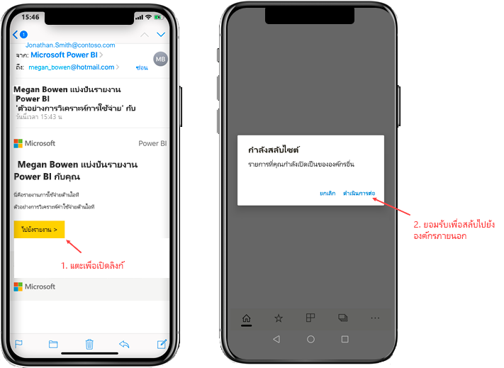
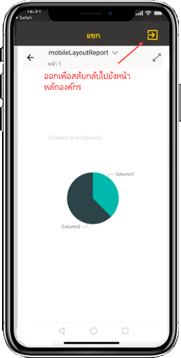
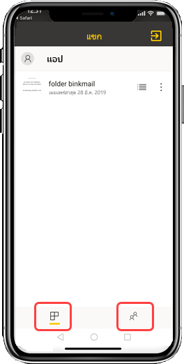

# ดูเนื้อหา Power BI ที่แชร์กับคุณจากองค์กรภายนอก

Power BI บูรณาการรวมเข้ากับ Azure Active Directory แบบธุรกิจกับธุรกิจ (Azure AD B2B) เพื่ออนุญาตให้มีการกระจายความปลอดภัยของเนื้อหา Power BI ไปยังผู้ใช้เป็นผู้เยี่ยมชมภายนอกองค์กรของคุณ และผู้ใช้ที่เป็นผู้เยี่ยมชมภายนอกสามารถใช้แอป Power BI เพื่อเข้าถึงเนื้อหา Power BI ที่แชร์กับพวกเขาได้ 

ใช้ได้กับ:

|  |  |  |  |
|:--- |:--- |:--- |:--- |
| iPhones |iPad |มือถือ Android |แท็บเล็ต Android |

## การเข้าถึงเนื้อหาที่แชร์

**ก่อนอื่น คุณต้องการใครสักคนจากองค์กรภายนอกเพื่อแชร์รายการกับคุณ** เมื่อมีคน [แชร์รายการกับคุณ](../../service-share-dashboards.md) ไม่ว่าจะเป็นจากองค์กรเดียวกันหรือจากองค์กรภายนอก คุณจะได้รับอีเมลพร้อมลิงก์ไปยังรายการที่แชร์นั้น การกดเข้าลิงก์ในอุปกรณ์มือถือของคุณจะเปิดแอป Power BI สำหรับอุปกรณ์เคลื่อนที่ หากแอปตระหนักว่ารายการนั้นแชร์จากองค์กรภายนอก แอปจะเชื่อมต่อกับองค์กรนั้นอีกครั้งด้วยข้อมูลประจำตัวของคุณ หลังจากนั้นแอปจะโหลดรายการทั้งหมดที่แชร์กับคุณจากองค์กรนั้น

> [!NOTE]
> หากนี่เป็นรายการแรกที่แชร์กับคุณในฐานะผู้ใช้ที่เป็นผู้เยี่ยมชมภายนอก คุณจะต้องอ้างสิทธิ์การเชิญในเบราว์เซอร์ก่อน คุณไม่สามารถอ้างสิทธิ์คำเชิญในแอป Power BI ได้

ตราบใดที่คุณเชื่อมต่อกับองค์กรภายนอก ส่วนหัวสีดำจะปรากฏขึ้นในแอป ส่วนหัวนี้บ่งชี้ว่าคุณไม่ได้เชื่อมต่อกับองค์กรหลักของคุณ หากต้องการเชื่อมต่อกลับไปยังองค์กรหลักของคุณ ให้ออกจากโหมดผู้เยี่ยมชม

แม้ว่าคุณจะต้องมีลิงก์วัตถุ Power BI เพื่อเชื่อมต่อกับองค์กรภายนอก แต่เมื่อมีการสลับแอปของคุณ คุณสามารถเข้าถึงรายการทั้งหมดที่แชร์กับคุณได้ (ไม่เฉพาะรายการที่คุณเปิดจากอีเมลเท่านั้น) หากต้องการดูรายการทั้งหมดที่คุณสามารถเข้าถึงได้ในองค์กรภายนอก ให้ไปที่เมนูแอปและเลือก **แบ่งปันกับฉัน** ภายใต้ **แอป** คุณจะพบแอปที่คุณสามารถใช้ได้เช่นกัน

## ข้อจำกัด

- ผู้ใช้ต้องมีบัญชี Power BI ที่ใช้งานอยู่และผู้เช่าหลัก
- ผู้ใช้จะต้องลงชื่อเข้าใช้ผู้เช่าหลักของ Power BI ก่อนจึงจะสามารถเข้าถึงเนื้อหาที่แชร์กับผู้เช่าภายนอกได้
- การเข้าถึงแบบมีเงื่อนไขและนโยบาย Intune อื่นไม่ได้รับการสนับสนุนใน Azure AD B2B และใน Power BI สำหรับอุปกรณ์เคลื่อนที่ ซึ่งหมายความว่าแอปจะบังคับใช้เฉพาะนโยบายขององค์กรหลักเท่านั้น ถ้ามีอยู่
- ผู้ใช้จะได้รับการแจ้งเตือนแบบพุชจากเว็บไซต์องค์กรหลักเท่านั้น (แม้ว่าผู้ใช้จะเชื่อมต่อในฐานะผู้เยี่ยมชมกับองค์กรภายนอก) การเปิดการแจ้งเตือนจะเชื่อมต่อแอปกับเว็บไซต์องค์กรหลักของผู้ใช้อีกครั้ง
- หากผู้ใช้ปิดแอป เมื่อเปิดใหม่อีกครั้ง แอปจะเชื่อมต่อกับองค์กรบหลักของผู้ใช้โดยอัตโนมัติ
- เมื่อเชื่อมต่อกับองค์กรภายนอก การดำเนินการบางอย่างจะถูกปิดใช้งาน: รายการโปรด การแจ้งเตือนข้อมูล การแสดงข้อคิดเห็น และการแชร์
- ข้อมูลแบบออฟไลน์ไม่พร้อมใช้งานในขณะที่เชื่อมต่อกับองค์กรภายนอก
- หากคุณติดตั้งแอป Company Portal บนอุปกรณ์ของคุณคุณจะต้องลงทะเบียนอุปกรณ์ของคุณ
