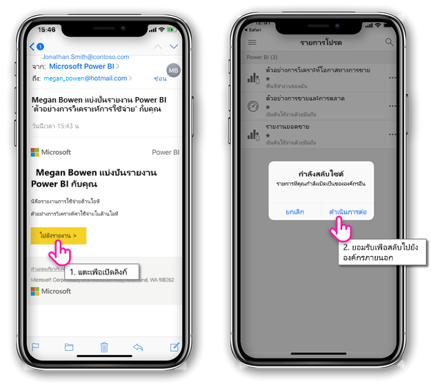
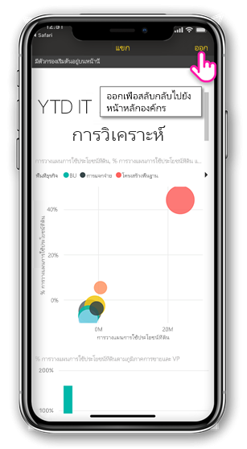
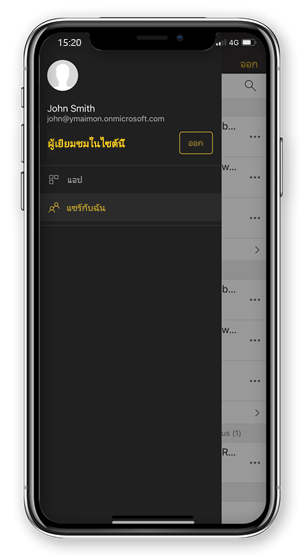

# ดูเนื้อหา Power BI ที่แชร์กับคุณจากภายนอกองค์กร

Power BI รวมเข้ากับ Azure Active Directory เพื่อธุรกิจ (Azure AD B2B) เพื่ออนุญาตให้กระจายเนื้อหา Power BI ไปยังผู้เยี่ยมชมภายนอกองค์กรของคุณ และผู้เยี่ยมชมภายนอกสามารถใช้แอปสำหรับอุปกรณ์เคลื่อน Power BI เพื่อเข้าถึงเนื้อหา Power BI ที่แชร์กับพวกเขา 

นำไปใช้กับ:

|  |  |  |  |
|:--- |:--- |:--- |:--- |
| iPhone |iPad |โทรศัพท์ Android |แท็บเล็ต Android |

## เข้าถึงเนื้อหาที่แชร์

**ก่อนอื่น คุณจำเป็นบุคคลจากภายนอกองค์กรเพื่อแชร์รายการกับคุณ** เมื่อมีใคร[แชร์รายการกับคุณ](../../service-share-dashboards.md)จากองค์กรเดียวกัน หรือ จากภายนอกองค์กร คุณได้รับอีเมลที่ มีลิงก์ไปยังที่แชร์รายการ ไปตามลิงก์นั้นในอุปกรณ์เคลื่อนที่ของคุณเปิดแอปสำหรับอุปกรณ์เคลื่อน Power BI ถ้าแอจดจำว่า รายการที่แชร์จากองค์กรภายนอก แอเชื่อมต่อกับองค์กรที่มีข้อมูลเฉพาะตัวของคุณ แอปแล้วโหลดรายการทั้งหมดที่แชร์กับคุณจากองค์กร

> [!NOTE]
> ถ้านี่เป็นรายการแรกที่ใช้ร่วมกันกับคุณเป็นผู้ใช้เป็นผู้เยี่ยมชมภายนอก คุณต้องการอ้างสิทธิ์คำเชิญในเบราว์เซอร์ คุณสามารถไม่สามารถอ้างสิทธิ์คำเชิญในแอป Power BI

ตราบใดที่คุณเชื่อมต่อกับภายนอกองค์กร ส่วนหัวของสีดำปรากฏในแอป หัวข้อนี้ระบุว่า คุณไม่ได้เชื่อมต่อกับองค์กรของคุณภายในบ้าน เมื่อต้องการเชื่อมต่อกับองค์กรของคุณภายในบ้านกลับ ออกจากโหมดผู้เยี่ยมชม

แม้ว่าคุณจำเป็นต้องมีการเชื่อมโยงวัตถุ Power BI เพื่อเชื่อมต่อกับภายนอกองค์กร เมื่อแอปของคุณสลับ คุณสามารถเข้าถึงรายการทั้งหมดที่แชร์กับคุณ (ไม่ใช่เฉพาะรายการคุณเปิดจากอีเมล) เมื่อต้องดูรายการทั้งหมดที่คุณสามารถเข้าถึงในองค์กรภายนอก ไปเมนูแอป และเลือก**แชร์กับฉัน** ภายใต้**แอ**คุณค้นหาแอปที่คุณสามารถใช้ได้เช่นกัน

## ข้อจำกัด

- เข้าถึงตามเงื่อนไขและนโยบาย Intune อื่น ๆ จะไม่ได้รับการสนับสนุน ใน Azure AD B2B และ ใน Power BI สำหรับอุปกรณ์เคลื่อน นั่นหมายความ ว่า แอบังคับใช้เท่านั้นที่บ้านนโยบายขององค์กร ถ้าพวกเขามีอยู่
- แจ้งเตือนแบบพุได้รับจากไซต์ภายในบ้านองค์กรเท่านั้น (แม้แต่เมื่อผู้ใช้เชื่อมต่อเป็นผู้เยี่ยมชมภายนอกองค์กร) เปิดการแจ้งเตือนใหม่เชื่อมต่อแอไซต์องค์กรภายในบ้านของผู้ใช้
- ถ้าผู้ใช้ปิดแอ เมื่อเปิดใหม่แอเชื่อมต่อโดยอัตโนมัติกับองค์กรหลักของผู้ใช้
- เมื่อเชื่อมต่อกับภายนอกองค์กร การดำเนินการที่ถูกปิดใช้งาน: รายการโปรดรายการ แจ้งเตือนข้อมูล ข้อคิดเห็น และแชร์
- ข้อมูลแบบออฟไลน์จะไม่พร้อมใช้งานในขณะที่เชื่อมต่อกับภายนอกองค์กร
- ถ้าคุณมีแอป Company Portal ติดตั้งบนอุปกรณ์ของคุณ แล้วอุปกรณ์ของคุณต้องลงทะเบียน
