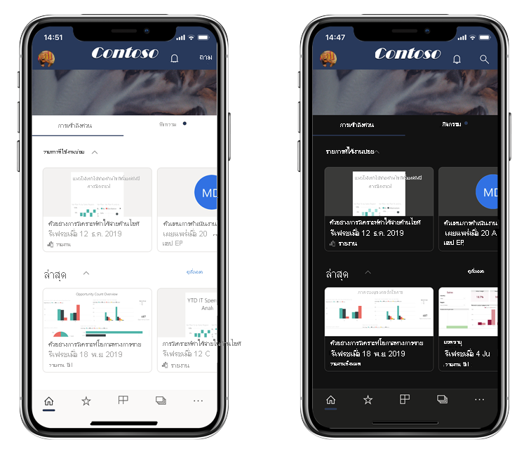
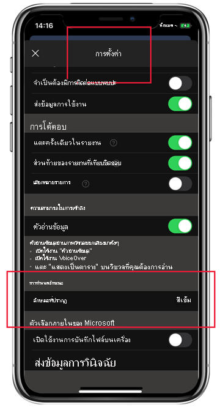

# โหมดสีเข้ม

เพื่อรองรับมุมมองตามความต้องการส่วนบุคคลของคุณ แอป Power BI สำหรับอุปกรณ์เคลื่อนที่สำหรับ iOS รองรับทั้งโหมดสว่างและโหมดสีเข้ม โหมดสีเข้มลดความสว่างของหน้าจอ ทำให้ง่ายต่อการดูเนื้อหาของคุณ

 ในโหมดสีเข้ม ประสบการณ์การใช้งานแอปทั้งหมดจะปรากฏด้วยพื้นหลังสีเข้ม อย่างไรก็ตาม เนื้อหา Power BI จะไม่ได้รับผลกระทบใด รายงาน แดชบอร์ด และแอปของคุณจะแสดงตามที่นักออกแบบต้องการเสมอ
 
 ตามค่าเริ่มต้นแอป Power BI สำหรับอุปกรณ์เคลื่อนที่ของคุณจะใช้การตั้งค่าของอุปกรณ์ของคุณเพื่อกำหนดลักษณะของหน้าจอที่จะปรากฏ ถ้าอุปกรณ์ของคุณได้รับการกำหนดค่าเป็นโหมดสีเข้ม แอปก็จะปรากฏในโหมดสีเข้ม
 
 หากต้องการสลับไปมาระหว่างโหมดสว่างและโหมดสีเข้ม หรือต้องการให้การตั้งค่าอุปกรณ์กำหนดโหมด ให้ไปที่ **การตั้งค่า > กำหนดลักษณะ** และแตะที่ **ลักษณะที่ปรากฏ** เพื่อเลือกโหมดที่คุณต้องการ

