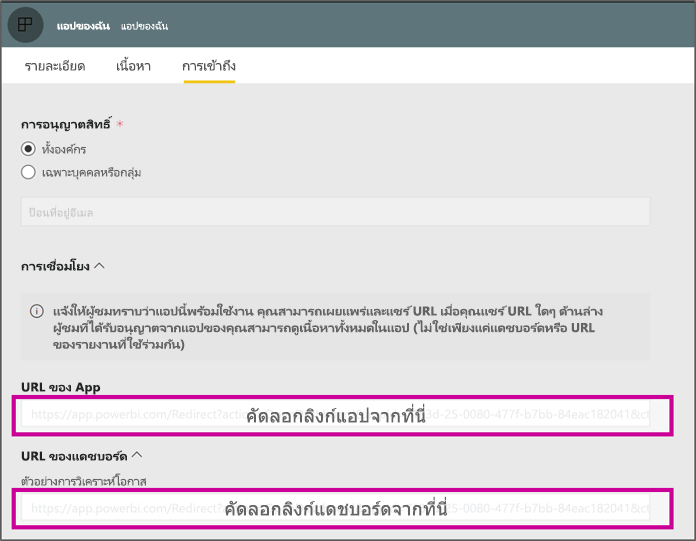

# <a name="create-a-link-to-a-specific-location-in-the-power-bi-mobile-apps"></a>สร้างการเชื่อมโยงไปยังตำแหน่งที่ตั้งเฉพาะในแอป Power BI สำหรับอุปกรณ์เคลื่อนที่
คุณสามารถใช้ลิงก์เพื่อเข้าใช้งานรายการเฉพาะใน Power BI ได้โดยตรง: รายงาน แดชบอร์ด และไทล์

การใช้ลิงก์ใน Power BI บนมือถือหลัก ๆ แล้วมีอยู่ด้วยกันสองสถานการณ์: 

* หากต้องการเปิด Power BI **จากภายนอกแอป**แล้วไปที่เนื้อหาเฉพาะ (รายงาน/แดชบอร์ด/แอป) ซึ่งมักจะเป็นสถานการณ์ที่ผสมผสานกัน เมื่อคุณต้องการเปิด Power BI บนมือถือจากแอปอื่น ๆ 
* เพื่อใช้**สำรวจ**ภายใน Power BI ซึ่งมักจะเป็นกรณีที่คุณต้องการสร้างการนำทางแบบกำหนดเองใน Power BI


## <a name="use-links-from-outside-of-power-bi"></a>ใช้ลิงก์จากภายนอก Power BI
เมื่อคุณใช้ลิงก์จากภายนอกแอป Power BI คุณต้องตรวจสอบให้มั่นใจว่าแอปจะสามารถเปิดลิงก์ได้ ซึ่งหากไม่ได้ติดตั้งแอปในอุปกรณ์ดังกล่าวไว้ ลิงก์จะเสนอให้ผู้ใช้ติดตั้งแอปดังกล่าว เราได้สร้างรูปแบบลิงก์พิเศษเพื่อสนับสนุนการดำเนินการดังกล่าว รูปแบบลิงก์นี้จะช่วยให้มั่นใจได้ว่าแอปจะสามารถเปิดลิงก์ได้ และหากอุปกรณ์ไม่ได้ติดตั้งแอปไว้ ลิงก์จะนำผู้ใช้ไปยังร้านค้าเพื่อทำการติดตั้งแอป

ลิงก์ควรเริ่มต้นด้วยการปฏิบัติตามขั้นตอนต่อไปนี้  
```html
https://app.powerbi.com/Redirect?[**QUERYPARAMS**]
```

> [!IMPORTANT]
> หากเนื้อหาของคุณโฮสต์อยู่ในศูนย์ข้อมูลพิเศษ เช่น หน่วยงานราชการ ประเทศจีน ฯลฯ ลิงก์ควรเริ่มต้นด้วยที่อยู่ Power BI ที่เหมาะสม เช่น `app.powerbigov.us` หรือ  `app.powerbi.cn`   
>


**QUERY PARAMS**คือ:
* **การดำเนินการ** (จำเป็น) = OpenApp / OpenDashboard / OpenTile / OpenReport
* **appId** = หากคุณต้องการเปิดรายงานหรือแดชบอร์ดที่เป็นส่วนหนึ่งของแอป 
* **groupObjectId** = หากคุณต้องการเปิดรายงานหรือแดชบอร์ดที่เป็นส่วนหนึ่งของพื้นที่ทำงาน (แต่ไม่ใช่พื้นที่ทำงานของฉัน)
* **dashboardObjectId** = ID ออปเจ็กต์ของแดชบอร์ด (หากการดำเนินการคือ OpenDashboard หรือ OpenTile)
* **reportObjectId** = ID ออปเจ็กต์ของรายงาน (หากการดำเนินการคือ OpenReport)
* **tileObjectId** = ID ออปเจ็กต์ของไทล์ (หากการดำเนินการคือ OpenTile)
* **reportPage** = หากคุณต้องการเปิดส่วนรายงานเฉพาะ (หากการดำเนินการคือ OpenReport)
* **ctid** = ID หน่วยข้อมูลองค์กร (ที่เหมาะสมกับสถานการณ์ B2B ซึ่งสามารถเว้นไว้ได้หากหน่วยข้อมูลเป็นขององค์กรของผู้ใช้)

**ตัวอย่าง:**

* เปิดลิงก์ของแอป 
  ```html
  https://app.powerbi.com/Redirect?action=OpenApp&appId=appidguid&ctid=organizationid
  ```

* เปิดแดชบอร์ดที่เป็นส่วนหนึ่งของแอป 
  ```html
  https://app.powerbi.com/Redirect?action=OpenDashboard&appId=**appidguid**&dashboardObjectId=**dashboardidguid**&ctid=**organizationid**
  ```

* เปิดรายงานที่เป็นส่วนหนึ่งของพื้นที่ทำงาน
  ```html
  https://app.powerbi.com/Redirect?Action=OpenReport&reportObjectId=**reportidguid**&groupObjectId=**groupidguid**&reportPage=**ReportSectionName**
  ```

### <a name="how-to-get-the-right-link-format"></a>วิธีการขอรูปแบบลิงก์ที่เหมาะสม

#### <a name="links-of-apps-and-items-in-app"></a>ลิงก์ของแอปและหน่วยข้อมูลในแอป

สำหรับ**แอปและรายงานและแดชบอร์ดที่เป็นส่วนหนึ่งของแอป** วิธีที่ง่ายที่สุดในการขอลิงก์คือไปยังพื้นที่ทำงาน แล้วเลือก "อัปเดตแอป" ซึ่งจะเปิด "การเผยแพร่แอป" ขึ้นมา ซึ่งคุณจะพบส่วน **ลิงก์**อยู่ในแท็บการเข้าถึง เมื่อขยายส่วนดังกล่าว คุณจะเห็นรายการแอปและลิงก์เนื้อหาทั้งหมดที่สามารถใช้เพื่อเข้าถึงข้อมูลต่าง ๆ ได้โดยตรง



#### <a name="links-of-items-not-in-app"></a>ลิงก์ของหน่วยข้อมูลที่ไม่ได้อยู่ในแอป 

สำหรับรายงานและแดชบอร์ดที่ไม่ได้เป็นส่วนหนึ่งของแอป คุณต้องแยก IDจาก URL ของหน่วยข้อมูล

เช่น ในการค้นหา ID ออปเจ็กต์ของ**แดชบอร์ด** 36 ตัวอักษร ให้ไปยังแดชบอร์ดนั้นในบริการของ Power BI 

```html
https://app.powerbi.com/groups/me/dashboards/**dashboard guid comes here**?ctid=**organization id comes here**`
```

ในการค้นหา ID ออปเจ็กต์ของ**รายงาน** 36 ตัวอักษร ให้ไปยังรายงานนั้นในบริการของ Power BI
นี่คือตัวอย่างของรายงานจาก "พื้นที่ทำงานของฉัน"

```html
https://app.powerbi.com/groups/me/reports/**report guid comes here**/ReportSection3?ctid=**organization id comes here**`
```
URL ด้านบนประกอบด้วยหน้ารายงานเฉพาะ **"ReportSection3"**

นี่คือตัวอย่างของรายงานจากพื้นที่ทำงาน (แต่ไม่ใช่พื้นที่ทำงานของฉัน)

```html
https://app.powerbi.com/groups/**groupid comes here**/reports/**reportid comes here**/ReportSection1?ctid=**organizationid comes here**
```

## <a name="use-links-inside-power-bi"></a>ใช้ลิงก์ภายใน Power BI

ลิงก์ภายใน Power BI จะทำงานได้ในแอปสำหรับอุปกรณ์เคลื่อนที่เหมือนกับในบริการของ Power BI

หากคุณต้องการเพิ่มลิงก์ไปยังรายงานของคุณที่ชี้ไปยังรายการ Power BI อื่น คุณสามารถคัดลอก URL ของหน่วยข้อมูลนั้นจากแถบที่อยู่ของเบราว์เซอร์ได้ ศึกษาเพิ่มเติมเรื่อง[วิธีการเพิ่มไฮเปอร์ลิงก์ไปยังกล่องข้อความในรายงาน](https://docs.microsoft.com/power-bi/service-add-hyperlink-to-text-box)

## <a name="use-report-url-with-filter"></a>ใช้ URL รายงานที่มีตัวกรอง
ซึ่งแอป Power BI บนมือถือก็รองรับ URL รายงานที่มีพารามิเตอร์แบบสอบถามที่มีตัวกรองเช่นเดียวกับบริการของ Power BI ด้วยเช่นกัน คุณสามารถเปิดรายงานในแอป Power BI บนมือถือและกรองไปยังสถานะที่กำหนดโดยเฉพาะได้ เช่น URL นี้เปิดรายงานยอดขายและกรองตามเขตการขาย

```html
https://app.powerbi.com/groups/me/reports/**report guid comes here**/ReportSection3?ctid=**organization id comes here**&filter=Store/Territory eq 'NC'
```

ศึกษาเพิ่มเติมเกี่ยวกับ[วิธีการสร้างพารามิเตอร์แบบสอบถามเพื่อกรองรายงาน](https://docs.microsoft.com/power-bi/service-url-filters)

## <a name="next-steps"></a>ขั้นตอนถัดไป
คำติชมของคุณจะช่วยให้เราตัดสินใจว่าสิ่งใดควรดำเนินการในอนาคต ดังนั้นอย่าลืมลงคะแนนให้กับคุณลักษณะอื่นๆ ที่คุณต้องการเห็นในแอป Power BI สำหรับอุปกรณ์เคลื่อนที่ 

* [แอป Power BI สำหรับอุปกรณ์เคลื่อนที่](mobile-apps-for-mobile-devices.md)
* ติดตาม@MSPowerBIบน Twitter
* เข้าร่วมการสนทนาที่[ชุมชน Power BI](https://community.powerbi.com/)
* [Power BI คืออะไร](../../fundamentals/power-bi-overview.md)

