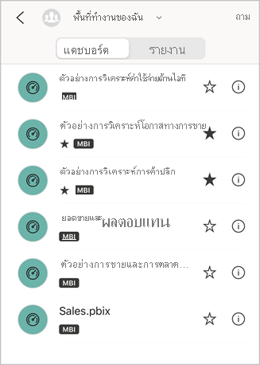
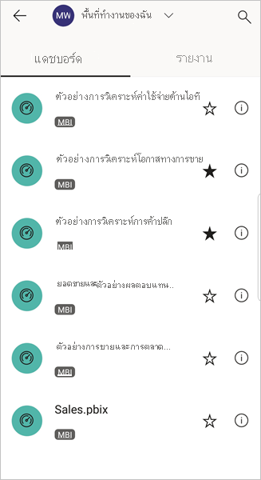

# สร้างและดูรายการโปรดในแอป Power BI สำหรับอุปกรณ์เคลื่อนที่
นำไปใช้กับ:

|  |  |  |  |  |
|:--- |:--- |:--- |:--- |:--- |
| iPhone |iPad |โทรศัพท์ Android |แท็บเล็ต Android |อุปกรณ์ Windows 10 |

อ่านเกี่ยวกับการสร้างและดูแดชบอร์ด รายงาน และแอป Power BI รายการโปรด รวมถึง KPI และเซิร์ฟเวอร์รายงาน Power BI และ Reporting Services ภายในองค์กรของคุณที่เป็นรายการโปรดในแอปสำหรับอุปกรณ์เคลื่อนที่

เมื่อคุณสร้างรายการโปรดในแอป Power BI สำหรับอุปกรณ์เคลื่อนที่ คุณจะเห็นรายการนั้นในหน้ารายการโปรด ในบริการของ Power BI ([https://powerbi.com](https://powerbi.com)) และในอุปกรณ์เคลื่อนที่ของคุณทั้งหมด 

คุณยังสามารถ[สร้างแดชบอร์ดและแอป Power BI รายการโปรดได้ในบริการของ Power BI](../../service-dashboard-favorite.md) จากนั้น คุณจะเห็นรายการโปรดที่คุณสร้างในหน้ารายการโปรดของแอปอุปกรณ์เคลื่อนที่

คุณสามารถทำเครื่องหมายให้ KPI และรายงานบนเซิร์ฟเวอร์รายงาน Power BI หรือพอร์ทัลเว็บ Reporting Services เป็นรายการโปรด และจากนั้น ดูรายการโปรดเหล่านี้ในโฟลเดอร์ที่คุณสะดวกบนอุปกรณ์เคลื่อนที่ พร้อมกับแดชบอร์ด Power BI ตัวโปรดของคุณ

## ดูรายการโปรด Power BI ของคุณ
* แตะเมนูการนำทางด้านบนแล้ว แตะ**รายการโปรด**
  
  
  
  คุณจะเห็นรายการโปรดทั้งหมดของคุณรวมกันบนหน้านี้
  
  

## เพิ่มแอปให้เป็นรายการโปรด
1. ในรายการแอปในแอปอุปกรณ์เคลื่อนที่ แตะจุดไข่ปลา (...) ที่อยู่ถัดจากแอป > **รายการโปรด**
   
    
   
    ในตอนนี้ เมนูจะแสดงแดชบอร์ดและแอปอื่นๆ ที่เป็นรายการโปรด
   
    

## สร้างแดชบอร์ดหรือรายงานเป็นรายการโปรดในแอปสำหรับอุปกรณ์เคลื่อนที่ iOS และ Windows 10
คุณสามารถสร้างแดชบอร์ดหรือรายงาน Power BI เป็นรายการโปรดจากรายการของแดชบอร์ดหรือรายงาน หรือ จากแดชบอร์ดหรือรายงานนั้นๆ

* ในรายการของแดชบอร์ดหรือรายงานในแอปอุปกรณ์เคลื่อนที่ แตะดาวว่างเปล่าที่อยู่ถัดจากชื่อ . ดาวเปลี่ยนเป็นสีเหลือง .
  
    
* บนแดชบอร์ดหรือรายงาน แตะดาวว่างเปล่าใน ribbon . ดาวเปลี่ยนเป็นสีเหลือง .
  
    

## สร้างแดชบอร์ดหรือรายงานเป็นรายการโปรดในแอปสำหรับอุปกรณ์เคลื่อนที่ Android
คุณสามารถสร้างแดชบอร์ดหรือรายงานเป็นรายการโปรดจากรายการของแดชบอร์ดหรือรายงาน หรือ จากแดชบอร์ดหรือรายงานนั้นๆ

* ในรายการของแดชบอร์ดหรือรายงานในแอปอุปกรณ์เคลื่อนที่ แตะจุดไข่ปลาแนวตั้ง (...) ที่อยู่ถัดจากชื่อ จากนั้น แตะ**รายการโปรด** คุณจะเห็นรูปดาวสีเหลืองอยู่ถัดจากชื่อ
  
    
* บนแดชบอร์ดหรือรายงาน แตะดาวว่างเปล่าใน ribbon . ดาวเปลี่ยนเป็นสีเทาเข้ม .
  
    

## สร้างเซิร์ฟเวอร์รายงาน Power BI และ Reporting Services report และ KPI ที่เป็นรายการโปรด
คุณสามารถดูเซิร์ฟเวอร์รายงาน Power BI และ Reporting Services report และ KPI ที่เป็นรายการโปรดของคุณในแอป Power BI สำหรับอุปกรณ์เคลื่อนที่ได้ แต่คุณไม่สามารถทำให้เป็นรายการโปรดในแอปสำหรับอุปกรณ์เคลื่อนที่ คุณ[แท็กสิ่งเหล่านี้เป็นรายการโปรดในพอร์ทัลเว็บ](../../report-server/tutorial-explore-report-server-web-portal.md#tag-your-favorites) 

## ขั้นตอนถัดไป
* [แดชบอร์ดรายการโปรดในบริการของ Power BI](../../service-dashboard-favorite.md) 
* มีคำถามหรือไม่ [ลองถามชุมชน Power BI](http://community.powerbi.com/)

