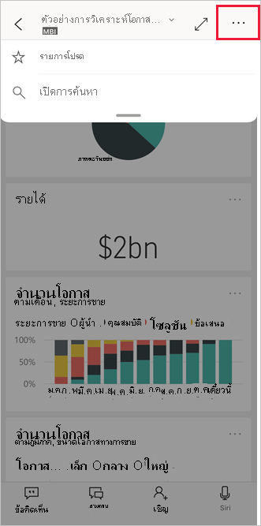

# สร้างและดูรายการโปรดในแอป Power BI สำหรับอุปกรณ์เคลื่อนที่
นำไปใช้กับ:

|  |  |  |  |  |
|:--- |:--- |:--- |:--- |:--- |
| iPhone |iPad |โทรศัพท์ Android |แท็บเล็ต Android |อุปกรณ์ Windows 10 |

อ่านเกี่ยวกับการสร้างและดูแดชบอร์ด รายงาน และแอป Power BI รายการโปรด รวมถึง KPI และเซิร์ฟเวอร์รายงาน Power BI และ Reporting Services ภายในองค์กรของคุณที่เป็นรายการโปรดในแอปสำหรับอุปกรณ์เคลื่อนที่

เมื่อคุณสร้างรายการโปรดในแอป Power BI สำหรับอุปกรณ์เคลื่อนที่ คุณจะเห็นรายการนั้นในหน้ารายการโปรด ในบริการของ [Power BI service](https://powerbi.com) และในอุปกรณ์เคลื่อนที่ของคุณทั้งหมด

หากต้องการดูหน้ารายการโปรดของคุณ แตะที่ไอคอนรายการโปรดบนแถบนำทาง:

คุณยังสามารถ[สร้างแดชบอร์ดและแอป Power BI รายการโปรดได้ในบริการของ Power BI](../end-user-favorite.md) จากนั้น คุณจะเห็นรายการโปรดที่คุณสร้างในหน้ารายการโปรดของแอปอุปกรณ์เคลื่อนที่

คุณสามารถทำเครื่องหมายให้ KPI และรายงานบนเซิร์ฟเวอร์รายงาน Power BI หรือพอร์ทัลเว็บ Reporting Services เป็นรายการโปรด และจากนั้น ดูรายการโปรดเหล่านี้ในโฟลเดอร์ที่คุณสะดวกบนอุปกรณ์เคลื่อนที่ พร้อมกับแดชบอร์ด Power BI ตัวโปรดของคุณ

## เพิ่มแอปให้เป็นรายการโปรด
1. แตะไอคอนแอปบนแถบนำทางด้านล่าง เพื่อให้แสดงหน้าแอปของคุณ

2. ในอุปกรณ์ iOS แตะที่ปุ่มข้อมูลของชื่อแอปที่คุณต้องการทำให้เป็นรายการโปรด ในอุปกรณ์แอนดรอยด์ จะมีปุ่มตัวเลือกเพิ่มเติม (...) แทนที่ปุ่มข้อมูล 

3. ในส่วนของข้อมูลแอปที่เปิดขึ้น ให้แตะที่รูปดาว
   
    
   
    แอปนั้นจะเข้าไปอยู่ในรายการโปรด พร้อมกับแดชบอร์ด รายงาน และแอปอื่นที่อนู่ในรายการโปรดของคุณ
   
## สร้างแดชบอร์ดหรือรายงานเป็นรายการโปรดในแอปสำหรับอุปกรณ์เคลื่อนที่ iOS และ Windows 10
คุณสามารถสร้างแดชบอร์ดหรือรายงาน Power BI เป็นรายการโปรดจากรายการของแดชบอร์ดหรือรายงาน หรือ จากแดชบอร์ดหรือรายงานนั้นๆ

* ในรายการของแดชบอร์ดหรือรายงานในแอปอุปกรณ์เคลื่อนที่ แตะดาวว่างเปล่าที่อยู่ถัดจากชื่อ . ดาวเปลี่ยนเป็นสีเหลือง .
  
    
* หากคุณอยู่ในแดชบอร์ด แตะ  ที่เป็นรูปดาวเปล่าในริบบิ้น หากคุณอยู่มนรายงาน รูปดาวจะอยู่ใน **ตัวเลือกเพิ่มเติม** (...)  ดาวจะเปลี่ยนเป็นสีดำ 
  
    

## สร้างแดชบอร์ดหรือรายงานเป็นรายการโปรดในแอปสำหรับอุปกรณ์เคลื่อนที่ Android
คุณสามารถสร้างแดชบอร์ดหรือรายงานเป็นรายการโปรดจากรายการของแดชบอร์ดหรือรายงาน หรือ จากแดชบอร์ดหรือรายงานนั้นๆ

* ในรายการของแดชบอร์ดหรือรายงานในแอปสำหรับอุปกรณ์เคลื่อนที่ ให้แตะที่ปุ่ม **ตัวเลือกเพิ่มเติม** (...) ที่อยู่ถัดจากชื่อ จากนั้นแตะดาวรายการโปรดบนแถบข้อมูลที่ดาวปรากฎ
  
    

* เมื่อคุณอยู่ในแดชบอร์ด แตะรูปดาวเปล่าในริบบิ้น . ดาวเปลี่ยนเป็นสีเทาเข้ม .
  
    

* หากคุณอยู่ในรายงาน ให้ปัดลงเพื่อให้ริบบิ้นปรากฏ แตะ **ตัวเลือกเพิ่มเติม** (...) และจากนั้นเลื่นลงเพื่อหา ดาวเปล่า และแตะไอคอนรูปดาวนั้น ดาวจะเปลี่ยนเป็นสีเทาเข้ม ซึ่งเป็น
  
    

## สร้างเซิร์ฟเวอร์รายงาน Power BI และ Reporting Services report และ KPI ที่เป็นรายการโปรด
คุณสามารถดูเซิร์ฟเวอร์รายงาน Power BI และ Reporting Services report และ KPI ที่เป็นรายการโปรดของคุณในแอป Power BI สำหรับอุปกรณ์เคลื่อนที่ได้ แต่คุณไม่สามารถทำให้เป็นรายการโปรดในแอปสำหรับอุปกรณ์เคลื่อนที่ คุณ[แท็กสิ่งเหล่านี้เป็นรายการโปรดในพอร์ทัลเว็บ](../../report-server/tutorial-explore-report-server-web-portal.md#tag-your-favorites) 

## ขั้นตอนถัดไป
* [แดชบอร์ดรายการโปรดในบริการของ Power BI](../end-user-favorite.md) 
* มีคำถามหรือไม่ [ลองถามชุมชน Power BI](https://community.powerbi.com/)

