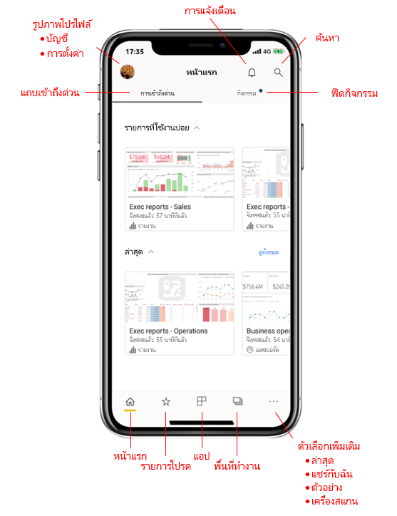
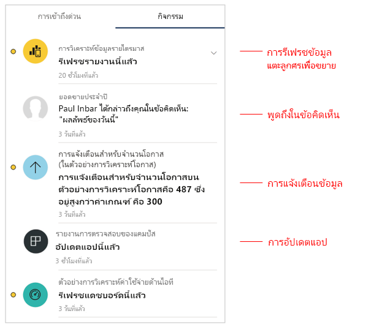
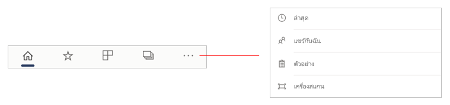
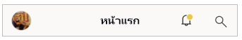
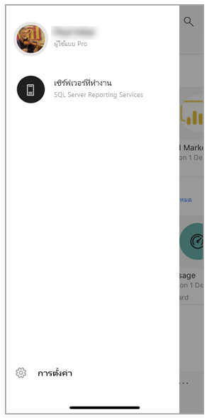
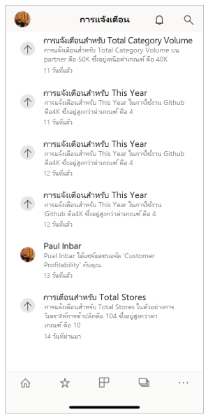
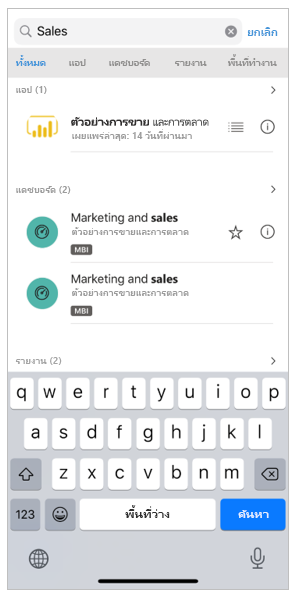

# แนะนำหน้าแรกของแอปสำหรับอุปกรณ์เคลื่อนที่อย่างรวดเร็ว
ในการแนะนำนี้ คุณจะคุ้นเคยกับหน้าแรกของแอปสำหรับอุปกรณ์เคลื่อนที่ของ Power BI และตัวช่วยนำทางที่จะทำให้คุณได้รับสิ่งที่คุณต้องการอย่างรวดเร็ว

นำไปใช้กับ:

|  |  |  |
|:--- |:--- |:--- |
| iPhone | iPad | Android | 

เมื่อคุณเปิดแอปอุปกรณ์เคลื่อนที่ Power BI คุณจะเข้าไปยังหน้าแรก ซึ่งคุณจะเข้าถึงรายงาน แดชบอร์ด และแอปที่คุณเปิดล่าสุด นี่หรือรายงานที่คุณดูบ่อย ๆ ได้อย่างรวดเร็ว นอกจากนั้นยังมีฟีดกิจกรรมที่ช่วยให้คุณอัปเดตสิ่งที่เกิดขึ้นกับเนื้อหาใน Power BI ของคุณ รวมทั้งตัวช่วยนำทางที่สะดวกที่จะพาคุณไปยังเนื้อหาที่คุณต้องการอย่างรวดเร็ว

 
## แถบเข้าถึงด่วน

แถบการเข้าถึงด่วนจะแสดงรายงาน แดชบอร์ด และแอปที่คุณเปิดเมื่อเร็ว ๆ นี่หรือรายงานที่คุณดูบ่อย ๆ โดยจัดกลุ่มเป็นสองส่วน หากต้องการดูรายการที่คุณเปิดล่าสุดมากขึ้น ให้แตะ **ดูทั้งหมด**ที่ด้านขวา 

## ตัวดึงข้อมูลกิจกรรม

ฟิดกิจกรรมช่วยให้คุณติดตามสิ่งที่เกิดขึ้นกับเนื้อหา Power BI ของคุณ ซึ่งแสดงการแจ้งเตือน การเตือน ความคิดเห็น และ@mentions ล่าสดทั้งหมดของคุณ

การอัปเดตในฟีดประกอบด้วย:
* **ข้อมูลที่ถูกรีเฟรช**: เมื่อข้อมูลในรายงานหรือแดชบบอร์ดในรายการโปรดหรือรายการล่าสุดของคุณได้รับการรีเฟรช
* **ความคิดเห็นใหม่**: เมื่อผู้คนสร้างความคิดเห็นในรายงานหรือแดชบอร์ดที่อยู่ในรายการโปรดหรือรายการล่าสุดของคุณ หรือเมื่อมีคนกล่าวถึงคุณในความคิดเห็น
* **การเตือนข้อมูล**: เมื่อข้อมูลถึงเกณฑ์ที่คุณได้ตั้งไว้ก่อนหน้าใน [การเตือนข้อมูล](../../mobile-set-data-alerts-in-the-mobile-apps.md)
* **อัปเดตแอป**: เมื่อผู้สร้างแอปเผยแพร่อัปเดตแอปที่คุณกำลังใช้

 แตะที่รายการกิจกรรม เพื่อไปยังตำแหน่งที่เกี่ยวข้อง เพื่อสำรวจเพิ่มเติม

รายการกิจกรรมนั้นรวมกัน เพื่อให้การอัปเดตข้อมูลทั้งหมดจากกแอปหรือพื้นที่ทำงานเดียวกันอยู่ในกลุ่มเดียวกัน ใช้  ลูกศรเพื่อขยายและดูรายการที่รวบรวม รายการล่าสุดจะแสดงด้านบนของรายชื่อเสมอ

## แถบนำทาง

ที่ด้านล่างของหน้าคุณจะเห็นแถบนำทาง

แถบนำทางช่วยให้เข้าถึงอย่างรวดเร็วไปยัง:

*  **หน้าหลัก** - กลับไปยังหน้าหลัก
*  **รายการโปรด** - รายงาน แดชบอร์ด และแอปที่คุณทำเครื่องหมายเป็น[รายการโปรด](../../mobile-apps-favorites.md)
*  **แอป** - แอปที่คุณติดตั้งในบัญชีของคุณ
*  **พื้นที่ทำงาน** - โฟลเดอร์งานที่มีรายงานและแดชบอร์ดที่ผู้สร้างเนื้อหาสร้างขึ้น
*  **ล่าสุด** - ที่คุณได้รับการเข้าชมเมื่อเร็วๆนี้-รายการที่คุณเพิ่งดู
*  **แชร์กับฉัน** - รายการที่บุคคลอื่นแชร์ให้คุณ
*  **ตัวอย่าง**- ตัวอย่าง Power BI ที่คุณสามารถใช้เพื่อเรียนรู้เกี่ยวกับความสามารถของ Power BI
*  **สแกนเนอร์** - กล้องของอุปกรณ์ที่คุณสามารถใช้เป็นสแกนเนอร์เพื่อสแกนบาร์โค้ด [บาร์โค้ด](../../mobile-apps-scan-barcode-iphone.md) และ [คิวอาร์โค้ด](../../mobile-apps-qr-code.md)

## ส่วนหัว

ที่ด้านบนของหน้า ส่วนหัวแสดงชื่อของหน้า Power BI รายงาน หรือแดชบอร์ดที่คุณอยู่

ส่วนหัวแสดงรายการนทางต่อไปนี้:
* **รูปโปรไฟล์หรืออวตาร** - เปิดแผงด้านข้าง ซึ่งคุณสามารถ [สลับระหว่างบริการ Power BI ของคุณและบัญชีเซิร์ฟเวอร์รายงาน](../../mobile-app-ssrs-kpis-mobile-on-premises-reports.md) รวมทั้งการตั้งค่าแอปอุปกรณ์เคลื่อนที่ Power BI

    

* **การแจ้งเตือน** - เปิด [หน้าการแจ้งเตือน](../../mobile-apps-notification-center.md) ซึ่งคุณสามารถดูและเข้าถึงการแจ้งเตือนของเรา จุดที่ระฆังการแจ้งเตือนที่คุณมีการแจ้งเตือนที่บ่งบอกว่าคุณมีการแจ้งเตือนใหม่

    

* **ค้นหา** - ค้นหาเนื้อหา Power BI ที่คุณติดตาม

    

## ขั้นตอนถัดไป
ในการแนะนำนี้ คุณจะได้สำรวจหน้าหลักของแอปอุปกรณ์เคลื่อนที่ Power BI อ่านข้อมูลเพิ่มเติมเกี่ยวกับการใช้สำหรับอุปกรณ์เคลื่อนที่ Power BI 
* [สำรวจแดชบอร์ดและรายงาน](../../mobile-apps-quickstart-view-dashboard-report.md)
* [สำรวจรายงานในแอปอุปกรณ์เคลื่อนที่ Power BI](../../mobile-reports-in-the-mobile-apps.md)
