# นักวิเคราะห์เสมือนของถามตอบ ในแอป iOS - Power BI

วิธีง่ายที่สุดในการเรียนรู้เกี่ยวกับข้อมูลของคุณ คือ การถามคำถามเกี่ยวกับข้อมูลของคุณโดยใช้ถ้อยคำของคุณเอง ในบทความนี้ คุณจะถามคำถาม และดูข้อมูลเชิงลึกที่แนะนำเกี่ยวกับข้อมูลตัวอย่าง ด้วยนักวิเคราะห์เสมือนของถามตอบ ในแอปมือถือ Microsoft Power BI บน iPad, iPhone และ iPod Touch 

นำไปใช้กับ:

|  |  |
|:--- |:--- |
| iPhone |iPad |

นักวิเคราะห์เสมือนของถามตอบ เป็นประสบการณ์การสนทนาข่าวกรองธุรกิจ ที่เข้าถึงข้อมูลการถามตอบเบื้องต้นในบริการของ Power BI [(https://powerbi.com)](https://powerbi.com) ซึ่งแนะนำข้อมูลเชิงลึก และคุณสามารถพิมพ์ หรือพูดคำถามของคุณเอง

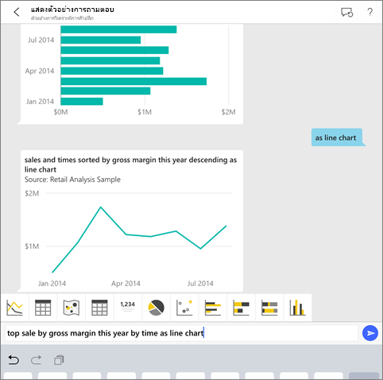

ถ้าคุณไม่ได้ลงทะเบียน Power BI ให้[ลงทะเบียนรุ่นทดลองใช้ฟรี](https://app.powerbi.com/signupredirect?pbi_source=web)ก่อนที่คุณจะเริ่มต้นใช้งาน

## ข้อกำหนดเบื้องต้น

### ติดตั้งแอป Power BI สำหรับ iOS
[ดาวน์โหลดแอป iOS](http://go.microsoft.com/fwlink/?LinkId=522062 "ดาวน์โหลดแอป iPhone") จาก Apple App Store ไปยัง iPad, iPhone หรือ iPod Touch ของคุณ

เวอร์ชันเหล่านี้สนับสนุนแอป Power BI สำหรับ iOS:
- iPad ที่มี iOS 10 หรือใหม่กว่า
- iPhone 5 และสูงกว่า ที่มี iOS 10 หรือใหม่กว่า 
- iPod Touch ที่มี iOS 10 หรือใหม่กว่า

### ดาวน์โหลดตัวอย่าง
ขั้นตอนแรกคือ ดาวน์โหลดตัวอย่างการวิเคราะห์ด้านการขายปลีก และตัวอย่างการวิเคราะห์โอกาสทางการขาย ในบริการของ Power BI

**รับตัวอย่างการวิเคราะห์ด้านการขายปลีก**

1. เปิดบริการ Power BI (app.powerbi.com) และลงชื่อเข้าใช้

2. ในบานหน้าต่างนำทางด้านซ้าย เลือก**พื้นที่ทำงาน**, **พื้นที่ทำงานของฉัน**

3. ในมุมล่างซ้าย เลือก**รับข้อมูล**
   
    

3. บนหน้ารับข้อมูล เลือกไอคอน**ตัวอย่าง**
   
   

4. เลือก**ตัวอย่างการวิเคราะห์ด้านการขายปลีก**
 
    
 
8. เลือก **เชื่อมต่อ**  
  
   
   
5. Power BI นำเข้าชุดเนื้อหา และเพิ่มแดชบอร์ด รายงาน และชุดข้อมูลใหม่ไปยังพื้นที่ทำงานปัจจุบันของคุณ
   
   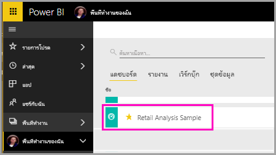

**รับตัวอย่างการวิเคราะห์โอกาสทางการขาย**

- ทำตามขั้นตอนเดียวกันกับที่คุณรับตัวอย่างการวิเคราะห์ด้านการขายปลีก แต่ในขั้นตอนที่ 4 เลือก**ตัวอย่างการวิเคราะห์โอกาสทางการขาย**

    
  
คุณพร้อมที่จะดูตัวอย่างบนอุปกรณ์ iOS ของคุณแล้ว

## ลองถามคำถามผ่าน iPhone หรือ iPad ของคุณ
1. บน iPhone หรือ iPad ของคุณ แตะที่ปุ่มนำทางส่วนกลาง  > **พื้นที่ทำงาน** > **พื้นที่ทำงานของฉัน** และเปิดแดชบอร์ดตัวอย่างการวิเคราะห์ด้านการขายปลีก

2. แตะไอคอนนักวิเคราะห์เสมือนของถามตอบ  จากเมนูการดำเนินการที่ด้านล่างของหน้า (ที่ด้านบนของหน้าใน iPad)
     นักวิเคราะห์เสมือนของถามตอบจะมีตัวอย่างคำแนะนำ เพื่อเริ่มต้นใช้งาน
3. พิมพ์ **แสดง** แตะ**ยอดขาย** จากรายการคำแนะนำ > **ส่ง** 

    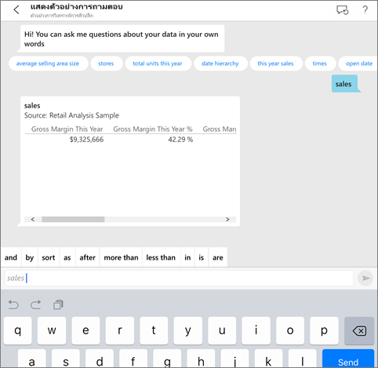
4. แตะ **โดย** จากคำสำคัญ แล้วแตะ**รายการสินค้า**จากรายการคำแนะนำ > **ส่ง** 

    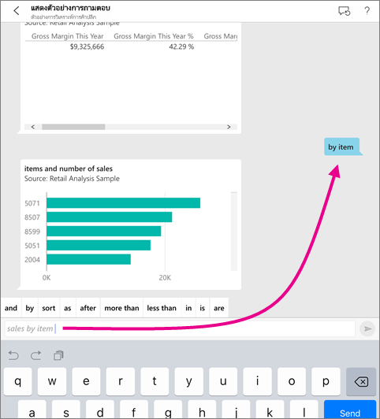
5. แตะ **เป็น** จากคำสำคัญ แตะไอคอนแผนภูมิคอลัมน์ แล้วแตะ **ส่ง** 
6. แตะแผนภูมิผลลัพธ์ค้างไว้ แล้วแตะ **ขยาย**

    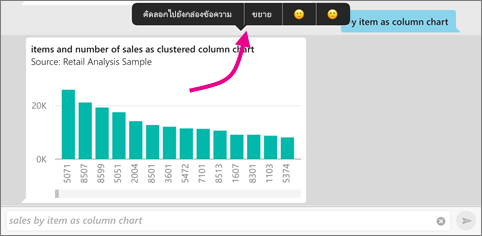

    แผนภูมิก็จะเปิดในโหมดโฟกัสในแอป

    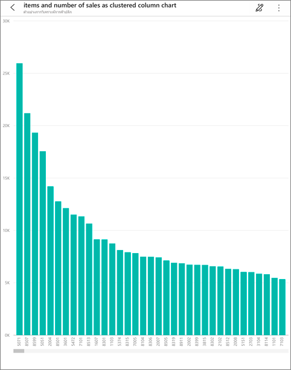
7. แตะลูกศรที่มุมซ้ายบน เพื่อกลับไปยังหน้าต่างการสนทนาสำหรับนักวิเคราะห์เสมือนของถามตอบ
8. แตะ X ที่ด้านขวาของกล่องข้อความ เพื่อลบข้อความ แล้วเริ่มต้นอีกครั้ง
9. ลองคำถามใหม่: แตะ **ด้านบน** ในส่วนคำสำคัญ ให้แตะ **ยอดขายโดยเฉลี่ย $/ หน่วย/ปี** > **ส่ง** 

    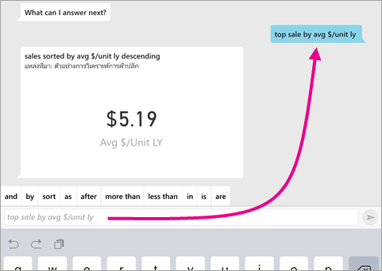
10. เลือก **โดย** ในส่วนคำสำคัญ ให้แตะ **เวลา**จากรายการคำแนะนำด้านบน > **ส่ง** 

     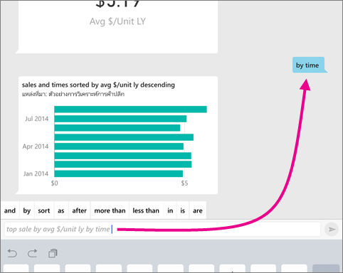
11. พิมพ์ **เป็น** เลือกไอคอนแผนภูมิเส้น จากรายการคำแนะนำ > **ส่ง** 

    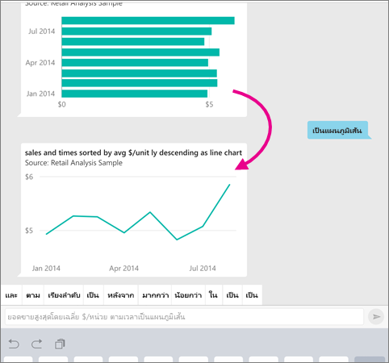

## ลองพูดถามคำถามของคุณ
ถึงตอนี้ คุณก็สามารถถามคำถามเกี่ยวกับข้อมูลของคุณในแอปสำหรับอุปกรณ์เคลื่อนที่ Power BI ได้โดยการพูดแทนที่จะใช้วิธีพิมพ์

1. แตะไอคอนนักวิเคราะห์เสมือนของถามตอบ  จากเมนูการดำเนินการที่ด้านล่างของหน้า (ที่ด้านบนของหน้าใน iPad)
2. แตะไอคอนไมโครโฟน 

    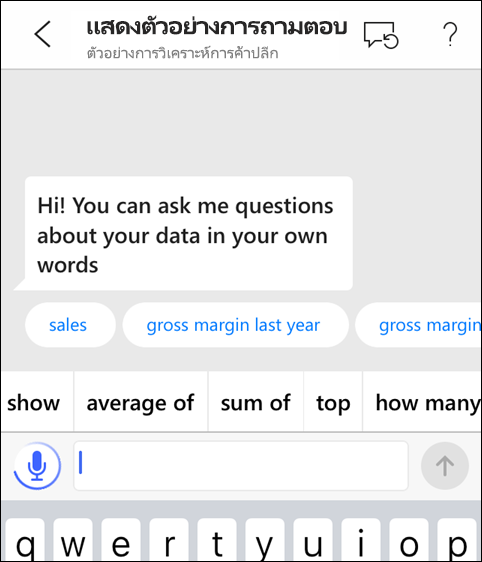

1. เมื่อไอคอนไมโครโฟนพร้อมใช้งาน ให้เริ่มพูด ตัวอย่างเช่น พูดว่า "average unit price by time (ราคาเฉลี่ยต่อหน่วยตามระยะเวลา)" จากนั้นแตะ **ส่ง** 

    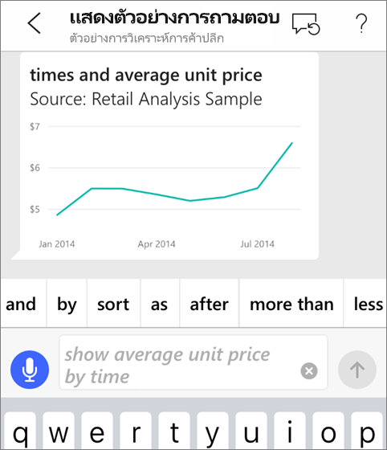

### มีคำถามเกี่ยวกับความเป็นส่วนตัว เมื่อใช้การเปลี่ยนคำพูดให้เป็นข้อความหรือไม่
โปรดดูส่วนเนื้อหาการรู้จำเสียงของ[มีอะไรใหม่ใน iOS](https://go.microsoft.com/fwlink/?linkid=845624) ในคู่มือสำหรับนักพัฒนา Apple iOS

## วิธีใช้และคำติชม
* ต้องการความช่วยเหลือหรือไม่ เพียงแค่พูดว่า "Hi (สวัสดี)" หรือ "Help (ช่วยด้วย)" แล้วคุณก็จะได้รับความช่วยเหลือเกี่ยวกับการเริ่มต้นถามคำถามใหม่
* มีความประสงค์จะส่งคำติชมเกี่ยวกับผลลัพธ์นี้หรือไม่ แตะแผนภูมิหรือผลลัพธ์อื่นๆ ค้างไว้ แล้วแตะที่รูปหน้ายิ้มหรือหน้าบึ้ง

    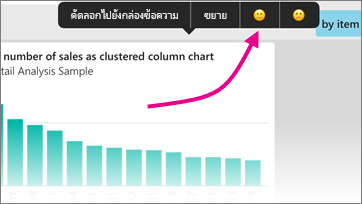

    คำติชมของคุณเป็นแบบไม่ระบุชื่อ และจะช่วยให้เราปรับปรุงการตอบคำถามของเรา

## ปรับปรุงผลลัพธ์นักวิเคราะห์เสมือนของถามตอบของคุณ
คุณสามารถปรับปรุงผลลัพธ์ที่คุณและลูกค้าของคุณได้รับ เมื่อมีการใช้นักวิเคราะห์เสมือนของถามตอบในชุดข้อมูลได้ด้วยการถามคำถามที่กำหนดเป้าหมายแล้วเพิ่มมากขึ้น หรือการปรับปรุงชุดข้อมูลดังกล่าว

### วิธีการถามคำถาม
* ทำตาม [เคล็ดลับเหล่านี้ในการถามคำถามในถามตอบ](../end-user-q-and-a-tips.md) ในบริการของ Power BI หรือนักวิเคราะห์เสมือนของถามตอบในแอปสำหรับอุปกรณ์เคลื่อนที่ระบบ iOS ของคุณ

### วิธีการปรับปรุงชุดข้อมูล
* ปรับปรุงชุดข้อมูลใน Power BI Desktop หรือในบริการของ Power BI เพื่อ [ทำให้ข้อมูลของคุณสามารถใช้งานได้อย่างมีประสิทธิภาพในการถามตอบและนักวิเคราะห์เสมือนของถามตอบ](../../service-prepare-data-for-q-and-a.md)

## ขั้นตอนถัดไป
* [การถามตอบในบริการ Power BI](../end-user-q-and-a.md)
* มีคำถามหรือไม่ โปรดดู [ส่วนเนื้อหาแอปสำหรับอุปกรณ์เคลื่อนที่ของชุมชน Power BI](https://go.microsoft.com/fwlink/?linkid=839277)
