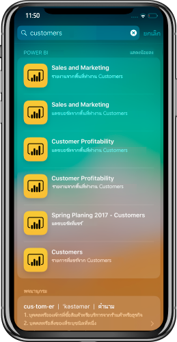

# การรวมการค้นหาอุปกรณ์ iOS (สปอตไลต์) ด้วยแอป Power BI บนมือถือระบบ iOS (ตัวอย่าง)
ใช้การค้นหาอุปกรณ์เพื่อค้นหาและเข้าถึงเนื้อหาที่คุณต้องการ

เมื่อคุณใช้การค้นหาอุปกรณ์ iOS (สปอตไลต์) เพื่อค้นหาเนื้อหาเฉพาะเ รายการ Power BI จะรวมอยู่ในรายการผลลัพธ์ เมื่อแตะรายการ Power BI จากรายการผลลัพธ์ ระบบจะนำคุณไปยังรายการภายในแอป Power BI โดยตรง

## ค้นหารายการโดยใช้การค้นหาอุปกรณ์

หากต้องการค้นหารายการโดยใช้การค้นหาอุปกรณ์:

1. ปัดลงจากตรงกลางของหน้าจอ **หน้าแรก** เพื่อไปที่การค้นหาอุปกรณ์

2. แตะที่เขตข้อมูล **ค้นหา** แล้วพิมพ์ข้อความที่คุณกำลังค้นหา
 
   ผลลัพธ์การค้นหาจะรวมรายการ Power BI ของประเภทต่อไปนี้:

    * แดชบอร์ด
    * รายงาน
    * แอป
    * พื้นที่ทำงาน
    * รายการที่แชร์โดยผู้ติดต่อที่คุณค้นหา

    

 3. เมื่อคุณค้นหารายการที่คุณต้องการ ให้แตะที่รายการนั้น แอป Power BI จะเปิดที่รายการที่เลือกโดยตรง 

นอกจากนี้ การค้นหาอุปกรณ์ที่สนับสนุนโดย Siri จะมีคำแนะนำตามการดำเนินการของคุณใช้บ่อยในแอป Power BI คำแนะนำของ Siri จะแสดงในการค้นหาและหน้าจอเมื่อล็อก

>[!NOTE]
>
>หากต้องการปิดใช้งานการค้นหาอุปกรณ์และคำแนะนำของ Siri ให้ไปที่**การตั้งค่าอุปกรณ์**>**การตั้งค่า Power BI**>**Siri และการค้นหา** และปิดใช้งานการตั้งค่า **Siri และคำแนะนำ**
>

## ขั้นตอนถัดไป
เรียนรู้เพิ่มเติมเกี่ยวกับแอป Power BI สำหรับอุปกรณ์เคลื่อนที่โดยดำเนินการดังนี้: 

* การดาวน์โหลด [แอป Power BI สำหรับ iPhone](https://go.microsoft.com/fwlink/?LinkId=522062)
* ติดตาม[@MSPowerBIบน Twitter](https://twitter.com/MSPowerBI)
* การเข้าร่วมการสนทนาที่[ชุมชน Power BI](https://community.powerbi.com/)

