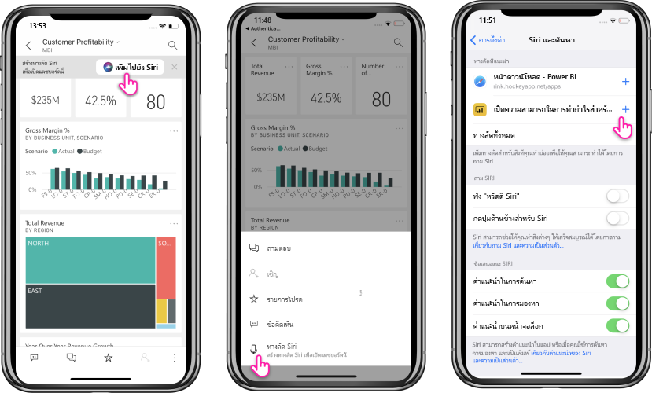

# การใช้ปุ่มลัด Siri ใน Power BI Mobile iOS แอป (การแสดงตัวอย่าง)

ใช้ปุ่มลัด Siri เพื่อเข้าถึงเนื้อหา Power BI ที่คุณต้องการโดยตรง

เพื่อรับง่าย ๆ และเข้าถึงด่วนไปยังรายงานที่ใช้บ่อยหรือแดชบอร์ด ใช้การรวมปุ่มลัด Siri สร้างปุ่มลัดไปยังรายการของคุณ และจากนั้นคุณสามารถบอก Siri ให้เปิดใช้งานปุ่มลัดเมื่อใดก็ตามที่คุณต้องการดูที่ข้อมูล

## สร้างปุ่มลัด Siri สำหรับรายงานหรือแดชบอร์ด

มีสามวิธีในการสร้างปุ่มลัด Siri ไปยังรายงานและแดชบอร์ดของคุณ:

- จะมีการเพิ่มแบนเนอร์พร้อมตัวเลือก**เพิ่มไปยัง Siri**ไปยังรายงานและแดชบอร์ดที่ใช้งานบ่อยของคุณ แตะที่แอคชันเพื่อเปิดหน้า**เพิ่มไปยัง Siri**
    
- ใช้แอคชัน **ปุ่มลัด Siri**บน**รายงาน**หรือเมนูแอคชัน **แดชบอร์ด**(...)
    
- ใช้**ปุ่มลัดที่แนะนำ**ในการตั้งค่าอุปกรณ์ (**การตั้งค่าอุปกรณ์** > **Siri และค้นหา**) คุณสามารถเพิ่มปุ่มลัดไปยังรายการในคำแนะนำ โดยใช้ปุ่มเครื่องหมายบวก (+) ได้
     
     

สำหรับรายงาน Power BI ปุ่มลัดจะจับภาพหน้าปัจจุบันที่คุณกำลังดูเมื่อสร้างปุ่มลัด 

ตัวเลือกทั้งหมดจะเปิดหน้า**เพิ่มไปยัง Siri** ในหน้านี้ คุณจำเป็นต้องบันทึกวลีที่คุณจะใช้ในภายหลังด้วย Siri เพื่อเปิดรายงานหรือแดชบอร์ด 
   

    

## ใช้ปุ่มลัด Siri เพื่อดูรายงานหรือแดชบอร์ด

ทันทีที่คุณสร้างปุ่มลัด ทุกครั้งที่คุณต้องการเข้าถึงแดชบอร์ดหรือรายงานที่คุณสร้างปุ่มลัดให้ แค่ถาม Siri
เปิดใช้งาน Siri และระบุวลีที่คุณบันทึกไว้สำหรับปุ่มลัด Siri จะเปิดใช้ Power BI และจะไปลงบนรายงานที่ร้องขอหรือแดชบอร์ด 

สำหรับรายงาน Power BI คุณจะไปลงยังหน้าที่จับภาพไว้เมื่อคุณสร้างปุ่มลัด

  
  

## แก้ไขวลีปุ่มลัด Siri 
คุณสามารถแก้ไขวลีปุ่มลัดของคุณได้โดยใช้ปุ่ม**ปุ่มลัด Siri**บน**รายงาน**หรือเมนูแอคชัน**แดชบอร์ด**(...) ได้ จะเปิดหน้าปุ่มลัด Siri พร้อมตัวเลือกเพื่อ**บันทึกวลีใหม่** 

## ลบปุ่มลัด Siri 
ในการลบปุ่มลัด ไปที่รายการ และออกจากเมนูแอคชัน (...) แตะที่แอคชัน**ปุ่มลัด Siri** หน้า**ปุ่มลัด Siri**จะเปิดขึ้น เลือก**ลบปุ่มลัด**

> [!NOTE]
> การรวมปุ่มลัด Siri กับแอป Power BI จะพร้อมใช้งานสำหรับ iPhone และ iPad ที่ทำงานบน iOS12 ขึ้นไป
> 

## ขั้นตอนถัดไป
เรียนรู้เพิ่มเติมเกี่ยวกับแอป Power BI สำหรับอุปกรณ์เคลื่อนที่โดยดำเนินการดังนี้: 

* การดาวน์โหลด [แอป Power BI สำหรับ iPhone](http://go.microsoft.com/fwlink/?LinkId=522062)
* ติดตาม[@MSPowerBIบน Twitter](https://twitter.com/MSPowerBI)
* การเข้าร่วมการสนทนาที่[ชุมชน Power BI](http://community.powerbi.com/)

