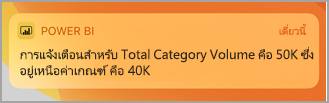
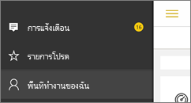
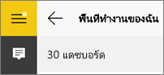
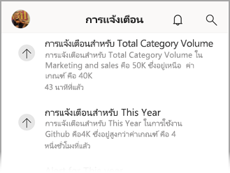
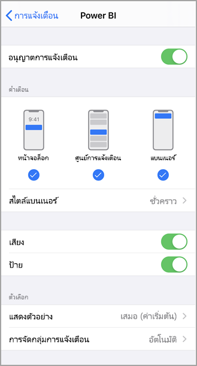
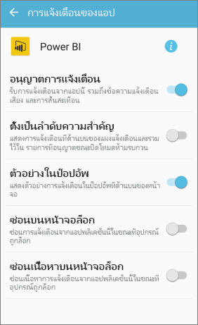
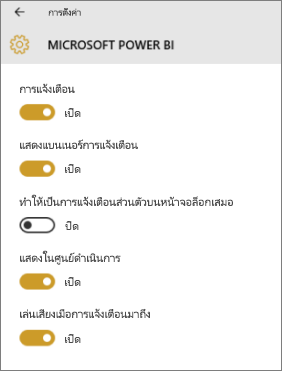

# รับการแจ้งเตือนในแอป Power BI สำหรับอุปกรณ์เคลื่อนที่
นำไปใช้กับ:

|  |  |  |  |  |
|:--- |:--- |:--- |:--- |:--- |
| iPhone |iPad |โทรศัพท์ Android |แท็บเล็ต Android |อุปกรณ์ Windows 10 |

การแจ้งเตือนจะนำข้อมูลที่เกี่ยวข้องกับประสบการณ์ Power BI ให้คุณ ในบริการของ Power BI หรือบนอุปกรณ์เคลื่อนที่ของคุณ เมื่อคุณเปิดการแจ้งเตือน คุณจะเห็นตัวดึงข้อมูลเรียงเป็นลำดับเกี่ยวกับ[การแจ้งเตือนที่คุณได้ตั้งค่า](mobile-set-data-alerts-in-the-mobile-apps.md)แดชบอร์ดใหม่ที่มีการแชร์กับคุณ การเปลี่ยนแปลงพื้นที่การทำงานกลุ่มของคุณ รายละเอียดเกี่ยวกับเหตุการณ์ใน Power BI และการประชุม และอื่นๆ

> [!NOTE]
> บนอุปกรณ์ iOS ในครั้งแรกที่คุณลงชื่อเข้าใช้[ปรับปรุงเวอร์ชันของแอป Power BI](https://powerbi.microsoft.com/mobile/)คุณจะเห็นข้อความถามว่า คุณต้องการให้ Power BI ส่งการแจ้งเตือนหรือไม่ คุณยังสามารถกำหนดวิธีที่ี Power BI จะแจ้งเตือนคุณใน**ตั้งค่า**สำหรับอุปกรณ์ของคุณ 
> 
> 

## ดูการแจ้งเตือนบนอุปกรณ์เคลื่อนที่ของคุณ
1. เมื่อคุณได้รับการแจ้งเตือนบนอุปกรณ์เคลื่อนที่ ค่าเริ่มต้นจะทำให้ Power BI ส่งเสียงและแสดงแบนเนอร์การแจ้งเตือน
   
   
   
   หรือ บน iPad:
   
   
   
   คุณสามารถ[เปลี่ยนวิธีที่ Power BI จะแจ้งเตือนคุณ](mobile-apps-notification-center.md#change-or-turn-off-notifications-on-your-mobile-device)ได้
2. ถ้าคุณได้รับการแจ้งเตือน เมื่อคุณลงชื่อเข้าใช้ Power BI บนอุปกรณ์เคลื่อนที่ของคุณ คุณจะเห็นจุดสีเหลืองบนปุ่มนำทางส่วนกลางที่เรียกว่า (Android) หรือบนไอคอน**การแจ้งเตือน** 
   
   
3. เลือกไอคอนการแจ้งเตือน  (Windows 10)
   
    การแจ้งเตือนจะแสดงรายการล่าสุดที่ด้านบนสุด รวมถึงไฮไลท์ข้อความที่ยังไม่ได้อ่าน การแจ้งเตือนจะถูกเก็บไว้เป็น 90 วัน เว้นแต่ว่าคุณลบทิ้งเร็วกว่านั้น หรือเมื่อถึงขีดจำกัดสูงสุดที่ 100 การแจ้งเตือน
   
   
4. เมื่อต้องละเว้นการแจ้งเตือน แตะ และกดค้างไว้ และเลือก**ยกเลิก**

## เปลี่ยน หรือปิดการแจ้งเตือนบนอุปกรณ์เคลื่อนที่ของคุณ
คุณสามารถเปลี่ยนวิธีที่ Power BI แจ้งเตือนคุณได้

1. บนอุปกรณ์ iOS ไปที่**ตั้งค่า** > **การแจ้งเตือน** 
   
    บนโทรศัพท์ Android ไปที่**ตั้งค่าการแจ้งเตือน**
   
    บนอุปกรณ์ Windows ใน**ตั้งค่า**ไปยัง**ระบบ** > **การแจ้งเตือนและการดำเนินการ**
2. ในรายการแอป เลือก**Power BI** 
3. ที่นี่คุณสามารถปิดการแจ้งเตือนทั้งหมด หรือเลือกการแจ้งเตือนที่คุณต้องการ
   
    **บน iPhone**
   
    
   
    **บนโทรศัพท์ Android**
   
    

    **บนอุปกรณ์ Windows 10**

    

## ขั้นตอนถัดไป
* [การแจ้งเตือนข้อมูลในบริการของ Power BI](../../service-set-data-alerts.md)
* [ตั้งค่าการแจ้งเตือนข้อมูลในแอปบน iPhone (Power BI สำหรับ iOS)](mobile-set-data-alerts-in-the-mobile-apps.md)
* [ตั้งค่าการแจ้งเตือนข้อมูลในแอป Power BI สำหรับอุปกรณ์เคลื่อนที่สำหรับ Windows 10](mobile-set-data-alerts-in-the-mobile-apps.md)
* [ดาวน์โหลดเวอร์ชันล่าสุดของแอป Power BI](https://powerbi.microsoft.com/mobile/)สำหรับอุปกรณ์เคลื่อนที่

