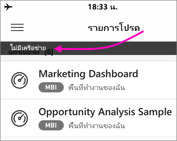

# ดูข้อมูลของคุณแบบออฟไลน์ในแอป Power BI สำหรับอุปกรณ์เคลื่อนที่
นำไปใช้กับ:

|  |  |  |  |  |
|:--- |:--- |:--- |:--- |:--- |
| iPhone |iPad |โทรศัพท์ Android |แท็บเล็ต Android |อุปกรณ์ Windows 10 |

ข้อดีประการหนึ่งของการดู Power BI ในแอปสำหรับอุปกรณ์เคลื่อนแทนในเบราว์เซอร์บนมือถือคือ คุณสามารถดูข้อมูลของคุณแม้ในขณะที่คุณไม่ได้เชื่อมต่อกับเครือข่ายได้ 

ตามค่าเริ่มต้น Power BI จะรีเฟรชข้อมูลบ่อยครั้งเพื่อให้คุณได้รับคำตอบล่าสุดสำหรับคำถามทางธุรกิจของคุณได้ตลอดเวลา แม้ขณะเดินทางหรือการใช้งานข้ามเขต

## การเข้าถึงข้อมูลขณะที่คุณออฟไลน์
ขณะที่คุณออฟไลน์ คุณสามารถเข้าถึงและโต้ตอบกับแดชบอร์ดที่คุณเคยเข้าถึงก่อนหน้านี้จากแอปสำหรับอุปกรณ์เคลื่อนที่

นอกจากนี้ คุณยังสามารถเข้าถึงรายงาน Power BI แบบอ่านอย่างเดียวที่คุณเคยเข้าถึงก่อนหน้านี้จากแอปสำหรับอุปกรณ์เคลื่อนที่ คุณสามารถดูรายงานฉบับเต็ม แต่ไม่กรอง กรองแบบไขว้ เรียงลำดับ หรือใช้ตัวแบ่งส่วนข้อมูลได้

## การรีเฟรชข้อมูลพื้นหลัง
การรีเฟรชพื้นหลังจะอัปเดตแดชบอร์ดรายการโปรดของคุณ รวมถึงแดชบอร์ดแลรายงานที่คุณเคยดูในสองสัปดาห์ที่ผ่านมา โดยมีข้อมูลบนบริการของ Power BI (ไม่ใช่แหล่งข้อมูล) หากคุณกำลังเชื่อมต่อกับ wi-fi การรีเฟรชพื้นหลังจะอัปเดตทุกๆ 2 ชั่วโมง หรือหากคุณอยู่บนเครือข่าย 3G, Power BI จะอัปเดตเนื้อหาทุกๆ 24 ชั่วโมง

คุณสามารถปิดการรีเฟรชพื้นหลัง ตัวอย่างเช่น เมื่อต้องการหลีกเลี่ยงการใช้งานเครือข่าย ตรวจสอบการตั้งค่าบนอุปกรณ์ของคุณ

> [!NOTE]
> หากคุณใช้แอป Power BI สำหรับอุปกรณ์เคลื่อนที่ บนอุปกรณ์ iOS ของคุณ และองค์กรของคุณได้กำหนดค่า Microsoft Intune MAM แล้ว การรีเฟรชข้อมูลพื้นหลังจะปิดอยู่ Power BI จะรีเฟรชข้อมูลจากบริการของ Power BI บนเว็บ ในครั้งต่อไปที่คุณเข้าใช้งานแอป
> 
> อ่านเพิ่มเติมเกี่ยวกับ[การกำหนดค่าแอป Power BI สำหรับอุปกรณ์เคลื่อนที่ด้วย Microsoft Intune](../../service-admin-mobile-intune.md) 
> 
> 

## ตัวบ่งชี้แบบออฟไลน์
Power BI จะเป็นตัวบ่งชี้ที่ชัดเจนเมื่อคุณเข้าและออกจากโหมดออฟไลน์ รวมถึงตัวบ่งชี้สำหรับแดชบอร์ด รายงาน และไทล์ที่ไม่พร้อมใช้งานแบบออฟไลน์ที่หายไปด้วย

## ข้อจำกัด
เมื่อคุณใช้งาน Power BI แบบออฟไลน์บนอุปกรณ์เคลื่อนที่ คุณอาจพบข้อจำกัดเหล่านี้:

* Power BI สามารถแคชข้อมูลแบบออฟไลน์ได้ถึง 250 MB
* ไทล์บางชนิดต้องมีการเชื่อมต่อกับเซิร์ฟเวอร์ที่ใช้งานอยู่ ดังนั้นจึงไม่สามารถใช้งานแบบออฟไลน์ได้ &#151; ตัวอย่างเช่น ไทล์ Bing map และไทล์บางไทล์ที่กำหนดเอง
* เวิร์กบุ๊ก Excel ทั้งหมดใน Power BI ไม่พร้อมใช้งานแบบออฟไลน์
* คุณสามารถดูรายงานมือถือของ Reporting Services และ KPI แบบออฟไลน์ได้ หากคุณดูในขณะเชื่อมต่ออยู่ รายงานดังกล่าวไม่ได้รีเฟรชในพื้นหลัง รายงานดังกล่าวจะรีเฟรชทุกครั้งที่คุณเปิด
* ในแอปอุปกรณ์เคลื่อนที่ Power BI คุณจะไม่เห็นไฟล์ Power BI Desktop (.pbix) ที่บันทึกไว้ในเซิฟเวอร์รายงานของ Power BI 
* รายงานแบบแบ่งหน้า (RDL) จะไม่พร้อมใช้งานในขณะที่เครือข่ายอยู่ในสถานะออฟไลน์

## ขั้นตอนถัดไป
คำติชมของคุณจะช่วยให้เราตัดสินใจว่าสิ่งใดควรดำเนินการในอนาคต ดังนั้นอย่าลืมลงคะแนนให้กับคุณลักษณะอื่นๆ ที่คุณต้องการเห็นในแอป Power BI สำหรับอุปกรณ์เคลื่อนที่ 

* [แอป Power BI สำหรับอุปกรณ์เคลื่อนที่](mobile-apps-for-mobile-devices.md)
* ติดตาม@MSPowerBIบน Twitter
* เข้าร่วมการสนทนาที่[ชุมชน Power BI](http://community.powerbi.com/)
* [Power BI คืออะไร](../../power-bi-overview.md)

