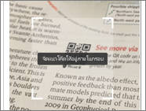
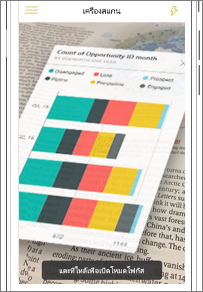
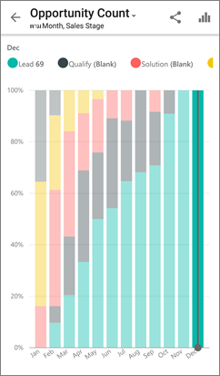

# สแกนคิวอาร์โค้ดของ Power BI จากอุปกรณ์เคลื่อนที่ของคุณ
นำไปใช้กับ:

|  |  |  |
|:--- |:--- |:--- |:--- |
| iPhones |โทรศัพท์ Android |แท็บเล็ต Android |

คิวอาร์โค้ดใน Power BI สามารถเชื่อมต่อทุกอย่างในโลกแห่งความจริง เข้ากับข้อมูลที่เกี่ยวข้องกับ BI่ได้โดยตรง &#151; โดยที่ไม่จำเป็นต้องใช้การค้นหา

อย่างเช่น เพื่อนร่วมงานได้[สร้างคิวอาร์โค้ดในบริการ Power BI](../../service-create-qr-code-for-tile.md)สำหรับรายงาน หรือไทล์ในแดชบอร์ด แชร์แดชบอร์ดหรือรายงานกับคุณ และวางคิวอาร์โค้ดในตำแหน่งที่ตั้งคีย์&#151;ตัวอย่างเช่น ในอีเมล หรือในรายการที่เฉพาะเจาะจง 

คุณสามารถสแกนคิวอาร์โค้ด สำหรับการเข้าถึงไปยังไทลแบบทันที์ที่เกี่ยวข้องหรือรายงาน จากโทรศัพท์ของคุณโดยตรง ใช้เครื่องสแกนในแอป Power BI หรือสแกนเนอร์อื่น ๆ ที่ติดตั้งบนโทรศัพท์ของคุณ 

ถ้าผู้ร่วมงานของคุณไม่ได้แชร์แดชบอร์ดหรือรายงานกับคุณ คุณสามารถร้องขอการเข้าถึงได้โดยตรงจากอุปกรณ์เคลื่อนที่ 

> [!NOTE]
> พวกเขายังสามารถ[สแกนคิวอาร์โค้ดด้วย Power BI สำหรับแอปความเป็นจริงผสม](mobile-mixed-reality-app.md#scan-a-report-qr-code-in-holographic-view)ได้อีกด้วย

## สแกนรหัส Power BI QR บน iPhone ของคุณกับสแกนเนอร์ Power BI
1. ในแอป Power BI สำหรับมือถือ ให้เปิดเมนูการนำทางส่วนกลาง  ที่ด้านบนซ้าย 
2. เลื่อนลงไปยัง**ตัวสแกน**และเลือก 
   
    
3. ถ้ากล้องของคุณไม่ได้เปิดใช้งาน คุณจำเป็นต้องอนุมัติให้แอป Power BI ใช้กล้อง นี่คืออนุมัติครั้งเดียว 
4. วางตำแหน่งสแกนเนอร์ที่ Power BI QR โค้ด 
   
    
5. ไทล์หรือรายงานปรากฏขึ้นเมื่อต้องการ เหนือพื้นหลังในความเป็นจริงเสริม
   
    
6. แตะรายงานหรือไทล์เพื่อเปิดในโหมดโฟกัส หรือย้อนกลับไปยังสแกนเนอร์

### สแกนคิวอาร์โค้ดจากสแกนเนอร์ภายนอกบน iPhone ของคุณ
1. สแกนเนอร์ใดก็ได้ที่ติดตั้งบนโทรศัพท์ของคุณสามารถนำมาวางให้ตรงตำแหน่งคิวอาร์โค้ดสแกนเนอร์ Power BI ที่เกี่ยวข้องเพื่อการเข้าถึงไปยังไทล์หรือรายงานอย่างทันที 
2. ถ้าคุณไม่ได้ติดตั้งแอป Power BI คุณจะถูกนำไปยัง[Apple App Store เพื่อดาวน์โหลด](https://go.microsoft.com/fwlink/?LinkId=522062)บน iPhone ของคุณ

## สแกนคิวอาร์โค้ด Power BI บน ของคุณกับสแกนเนอร ์Android Power BI
1. ในแอป mobile Power BI ให้เปิดเมนูการนำทางส่วนกลางด้านบนซ้าย 
2. เลื่อนลงไปยัง**คิวอาร์โค้ดสแกนเนอร์**และเลือก
   
    
3. ถ้าไม่ได้เปิดใช้กล้องของคุณ คุณจำเป็นต้องยืนยันแอป Power BI เมื่อต้องใช้กล้อง นี่คืออนุมัติครั้งเดียว 
4. วางตำแหน่งสแกนเนอร์ที่ Power BI QR โค้ด 
   
    
5. ไทล์หรือรายงานเปิดโดยอัตโนมัติใน Power BI
   
    

### สแกนคิวอาร์โค้ดจากสแกนเนอร์ภายนอกบน Android ของคุณ
1. สแกนเนอร์ใดก็ได้ที่ติดตั้งบนโทรศัพท์แอนดรอยด์ของคุณ Android สามารถนำมาวางให้ตรงตำแหน่งคิวอาร์โค้ดสแกนเนอร์ Power BI ที่เกี่ยวข้องเพื่อการเข้าถึงไปยังไทล์หรือรายงานอย่างทันที 
2. ถ้าคุณไม่ได้ติดตั้งแอป Power BI คุณจะถูกนำไปยัง[Google Play เพื่อดาวน์โหลดแอป](https://go.microsoft.com/fwlink/?LinkID=544867) 

## ขั้นตอนถัดไป
* [เชื่อมต่อกับข้อมูล Power BI จากโลกแห่งความจริง](mobile-apps-data-in-real-world-context.md)ด้วยแอปโทรศัพท์เคลื่อนที่
* [สร้างคิวอาร์โค้ดสำหรับไทล์ในบริการ Power BI](../../service-create-qr-code-for-tile.md)
* [สร้างคิวอาร์โค้ดสำหรับรายงานในบริการ Power BI](../../service-create-qr-code-for-report.md)
* คุณยังสามารถ[สแกนคิวอาร์โค้ดด้วย Power BI สำหรับแอปความเป็นจริงผสม](mobile-mixed-reality-app.md)ได้อีกด้วย
* มีคำถามหรือไม่ [ลองถามชุมชน Power BI](https://community.powerbi.com/)

